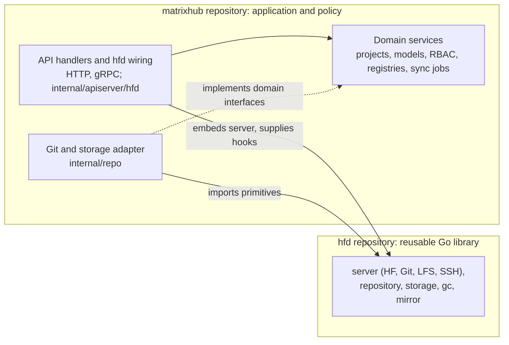

# MatrixHub and hfd: Repository and Application Boundaries

MatrixHub is the application in
[`matrixhub-ai/matrixhub`](https://github.com/matrixhub-ai/matrixhub). It
uses [`matrixhub-ai/hfd`](https://github.com/matrixhub-ai/hfd) as a separately
maintained Go library for Git, LFS, mirroring, and related protocol primitives.
hfd is linked into the MatrixHub binary; MatrixHub does not deploy an hfd
service. Both repositories are in scope for the CNCF Sandbox application, with
MatrixHub as the primary application repository.

MatrixHub owns projects and model records, identity and access control,
registry and proxy policies, model metadata, sync jobs, management APIs, the
web UI, and deployment. It applies these application rules to hfd's protocol
handlers through the validators and hooks it supplies when embedding them.

In short, hfd provides repository and transfer primitives, while MatrixHub owns the governed multi-tenant model-registry application.

## Repository relationship

The dependency direction is from MatrixHub to hfd. MatrixHub implements its
own [HTTP/gRPC API handlers](../../internal/apiserver/handler/), application
services, database repositories, and background jobs. hfd's `pkg/server`
assembles the HF, Git, LFS, SSH and xet CAS protocol handlers, which
[`internal/apiserver/hfd`](../../internal/apiserver/hfd/) embeds in the
MatrixHub process with MatrixHub's storage, identity validators, permission
and repository hooks. The diagram shows the repository boundary; the internal
MatrixHub package rules are documented in
[Code Architecture](../code-architecture.md).

## hfd packages consumed by MatrixHub

The table shows the hfd packages MatrixHub intends to keep using. Current code
also imports a few smaller hfd packages; they are omitted here and will be
removed in follow-up cleanup.

| hfd package(s) | What MatrixHub uses | What remains in MatrixHub |
| --- | --- | --- |
| `pkg/server`, `pkg/authenticate`, `pkg/permission`, `pkg/receive` | HF, Git, LFS and SSH protocol handlers, authentication and permission hook contracts, receive hooks | Identity mapping, access policy, model/dataset lifecycle hooks |
| `pkg/repository`, `pkg/storage`, `pkg/gc` | Git repository operations, the repository filesystem, Git GC and LFS pruning and usage over the xet store | The Git repository adapter, model records, project association, resource lifecycle, and the cleanup API |
| `pkg/mirror` | Git/LFS transfer and mirror primitives | Registry and credential selection, proxy behavior, synchronization policies, jobs, and status |

## Version pin and updates

MatrixHub pins hfd in [`go.mod`](../../go.mod), with checksums recorded in
[`go.sum`](../../go.sum). Maintainers review the pinned version during each
MatrixHub release preparation and when a relevant upstream security advisory or
dependency alert is received. Updates are made manually through reviewed pull
requests, with relevant checks run before merging.

## Security-sensitive application decisions

hfd implements reusable protocol and storage mechanics. The following
application-specific decisions are made by MatrixHub code:

- **Who an incoming request represents:** MatrixHub validates and maps access
  tokens, sessions, robot credentials, and SSH public keys to its own user or
  robot identities (`internal/apiserver/middleware/` and
  `internal/apiserver/middleware/authenticator/`).
- **What that identity may access:** MatrixHub evaluates platform and project
  permissions, public-project visibility, and model read or write
  access (`internal/domain/authz/` and `internal/apiserver/middleware/`).
- **Which application resources and upstreams are used:** MatrixHub owns the
  project and model lifecycles; it chooses registry URLs and
  credentials, and decides when proxy or scheduled synchronization runs
  (`internal/domain/`, `internal/repo/git_repo.go`, and
  `internal/apiserver/apiserver.go`).

These ownership statements concern application policy. hfd remains
responsible for the behavior of the lower-level primitives that MatrixHub
calls.
