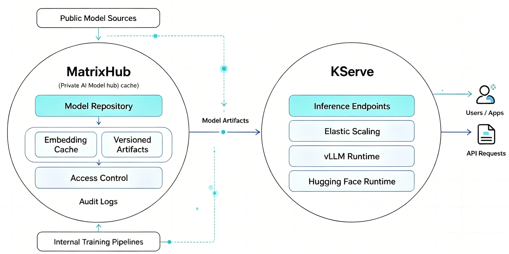

[KServe](https://kserve.github.io/website/) makes it straightforward to deploy and operate predictive and generative AI workloads on Kubernetes. As more teams move from prototypes to production LLM serving, one operational question keeps showing up earlier and earlier:

How should a platform team distribute very large model artifacts to many KServe workloads without making every pod, cluster, or data center depend on the public internet?

[MatrixHub](https://github.com/matrixhub-ai/matrixhub) is an open-source, self-hosted AI model registry designed for that part of the serving stack. It provides a Hugging Face-compatible private model hub for enterprise inference teams, with a focus on high-throughput distribution, governed model releases, air-gapped delivery, and Kubernetes-native deployment.

For KServe users, MatrixHub can sit between public model hubs, internal fine-tuned model artifacts, and KServe runtimes. KServe remains the inference control plane. MatrixHub becomes the private model distribution layer that keeps models close to the workloads that serve them.



## Why model distribution matters for KServe

KServe already supports a rich set of [storage options for model artifacts](https://kserve.github.io/website/docs/model-serving/storage/overview#storage-providers), including cloud object storage, HTTP(S), Git, PVCs, Hugging Face, and OCI images. Its storage initializer downloads artifacts and makes them available to the model server container before serving begins.

That flexibility is powerful, but LLM serving adds several hard edges:

- Model artifacts are often tens or hundreds of gigabytes.
- Autoscaling and rollout events can create many concurrent downloads.
- Multi-node or multi-GPU deployments amplify startup pressure across the cluster.
- Regulated environments may not allow direct access to public SaaS model hubs.
- Platform teams need repeatable model versions, auditability, and rollback controls.

KServe's Hugging Face runtime is optimized for serving Hugging Face models with vLLM and OpenAI-compatible APIs. MatrixHub complements that runtime by making Hugging Face-compatible model access private, cached, and governed.

## What MatrixHub adds

MatrixHub is built around a simple premise: AI platform teams should be able to run a private model hub the same way they run other critical platform infrastructure.

Key capabilities include:

- Hugging Face-compatible access: redirect Hugging Face clients to MatrixHub through `HF_ENDPOINT` while keeping model consumption patterns familiar.
- On-demand caching: pull public models once, keep them close to the cluster, and reduce repeated external downloads.
- Private model registry: centralize fine-tuned weights, model versions, and release tags for internal serving workflows.
- Enterprise controls: use project isolation, RBAC, audit logs, and policy controls around model uploads and downloads.
- Air-gapped workflows: support controlled transfer of models into isolated environments.
- Kubernetes deployment: install MatrixHub with Helm and run it alongside the rest of the AI platform stack.

MatrixHub describes the experience as "MatrixHub is to Hugging Face what Harbor is to Docker Hub": a private, self-hosted hub for model artifacts instead of container images.

## How MatrixHub fits with KServe

A typical architecture looks like this:

```text
Public model hub or internal training pipeline
              |
              v
        MatrixHub
  private model registry, cache,
  governance, and replication
              |
              v
          KServe
  InferenceService or LLMInferenceService
              |
              v
       vLLM / Hugging Face runtime
```

In this model, KServe continues to own deployment, routing, runtime selection, autoscaling, and inference APIs. MatrixHub owns the model artifact supply path: where models are stored, how they are cached, how teams publish internal revisions, and how workloads fetch them.

This division is useful because it matches how platform teams already think about production systems. Serving and artifact distribution are related, but they have different lifecycle concerns. KServe gives operators a Kubernetes-native serving API. MatrixHub gives them a private model hub that can be managed, replicated, and audited independently.

## Example: point Hugging Face clients at MatrixHub

MatrixHub is designed to work with Hugging Face-compatible clients. In workloads that use Hugging Face libraries directly, the switch can be as small as setting `HF_ENDPOINT`:

```bash
export HF_ENDPOINT=https://matrixhub.example.com
```

For KServe deployments that use Hugging Face-compatible model loading paths, the same pattern can be applied through runtime environment configuration.

```yaml
apiVersion: serving.kserve.io/v1beta1
kind: InferenceService
metadata:
  name: llama3-matrixhub
spec:
  predictor:
    model:
      modelFormat:
        name: huggingface
      storageUri: "hf://meta-llama/Meta-Llama-3-8B-Instruct"
      resources:
        requests:
          cpu: "2"
          memory: "8Gi"
          nvidia.com/gpu: "1"
        limits:
          cpu: "2"
          memory: "8Gi"
          nvidia.com/gpu: "1"
      env:
        - name: HF_ENDPOINT
          value: "https://matrixhub.example.com"
```

The exact configuration depends on the KServe version, runtime image, and how the model download path is configured in your cluster. The operational idea is consistent: keep the KServe API and Hugging Face model URI familiar, but resolve model artifacts through a private MatrixHub endpoint.

For newer KServe model cache workflows, the same private endpoint can also be represented as storage configuration:

```yaml
apiVersion: serving.kserve.io/v1alpha1
kind: LocalModelCache
metadata:
  name: llama3-from-matrixhub
spec:
  sourceModelUri: "hf://meta-llama/Meta-Llama-3-8B-Instruct"
  modelSize: 16Gi
  nodeGroups:
    - workers
  storage:
    key: matrixhub-secret
    parameters:
      endpoint: "https://matrixhub.example.com"
```

This lets teams combine KServe's model cache behavior with MatrixHub's private model hub and distribution controls.

## Deployment sketch

MatrixHub can be deployed with Helm from its chart or OCI registry. A minimal installation follows the standard Kubernetes pattern:

```bash
export CHART_VERSION=<chart-version>
export NAMESPACE=matrixhub

helm install matrixhub oci://ghcr.io/matrixhub-ai/matrixhub \
  --version ${CHART_VERSION} \
  --namespace ${NAMESPACE} \
  --create-namespace
```

Once MatrixHub is reachable inside the cluster, platform teams can:

1. Configure storage for MatrixHub model artifacts.
2. Mirror or cache selected public models.
3. Publish internal fine-tuned models to project-scoped repositories.
4. Configure KServe runtimes or model cache resources to use the MatrixHub endpoint.
5. Apply organization-specific access control, audit, and release policies.

For quick local evaluation, MatrixHub also provides Docker Compose deployment instructions and a hosted demo from the project README.

## Where MatrixHub is especially useful

### Large cluster rollouts

When many KServe workloads start at once, every replica downloading a large model from a public endpoint can turn startup into a bandwidth and reliability problem. MatrixHub's pull-once, serve-many cache model is designed to reduce repeated external downloads and keep hot model artifacts closer to inference workloads.

### Air-gapped and regulated environments

Some KServe deployments run in environments where public internet access is restricted or unavailable. MatrixHub supports workflows for moving model artifacts into isolated networks while keeping a Hugging Face-compatible access pattern for researchers and platform engineers.

### Fine-tuned model promotion

Production teams need a clean path from training output to tested release to served model. MatrixHub can act as the internal registry for fine-tuned weights, with tag locking and CI/CD integration patterns that help keep development, staging, and production deployments consistent.

### Multi-region serving

KServe can run close to users or GPU capacity across multiple clusters. MatrixHub's replication-oriented architecture is designed to support model distribution across data centers, so model downloads can stay local to the serving environment.

## KServe and MatrixHub together

KServe has become a strong Kubernetes-native foundation for model serving, especially as the project continues investing in LLMInferenceService, vLLM, OpenAI-compatible APIs, model caching, and multi-node inference.

MatrixHub addresses a neighboring platform concern: how models arrive at those runtimes quickly, privately, and consistently.

Together, they give AI platform teams a clean split:

- KServe for serving APIs, runtime orchestration, inference routing, and Kubernetes-native deployment.
- MatrixHub for private model hosting, model artifact caching, governance, and enterprise distribution.

That combination is especially compelling for organizations that want the developer experience of Hugging Face-style model access without making production inference depend on public model hub availability, external bandwidth, or unmanaged artifact flows.

## Get involved

MatrixHub is open source under the Apache 2.0 license. You can try it, review the code, and contribute through the project repository:

- GitHub: [matrixhub-ai/matrixhub](https://github.com/matrixhub-ai/matrixhub)
- Website and docs: [matrixhub.ai](https://matrixhub.ai/)
- KServe docs: [kserve.github.io/website](https://kserve.github.io/website/)

If you are running KServe at scale and want a private Hugging Face-compatible model hub for your inference platform, MatrixHub is worth a look.
