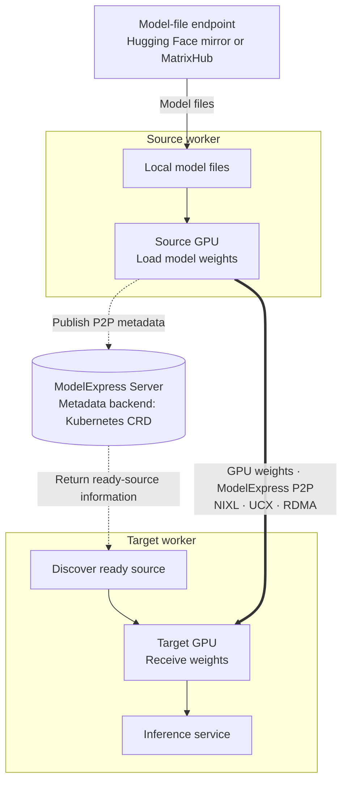
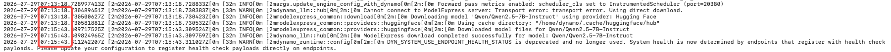
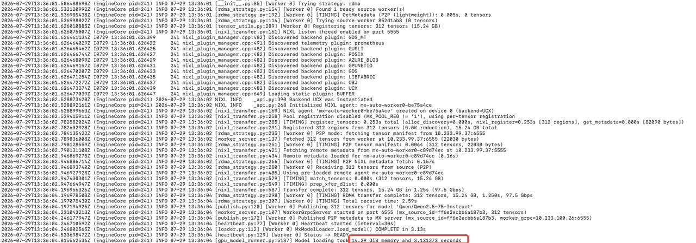
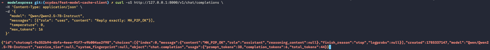

Starting a new inference worker involves two different data movements: model files must first reach a worker-local cache, then the weights must enter GPU memory. These stages are often described together as "model loading," but they have different bottlenecks and need different acceleration mechanisms.

[MatrixHub](https://github.com/matrixhub-ai/matrixhub) accelerates the first stage by serving model repositories from a self-hosted, Hugging Face-compatible endpoint close to the cluster. [ModelExpress](https://docs.nvidia.com/dynamo/kubernetes-deployment/model-loading/model-express) GPU-to-GPU P2P addresses the second stage: after one source worker has loaded the model, a target worker can receive weights from that ready source over NIXL, UCX, and RDMA instead of downloading the weight files again.

This article records the runtime build, essential DGD configuration, and cross-node GPU-to-GPU P2P validation. It then uses four scenarios—Hugging Face/MatrixHub × direct/P2P—to explain the time spent in each stage.



{/* truncate */}

## Questions and four scenarios

The experiment separates two questions:

1. How do model files reach a worker-local cache?
2. How do model weights reach the target GPU?

Four scenarios isolate the two paths:

| ID | Scenario | Question |
|---|---|---|
| E1 | Hugging Face direct | Can a worker download and load the model from the configured Hugging Face mirror? |
| E2 | MatrixHub direct | Can a worker download and load the same model from MatrixHub? |
| E3 | Hugging Face + P2P | After the source is prepared from Hugging Face, can it send GPU weights to the target? |
| E4 | MatrixHub + P2P | After the source is prepared through MatrixHub, can it send GPU weights to the target? |

Here, **direct** means the worker's Hugging Face provider downloads model files from the configured endpoint into its local cache. It does not mean that a ModelExpress server streams the complete model to the worker.

In a P2P scenario, the source completes model-file preparation, GPU loading, and P2P metadata publication first. The target then discovers the source through the ModelExpress metadata backend, establishes a NIXL/UCX path, receives the tensors over RDMA, and starts inference.

## Environment

The validation used two GPU nodes in one Kubernetes cluster:

| Item | Configuration |
|---|---|
| GPU | 1 × NVIDIA A800 80GB PCIe per node |
| Network | RDMA available on both nodes |
| Model | `Qwen/Qwen2.5-7B-Instruct` |

The source and target were scheduled to different nodes. Exact software versions and configuration are given only where they are needed in the reproduction steps; internal node names, addresses, and registry paths use placeholders.

## Key results

- In archived runs on the same source node, model-file preparation took 4,382.20 seconds through the Hugging Face mirror and 144.579 seconds through MatrixHub. Network, upstream, and cache conditions affect this result, so it is not a universal speedup ratio.
- E4 moved 312 tensors totaling 15.24 GB from the source GPU to the target GPU. Pure RDMA transfer took 1.25 seconds at a reported 97.5 Gbps, total reception took 2.59 seconds, and `MxModelLoader` took 3.13 seconds.
- The target returned `MH_P2P_OK`, proving that it could initialize the model from the received weights and serve inference.



## Step 1: Build a ModelExpress-enabled Dynamo Runtime

Build the runtime by following the [official ModelExpress P2P client-image documentation](https://github.com/ai-dynamo/modelexpress/blob/main/examples/p2p_transfer_k8s/client/README.md).

## Step 2: Preflight the cluster and hardware

Before deploying, confirm that GPU and RDMA resources are available on both nodes, the runtime image can be pulled, and MatrixHub, ModelExpress, and the metadata service are ready. This keeps basic environment failures from interfering with the validation.

## Step 3: Prepare the source and target DGDs

The experiment uses two `DynamoGraphDeployment` resources:

| Role | DGD | Node | Resources |
|---|---|---|---|
| Source | `mx-mh-p2p-source` | `source-node` | 1 GPU + 1 `spidernet.io/rdmas` |
| Target | `mx-mh-p2p-target` | `target-node` | 1 GPU + 1 `spidernet.io/rdmas` |

Both workers use the same model, revision, runtime, and ModelExpress service. The complete source and target DGDs differ mainly in `metadata.name` and the worker `nodeSelector`: the source is pinned to `source-node`, and the target to `target-node`; each DGD contains one frontend and one vLLM decode worker. The full manifests are included in the appendix.

## Step 4: Start the source and publish P2P metadata

After preparing the source DGD, submit it first:

```bash
kubectl apply -f <source-dgd.yaml>
kubectl -n dynamo-system get pods -w
kubectl -n dynamo-system logs -f <source-worker-pod>
```

The source log should show these signals in order:

1. Model-file preparation completes.
2. Weights load from disk.
3. Registration begins for 312 GPU tensors.
4. Publishing begins for 312 tensors.
5. `Published P2P metadata` appears.
6. `MxModelLoader` completes.

In the recorded E4 run, source `Time spent downloading weights` was 143.336599 seconds. Reading the weights from disk then took 5.36 seconds, after which the source registered and published 312 tensors totaling 15.24 GB.


Do not start the target until `Published P2P metadata` appears; before that, the target has no discoverable ready source.

## Step 5: Start the target and validate RDMA reception

After preparing a complete target DGD, submit it and follow its worker log:

```bash
kubectl apply -f <target-dgd.yaml>
kubectl -n dynamo-system get pods -w
kubectl -n dynamo-system logs -f <target-worker-pod>
```

The target log should prove, in order:

1. A ready source is discovered.
2. The tensor manifest is fetched.
3. GPU-weight reception begins.
4. The NIXL/UCX RDMA transfer completes.
5. `MxModelLoader` completes and the worker becomes Ready.

In the recorded E4 run, the target received 312 tensors totaling 15.24 GB. Pure RDMA transfer took 1.25 seconds at a reported 97.5 Gbps, total reception took 2.59 seconds, and `MxModelLoader` completed in 3.13 seconds before the worker entered Ready.



These numbers have different boundaries: 1.25 seconds covers the pure RDMA data movement, 2.59 seconds covers total reception, and 3.13 seconds covers the target loader stage. None is the complete time from creating a workload to receiving its first token.

## Step 6: Validate inference with a fixed prompt

After the target is Ready, forward the target frontend locally:

```bash
kubectl -n dynamo-system port-forward \
  deployment/mx-mh-p2p-target-frontend 8000:8000
```

Keep that command running and send a fixed prompt from another terminal:

```bash
curl -sS http://127.0.0.1:8000/v1/chat/completions \
  -H 'Content-Type: application/json' \
  -d '{
    "model": "Qwen/Qwen2.5-7B-Instruct",
    "messages": [{"role": "user", "content": "Reply exactly: MH_P2P_OK"}],
    "temperature": 0,
    "max_tokens": 16
  }'
```

The response contained `MH_P2P_OK`. This extends the evidence from "RDMA completed" to "the target initialized the model from the received weights and served inference."



## Four-scenario results

With the functional path established, place the direct and P2P records in one table. Each row describes a different stage and should not be added into one end-to-end duration.

| Metric | E1: HF direct | E2: MatrixHub direct | E3: HF + P2P | E4: MatrixHub + P2P |
|---|---:|---:|---:|---:|
| Source model acquisition endpoint | Hugging Face mirror | MatrixHub | Hugging Face mirror | MatrixHub |
| Target weight source | Target-local model files | Target-local model files | Source GPU | Source GPU |
| Source model-file preparation | 4,382.20 s | 144.579 s | 4,161.32 s | 143.34 s |
| Target model-file download | 4,247.68 s | 150.718 s | Not applicable | Not applicable |
| Source GPU loading | 20.88 s | 28.22 s | `MxModelLoader` 159.36 s | `MxModelLoader` 152.70 s |
| Target GPU loading | 32.46 s | 69.05 s | `MxModelLoader` 3.41 s | `MxModelLoader` 3.13 s |
| P2P tensors / data | None | None | 312 / 15.24 GB | 312 / 15.24 GB |
| Pure RDMA transfer | None | None | 1.34 s / 91.0 Gbps | 1.25 s / 97.5 Gbps |
| Inference verification | Passed | Passed | Passed | Passed |

The table expresses two complementary facts.

First, MatrixHub successfully served the model to both nodes. In the archived runs on the same source node, model-file preparation took 4,382.20 seconds through the Hugging Face mirror and 144.579 seconds through MatrixHub. The exact ratio depends on the network, upstream state, and cache conditions, but the result demonstrates the value of placing model distribution close to the inference cluster.

Second, the P2P scenarios did not repeat the weight-file download on the target. They received 15.24 GB of weights from a ready source GPU instead. In E4, the complete target `MxModelLoader` stage took 3.13 seconds and inference then passed.

## Conclusion

MatrixHub and ModelExpress P2P are not competing choices. They serve adjacent stages of the model-readiness path.

| Situation | Recommended path |
|---|---|
| First replica or no ready source | Download from an in-cluster MatrixHub cache |
| Scale-out while a compatible source is ready | Use ModelExpress P2P from the source GPU |
| No RDMA-capable path | Use MatrixHub direct download |
| Air-gapped or controlled model supply | Use MatrixHub as the governed model source |
| Need to evaluate startup performance | Measure file preparation, GPU loading, and end-to-end readiness separately |

For a cold deployment, MatrixHub shortens the path from the model repository to the first worker. Once a source is ready, ModelExpress P2P lets a target avoid downloading the weight files again and receive weights directly from the ready GPU. Together they form a model-readiness pipeline: prepare one source efficiently, then use it to bring additional workers online.

## Appendix: Complete source and target DGD YAML

The following are complete `DynamoGraphDeployment` examples. Save them as `source.yaml` and `target.yaml` as a deployment starting point. Replace the endpoint, image digest, and node-name placeholders; both sides must use the same model, revision, runtime, and ModelExpress service.

### Source DGD

```yaml
apiVersion: nvidia.com/v1beta1
kind: DynamoGraphDeployment
metadata:
  name: mx-mh-p2p-source
  namespace: dynamo-system
spec:
  backendFramework: vllm
  components:
    - name: Frontend
      type: frontend
      replicas: 1
      podTemplate:
        spec:
          containers:
            - name: main
              image: <runtime-image>@sha256:<digest>
              imagePullPolicy: IfNotPresent
              workingDir: /workspace
              env:
                - name: HF_ENDPOINT
                  value: http://<matrixhub-endpoint>
              command: ["python3", "-m", "dynamo.frontend"]
              args: ["--http-port", "8000"]
    - name: VllmWorker
      type: decode
      replicas: 1
      sharedMemorySize: 2Gi
      podTemplate:
        spec:
          nodeSelector:
            kubernetes.io/hostname: <source-node>
          containers:
            - name: main
              image: <runtime-image>@sha256:<digest>
              imagePullPolicy: IfNotPresent
              workingDir: /workspace
              securityContext:
                runAsUser: 0
                allowPrivilegeEscalation: true
                capabilities:
                  add: ["IPC_LOCK", "SYS_RESOURCE"]
              env:
                - name: HF_ENDPOINT
                  value: http://<matrixhub-endpoint>
                - name: VLLM_PLUGINS
                  value: modelexpress
                - name: MODEL_EXPRESS_URL
                  value: http://<modelexpress-service>:8001
                - name: MX_SERVER_ADDRESS
                  value: http://<modelexpress-service>:8001
                - name: MODEL_EXPRESS_NO_SHARED_STORAGE
                  value: "1"
                - name: MX_MODEL_REVISION
                  value: a09a35458c702b33eeacc393d103063234e8bc28
                - name: MX_NIXL_BACKEND
                  value: UCX
                - name: MX_P2P_METADATA
                  value: "1"
                - name: MX_METADATA_PORT
                  value: "5555"
                - name: MX_WORKER_GRPC_PORT
                  value: "6555"
                - name: MX_CONTIGUOUS_REG
                  value: "0"
                - name: UCX_RNDV_SCHEME
                  value: get_zcopy
                - name: NIXL_LOG_LEVEL
                  value: INFO
                - name: UCX_LOG_LEVEL
                  value: WARN
              command: ["/bin/sh", "-lc"]
              args:
                - >-
                  ulimit -l unlimited && exec python3 -m dynamo.vllm
                  --model Qwen/Qwen2.5-7B-Instruct
                  --revision a09a35458c702b33eeacc393d103063234e8bc28
                  --served-model-name Qwen/Qwen2.5-7B-Instruct
                  --load-format mx
                  --tensor-parallel-size 1
                  --gpu-memory-utilization 0.90
                  --max-model-len 8192
                  --no-enable-log-requests
              resources:
                requests:
                  cpu: "4"
                  memory: 16Gi
                  nvidia.com/gpu: "1"
                  spidernet.io/rdmas: "1"
                limits:
                  cpu: "4"
                  memory: 16Gi
                  nvidia.com/gpu: "1"
                  spidernet.io/rdmas: "1"
```

### Target DGD

```yaml
apiVersion: nvidia.com/v1beta1
kind: DynamoGraphDeployment
metadata:
  name: mx-mh-p2p-target
  namespace: dynamo-system
spec:
  backendFramework: vllm
  components:
    - name: Frontend
      type: frontend
      replicas: 1
      podTemplate:
        spec:
          containers:
            - name: main
              image: <runtime-image>@sha256:<digest>
              imagePullPolicy: IfNotPresent
              workingDir: /workspace
              env:
                - name: HF_ENDPOINT
                  value: http://<matrixhub-endpoint>
              command: ["python3", "-m", "dynamo.frontend"]
              args: ["--http-port", "8000"]
    - name: VllmWorker
      type: decode
      replicas: 1
      sharedMemorySize: 2Gi
      podTemplate:
        spec:
          nodeSelector:
            kubernetes.io/hostname: <target-node>
          containers:
            - name: main
              image: <runtime-image>@sha256:<digest>
              imagePullPolicy: IfNotPresent
              workingDir: /workspace
              securityContext:
                runAsUser: 0
                allowPrivilegeEscalation: true
                capabilities:
                  add: ["IPC_LOCK", "SYS_RESOURCE"]
              env:
                - name: HF_ENDPOINT
                  value: http://<matrixhub-endpoint>
                - name: VLLM_PLUGINS
                  value: modelexpress
                - name: MODEL_EXPRESS_URL
                  value: http://<modelexpress-service>:8001
                - name: MX_SERVER_ADDRESS
                  value: http://<modelexpress-service>:8001
                - name: MODEL_EXPRESS_NO_SHARED_STORAGE
                  value: "1"
                - name: MX_MODEL_REVISION
                  value: a09a35458c702b33eeacc393d103063234e8bc28
                - name: MX_NIXL_BACKEND
                  value: UCX
                - name: MX_P2P_METADATA
                  value: "1"
                - name: MX_METADATA_PORT
                  value: "5555"
                - name: MX_WORKER_GRPC_PORT
                  value: "6555"
                - name: MX_CONTIGUOUS_REG
                  value: "0"
                - name: UCX_RNDV_SCHEME
                  value: get_zcopy
                - name: NIXL_LOG_LEVEL
                  value: INFO
                - name: UCX_LOG_LEVEL
                  value: WARN
              command: ["/bin/sh", "-lc"]
              args:
                - >-
                  ulimit -l unlimited && exec python3 -m dynamo.vllm
                  --model Qwen/Qwen2.5-7B-Instruct
                  --revision a09a35458c702b33eeacc393d103063234e8bc28
                  --served-model-name Qwen/Qwen2.5-7B-Instruct
                  --load-format mx
                  --tensor-parallel-size 1
                  --gpu-memory-utilization 0.90
                  --max-model-len 8192
                  --no-enable-log-requests
              resources:
                requests:
                  cpu: "4"
                  memory: 16Gi
                  nvidia.com/gpu: "1"
                  spidernet.io/rdmas: "1"
                limits:
                  cpu: "4"
                  memory: 16Gi
                  nvidia.com/gpu: "1"
                  spidernet.io/rdmas: "1"
```

:::caution Security note

The root user, privilege escalation, and capabilities above came from this experiment configuration and should not be treated as production defaults. In production, validate each setting against the runtime, RDMA device plugin, and node policy; prefer a non-root user, grant only the capabilities that are actually required, and leave `allowPrivilegeEscalation` disabled unless a component explicitly needs it.

:::
