import Tabs from '@theme/Tabs';
import TabItem from '@theme/TabItem';

When deploying large models in highly regulated industries such as finance, government, and energy, teams usually face two challenges:

1. **Getting models into the private network:** Public model hubs are inaccessible, and manually copying hundreds of gigabytes of weights can take days.
2. **Managing model permissions:** Models are critical assets, so there must be clear boundaries around who can download, modify, and manage them.

Both matter. A **self-hosted, Hugging Face-compatible private model hub** solves them together: it centralizes model storage and access control while allowing development teams to use familiar tools and workflows.

{/* truncate */}

<div className="enterprise-blog">

## The big picture: bring models in, store them centrally, and share them internally

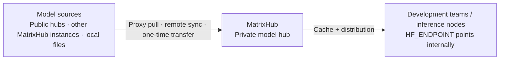

Models are stored centrally in the private model hub. Everyone retrieves them internally without depending on the public internet. Developers only need to point `HF_ENDPOINT` at the internal address—**no code changes required**.

There are three ways to bring models into the private network, depending on network connectivity:

- **Proxy pull:** In an internet-connected environment, the first request pulls and caches a model from a public source. All later requests use the internal cache.
- **Remote sync:** Automatically synchronize with MatrixHub in another environment to keep models consistent.
- **One-time transfer:** In a fully air-gapped environment, obtain the model files elsewhere and transfer them in as a complete set.

:::tip[Further reading]

For detailed proxy-pull and cache-distribution procedures, see:

- [Distributing DeepSeek v4](./2026-04-27-deepseek-v4-distribution.md)
- [Distributing Models to an Internal vLLM Cluster](./2026-04-27-examples.md)

:::

## Access isolation: define who can work with each model

Models are critical assets. MatrixHub protects them through three layers:

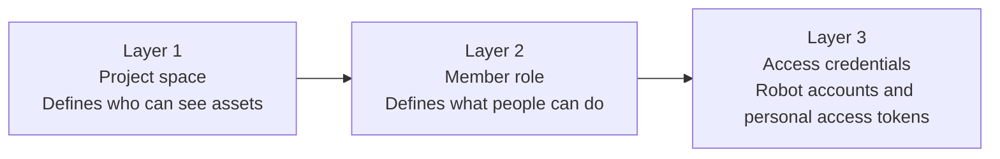

### Layer 1: project spaces—an independent space for each team

Each team or business unit has its own project. For example, development, staging, and production can use `dev`, `stage`, and `prod`. Projects are hidden from one another by default, providing natural isolation. The following three projects demonstrate this behavior.

#### 1. Administrator view: all projects coexist

After signing in, an administrator can see every project on the platform:


#### 2. Each project has its own members

Members belong to their respective projects and do not overlap:

<Tabs groupId="project-members">
  <TabItem value="dev" label="dev" default>

  

  </TabItem>
  <TabItem value="stage" label="stage">

  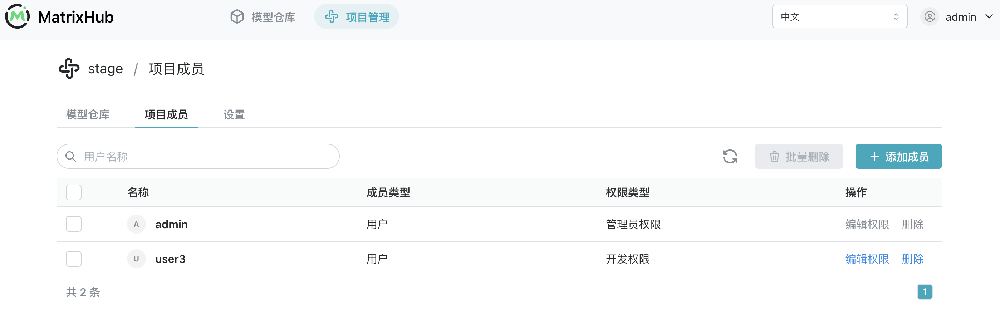

  </TabItem>
  <TabItem value="prod" label="prod">

  

  </TabItem>
</Tabs>

#### 3. Members see only their own projects

When members of the three projects sign in, each person can see only the project they belong to:

<Tabs groupId="member-login">
  <TabItem value="dev" label="dev" default>

  

  </TabItem>
  <TabItem value="stage" label="stage">

  

  </TabItem>
  <TabItem value="prod" label="prod">

  

  </TabItem>
</Tabs>

Everyone uses the same sign-in page, but members of different teams see different project sets. This is the clearest expression of an independent project space.

### Layer 2: member roles—control what people can do within a project

| Role | Capabilities | Typical use case |
| --- | --- | --- |
| Administrator | Manage all project settings and members | Platform operator responsible for creating projects and assigning members |
| Editor | Upload and modify models | ML engineer who trains or fine-tunes models and publishes new versions |
| Viewer | View and download, but not upload or modify | Colleague who needs model access, or a read-only model-pull pipeline |

To let someone view and download models without uploading or changing them, assign the Viewer role.

The project member list shows each member's account and role:

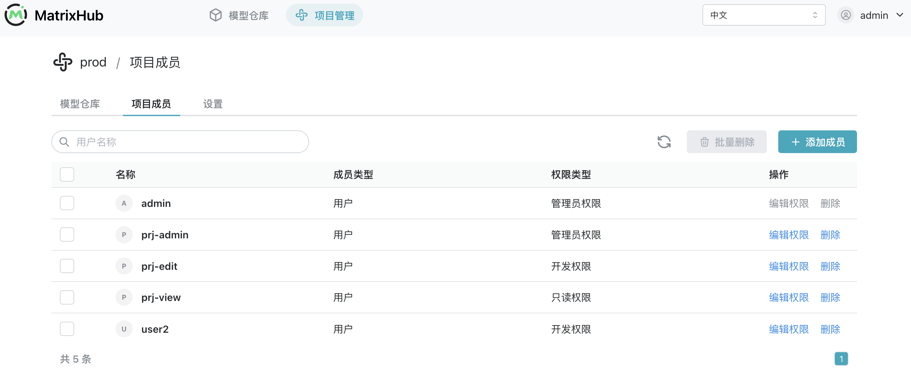

These permissions are enforced. If a Viewer attempts to upload a model, the request is rejected:


### Layer 3: access credentials—robot accounts and personal access tokens

People use signed-in accounts in the browser. Model downloads and uploads, along with CLI/API operations for CI/CD and inference services, require access credentials. MatrixHub provides two approaches:

| Approach | Identity represented | Best suited for | Permissions and lifecycle |
| --- | --- | --- | --- |
| Robot account | An independent machine identity | CI/CD, inference services, and shared pipelines | Platform administrators set its project scope, permissions, and expiration independently; its token can be disabled or refreshed separately |
| Personal access token | The signed-in user | Personal development, debugging, and local `hf` commands | Inherits the user's existing project roles and permissions; the user can create, expire, or delete it |

Both approaches use a token for CLI/API authentication, but the token represents a different identity and therefore serves a different operational purpose.

#### Approach 1: robot accounts—an independent identity for programs

Platform administrators can create robot accounts for CI/CD, inference services, and other programs, then explicitly limit their projects and permissions:

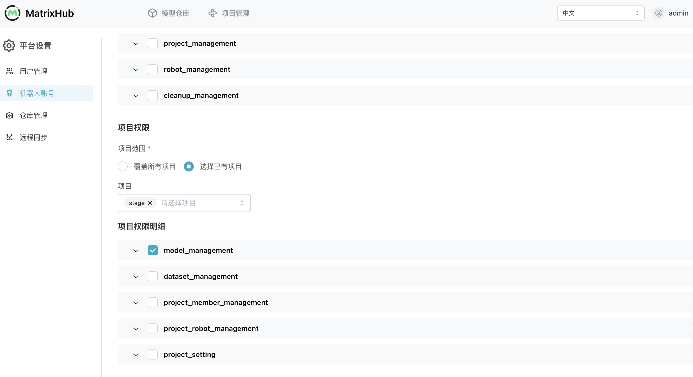

After creation, robot accounts can be reviewed, disabled, deleted, or have their tokens refreshed centrally. Their lifecycle does not depend on an employee's personal account:


#### Approach 2: personal access tokens—use an individual's existing permissions

A user can also create a personal access token for local `hf` commands, personal scripts, or debugging. The token inherits the user's existing project roles and permissions; it grants no additional access. The full value is displayed only once when created and should be saved immediately and stored securely:


## Adding models: manage in-house models centrally

After fine-tuning, bring the local model under centralized MatrixHub management in four steps.

#### 1. Create the target model repository

Sign in to the console and create a model repository under the target project. The account performing the upload needs the project Administrator or Editor role.

#### 2. Check the local model files

Before uploading, verify that the directory contains the weights, configuration, tokenizer, and other runtime files. This prevents missing dependencies from being discovered only after the model is stored:


#### 3. Configure the MatrixHub endpoint and upload

In a local terminal, point `HF_ENDPOINT` to the internal MatrixHub instance, then use `hf upload` to upload the complete model directory:

```bash
export HF_ENDPOINT=http://<internal-matrixhub-address>
hf upload <project-name>/<model-name> ./<local-model-directory> .
```

When the terminal shows file hashing, LFS transfer progress, and the final repository URL, the client-side upload has completed:


#### 4. Verify the model files and version history

Return to the console and verify the result from both the model details and commit history views:

<Tabs groupId="model-verification">
  <TabItem value="files" label="Model details" default>

  Use the model details page to confirm that weights, configuration, and other files are stored completely.

  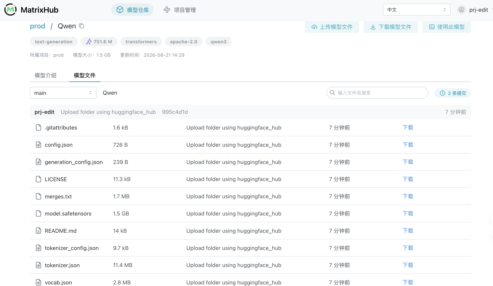

  </TabItem>
  <TabItem value="commits" label="Commit history">

  Every upload or modification creates a commit, making model versions and changes traceable.

  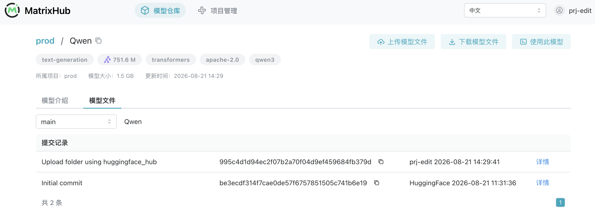

  </TabItem>
</Tabs>

Once stored, models no longer remain scattered across individual machines. Versions, files, and change history are managed centrally, while teams continue using familiar tools.

## Distributing models in isolated and controlled environments

There are two approaches, depending on whether the target environment can connect to the model source.

### Scenario 1: fully air-gapped environment—one-time transfer

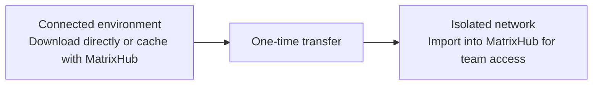

- **Connected environment:** Download the model files directly. If you cache them with MatrixHub before transferring them, their versions and file structure move together, avoiding a separate re-upload step.
- **Isolated network:** Import the model into the deployed MatrixHub instance, after which the team can retrieve it normally.

:::info[Operation note]

The download and import procedures follow the process described in “Adding models” above: use `hf download` to retrieve the model and `hf upload` to import it.

:::

### Scenario 2: connected environments—automated remote sync

When a staging environment can connect to the private network—or two data centers can reach each other—**remote sync** can automatically copy models between them.

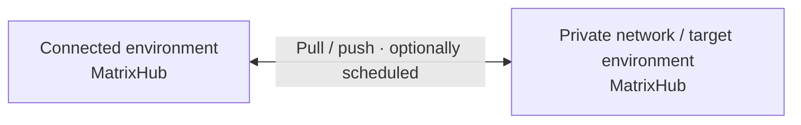

Configuration steps:

1. In the console, create a target registry and configure MatrixHub in the connected environment as the remote registry:

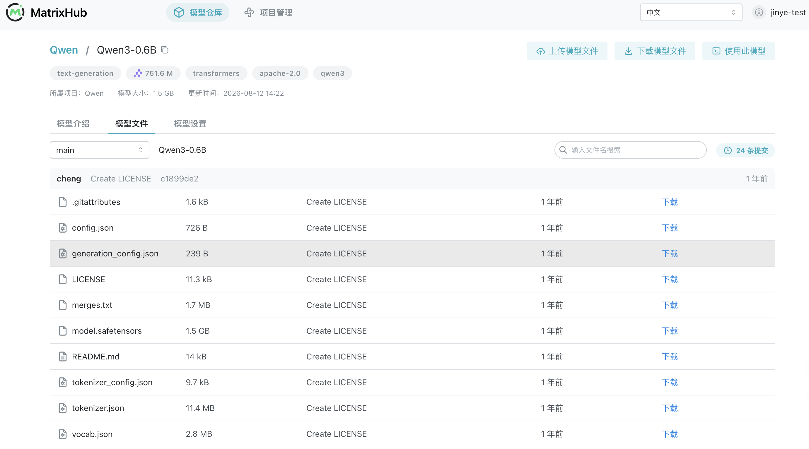


2. Create a sync rule and specify the target registry, resources, and trigger:

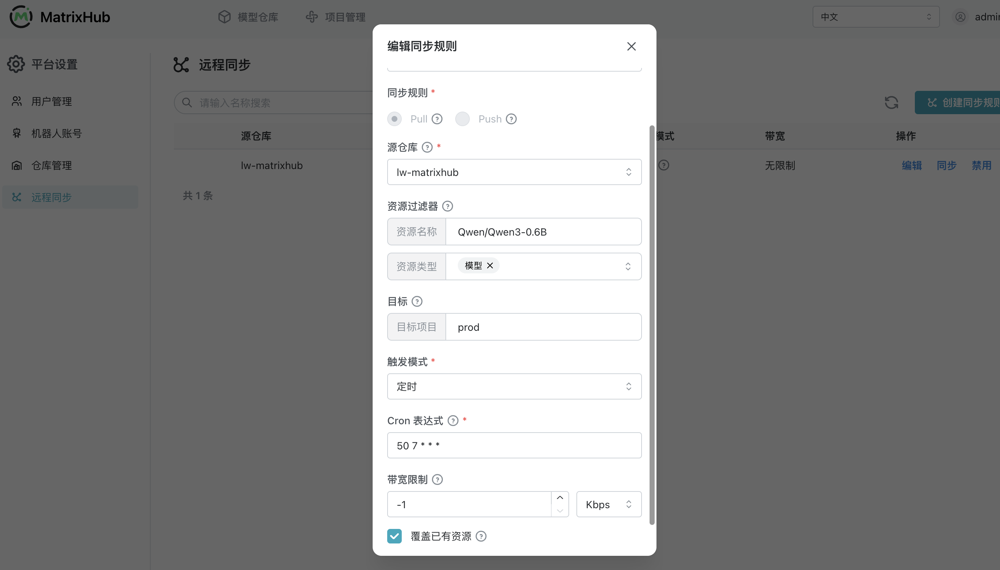

3. After triggering synchronization, view progress and logs on the task page:

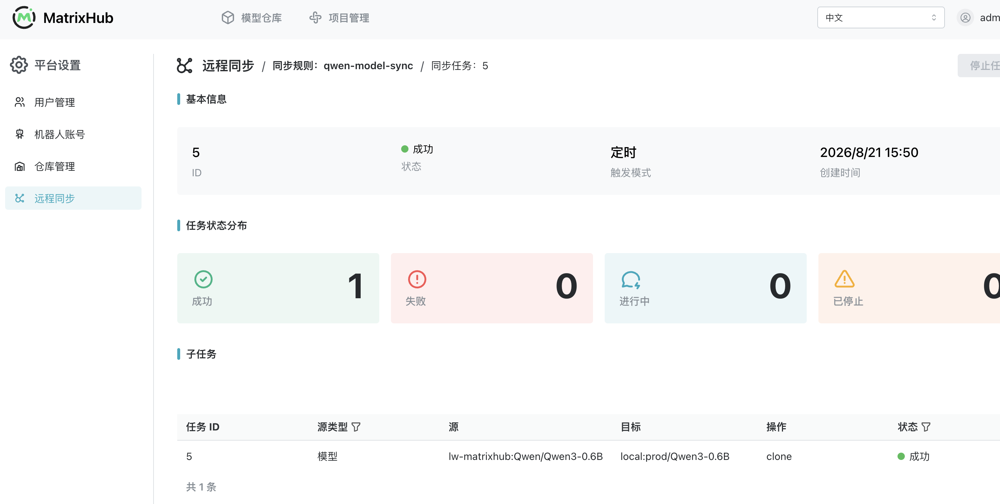

4. When synchronization finishes, inspect the synchronized model files in the target project:

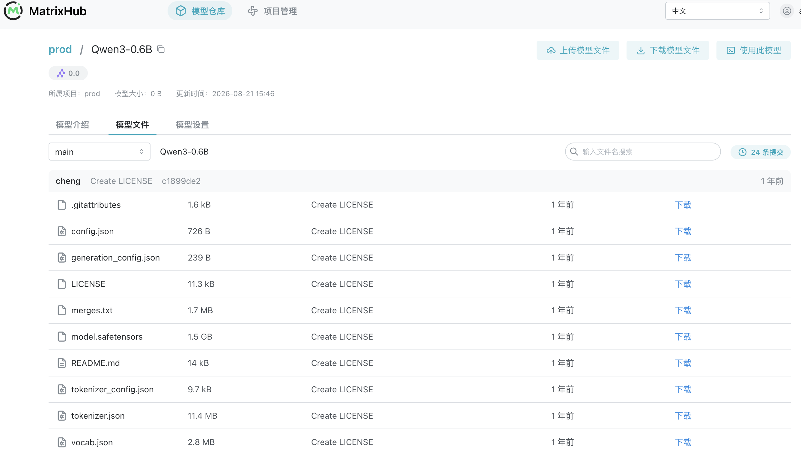

#### Why remote sync matters

Remote sync does more than copy files once. It turns model movement across environments into a **repeatable, controlled, and observable** process.

| Core capability | Problem addressed | Operational value |
| --- | --- | --- |
| Bidirectional movement | Some environments need to pull models in, while others need to push models out | One mechanism covers both model intake and distribution across staging zones, private networks, and multiple data centers |
| Automated execution | Manual copying must be repeated and can easily miss new versions | Scheduled runs and manual triggers reduce repetitive operations and help target environments receive the required versions sooner |
| Controlled transfer | Large model transfers can saturate a link, while name conflicts can overwrite existing assets unexpectedly | Bandwidth limits and overwrite policies make transfers more predictable and reduce their impact on production networks and existing models |
| End-to-end visibility | Manual transfers are opaque, making it difficult to identify which model failed and why | Every sync creates a task and splits execution by model; visible progress and logs make troubleshooting and result review easier |

For example, after caching a new model in an internet-connected staging environment, MatrixHub can synchronize it to the private network on a schedule. The same policy model can keep required model versions aligned across multiple data centers. Once platform administrators configure the policies centrally, model movement no longer depends on temporary scripts or constant manual supervision.

## Conclusion: bring models—and their governance—inside

An enterprise “private Hugging Face” is more than a place to store model files. It is internal model infrastructure that connects **access, governance, and distribution**:

- **Keep familiar workflows:** Development teams continue using Hugging Face tools and point `HF_ENDPOINT` to the internal MatrixHub instance without changing application code.
- **Manage model assets centrally:** In-house and external models, along with their version history, remain on one platform instead of being scattered across personal machines and temporary storage.
- **Define clear permission boundaries:** Project spaces and member roles determine who can see and modify assets, while robot accounts and personal access tokens represent machine and human identities separately.
- **Control movement across environments:** Proxy caching, one-time transfers, and remote sync cover connected, isolated, and multi-data-center environments; bandwidth policies, task progress, and logs keep transfers controlled and observable.

For regulated industries, the goal is not merely to download models faster. Models must be able to **enter the network, remain governed, move efficiently, and leave a trace**. That is the role MatrixHub is designed to play inside the enterprise network.

</div>
