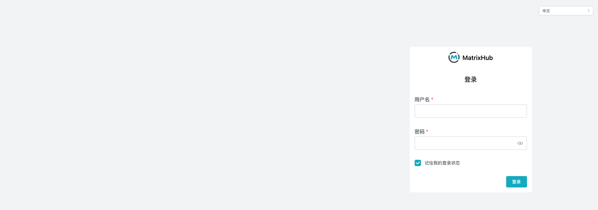
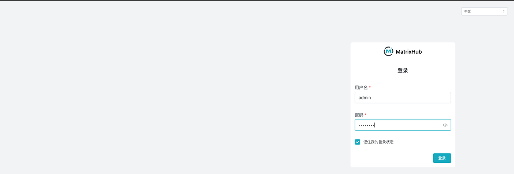
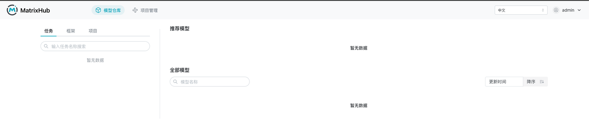
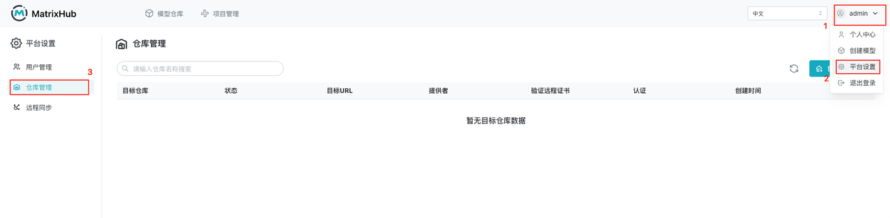
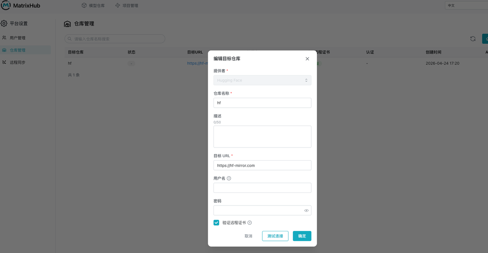
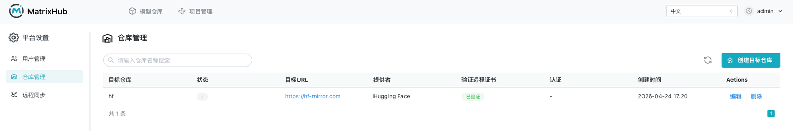
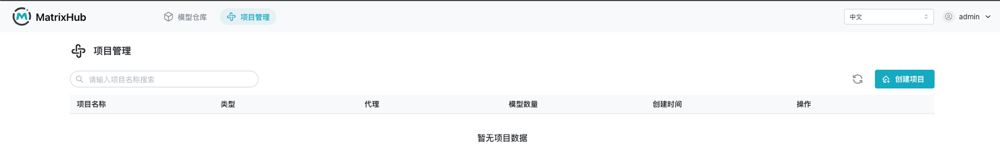
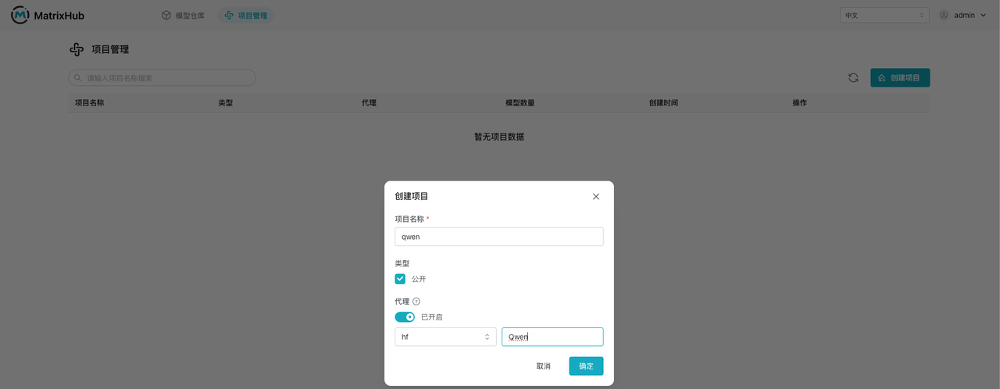
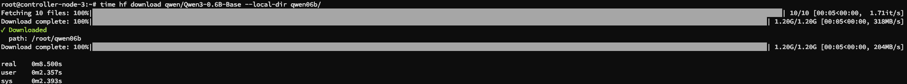
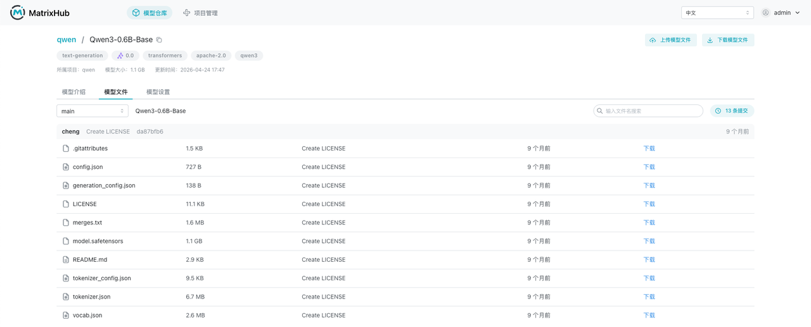

# 示例

这里用于放置 MatrixHub 的中文使用示例。

## 常用场景

### 内网 vLLM 集群的大规模极速分发（内网推理加速）

- **场景描述**：内网生产环境部署了由 100 台 GPU 服务器组成的 vLLM 推理集群。由于模型文件极大（如 70B 权重超过 130GB），若每台机器都去公网 Hugging Face 拉取，不仅耗时很长，还可能触发公网带宽限流。
- **流程概览**：
  1. **统一接入点**：将所有 vLLM 节点的 `HF_ENDPOINT` 环境变量统一指向内网 MatrixHub 地址。
  2. **拉取即缓存**：首台机器请求模型时，MatrixHub 自动从公网拉取并持久化到本地；后续节点请求将直接命中内网缓存。

> **测试场景**：作为用户，我希望将 `hf download` 的 Endpoint 指向 MatrixHub 来下载 Hugging Face 上的公共模型，从而当内网的其它节点或集群在模型已被下载过一次的情况下，下载速度会显著提升。

#### 操作步骤

1. 访问 MatrixHub 地址（`http://x.x.x.x:3001`），进入登录页面。



2. 使用 admin 用户登录平台，进入模型仓库列表。





3. 点击右上角用户 → 平台设置 → 仓库管理。



4. 创建目标仓库：选择提供者（Hugging Face），填写仓库名称（`hf`），输入目标 URL（`https://hf-mirror.com`），勾选验证远程证书，点击“确定”。





5. 选择“项目管理”，进入项目管理列表页面。



6. 点击“创建项目”：输入项目名称（`qwen`），选择类型为公开，开启代理，选择仓库，填写代理组织（`Qwen`），点击“确定”。



7. 进行模型拉取。

   - **第一个节点**：拉取耗时约 3m37.318s（3 分 37 秒）。

```shell
root@controller-node-2:~# export HF_ENDPOINT="http://x.x.x.x:3001"
root@controller-node-2:~# time hf download qwen/Qwen3-0.6B-Base --local-dir qwen06b/
Downloading (incomplete total...):  15%|███████████████████████▌                                                                                                                                        | 1.70M/11.5M [00:00<00:00, 16.3MB/s]Still waiting to acquire lock on qwen06b/.cache/huggingface/.gitignore.lock (elapsed: 0.1 seconds)                                                                                                                    | 0/10 [00:00<?, ?it/s]
Fetching 10 files: 100%|█████████████████████████████████████████████████████████████████████████████████████████████████████████████████████████████████████████████████████████████████████████████████████| 10/10 [03:24<00:00, 20.45s/it]
Download complete: 100%|█████████████████████████████████████████████████████████████████████████████████████████████████████████████████████████████████████████████████████████████████████████████████| 1.20G/1.20G [03:24<00:00, 117MB/s]✓ Downloaded
  path: /root/qwen06b
Download complete: 100%|████████████████████████████████████████████████████████████████████████████████████████████████████████████████████████████████████████████████████████████████████████████████| 1.20G/1.20G [03:24<00:00, 5.88MB/s]

real    3m37.318s
user    0m2.293s
sys     0m2.639s
```


   - **第二个内网节点**：拉取耗时约 0m8.500s（8.5 秒），从分钟级降低到秒级。

```shell
root@controller-node-3:~# export HF_ENDPOINT="http://x.x.x.x:3001"
root@controller-node-3:~# time hf download qwen/Qwen3-0.6B-Base --local-dir qwen06b/
Fetching 10 files: 100%|█████████████████████████████████████████████████████████████████████████████████████████████████████████████████████████████████████████████████████████████████████████████████████| 10/10 [00:05<00:00,  1.71it/s]
Download complete: 100%|█████████████████████████████████████████████████████████████████████████████████████████████████████████████████████████████████████████████████████████████████████████████████| 1.20G/1.20G [00:05<00:00, 318MB/s]✓ Downloaded
  path: /root/qwen06b
Download complete: 100%|█████████████████████████████████████████████████████████████████████████████████████████████████████████████████████████████████████████████████████████████████████████████████| 1.20G/1.20G [00:05<00:00, 204MB/s]

real    0m8.500s
user    0m2.357s
sys     0m2.393s
```



8. 查看 MatrixHub 上的模型信息。


