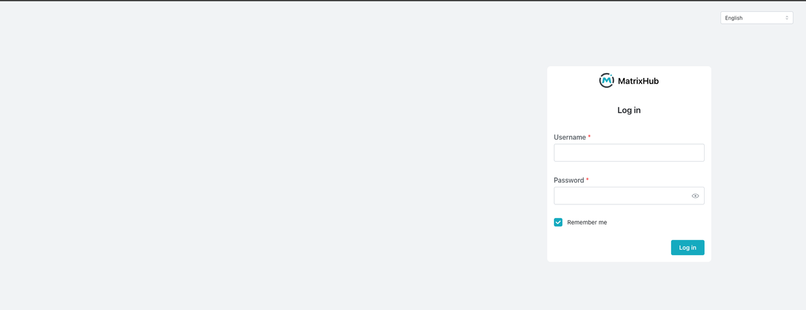
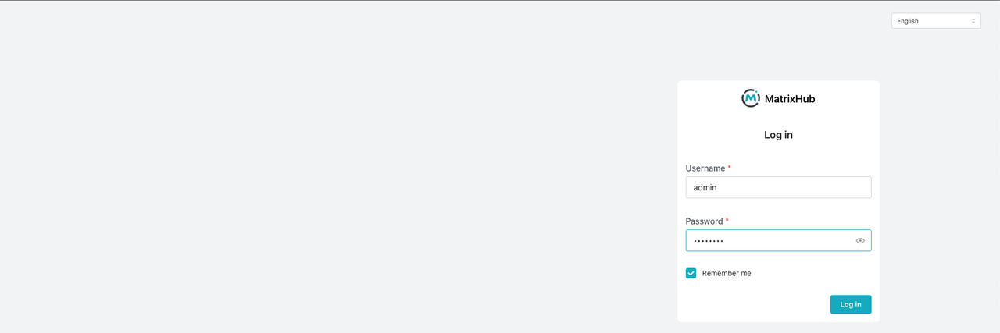
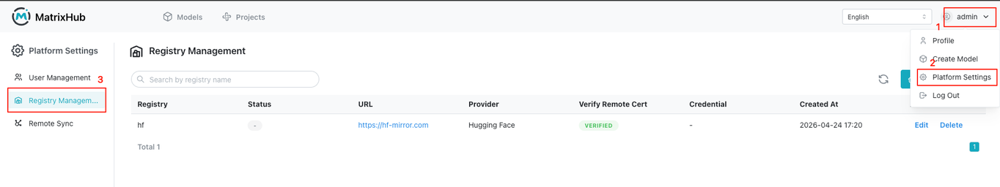
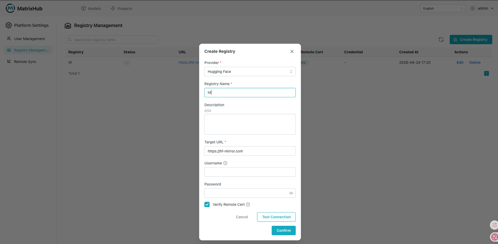
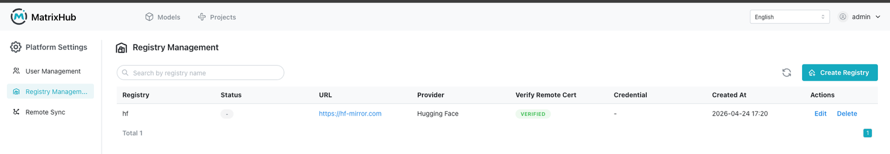
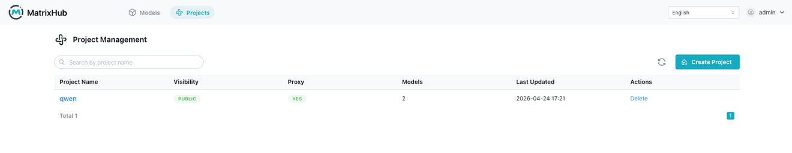
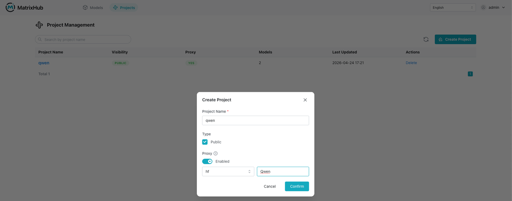
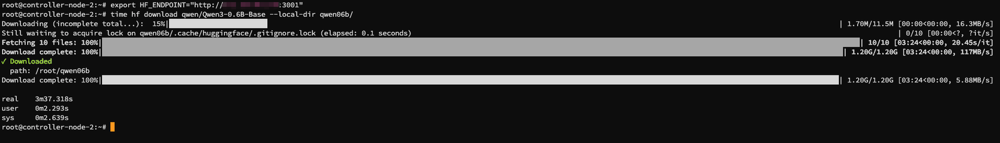
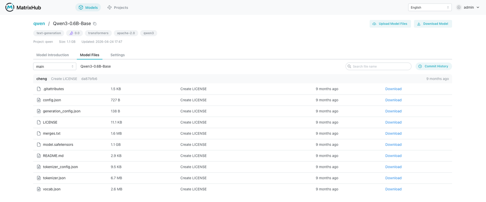

# Examples

Real-world examples of using MatrixHub.

## Common Use Cases

### Intranet vLLM cluster distribution (inference acceleration)

- **Scenario**: A production intranet runs a vLLM inference cluster with 100 GPU servers. Because model files can be huge (for example, a 70B model can exceed 130GB), having every machine pull from public Hugging Face is slow and may trigger outbound bandwidth throttling.
- **Flow overview**:
  1. **Single access point**: Set the `HF_ENDPOINT` environment variable of all vLLM nodes to the internal MatrixHub endpoint.
  2. **Pull once, cache for all**: When the first node requests a model, MatrixHub pulls it from the public network and persists it locally; subsequent nodes hit the intranet cache directly.

> **Test Scenario**: As a user, I want to point the `hf download` endpoint to MatrixHub to download public models from Hugging Face, so that other nodes or clusters in the internal network can download the same model much faster if it has already been downloaded once.

#### Steps

1. Visit the MatrixHub address (`http://x.x.x.x:3001`) and open the login page.

2. Log in as the admin user and open the model repository list.

3. Click the top-right user menu → Platform Settings → Repository Management.

4. Create a target repository: select the provider (Hugging Face), set the repository name to `hf`, enter the target URL (`https://hf-mirror.com`), enable remote certificate verification, and click “OK”.

5. Go to Project Management and open the project list page.

6. Click “Create Project”: set the project name to `qwen`, set it to Public, enable Proxy, select the repository, set the proxy organization to `Qwen`, and click “OK”.

7. Pull the model.

   - **First node**: ~3m37.318s

   - **Second node**: ~0m8.500s

8. View the model information in MatrixHub.

