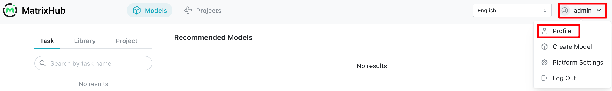
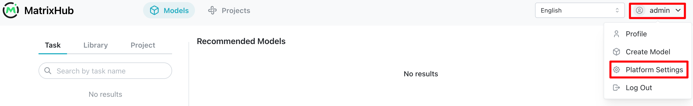
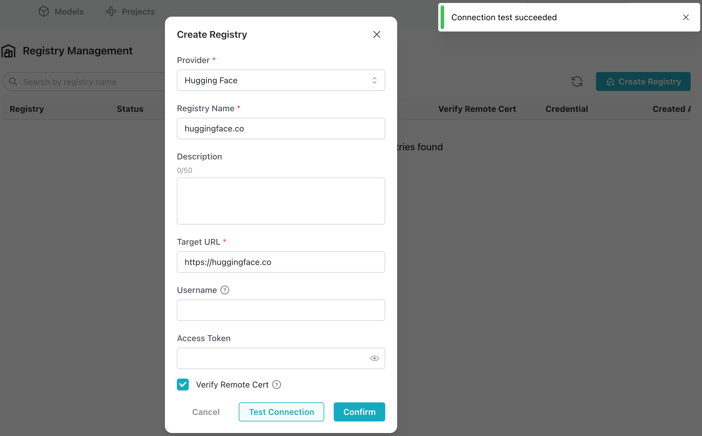
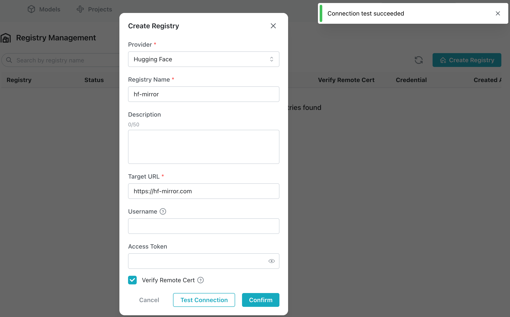
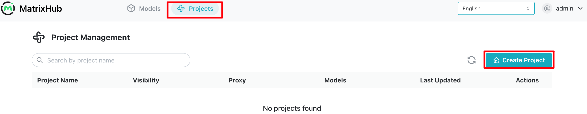
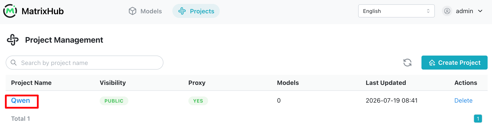
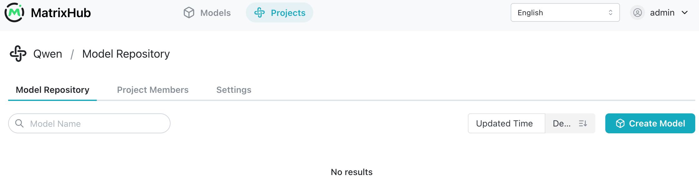
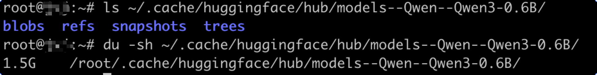
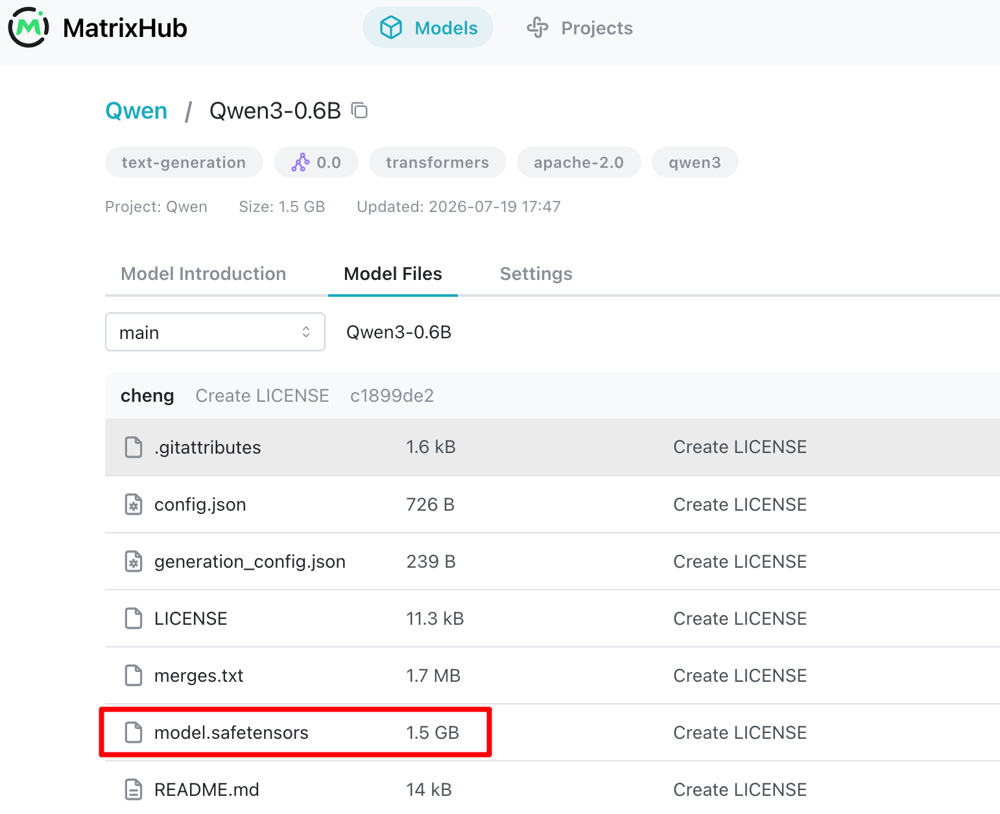
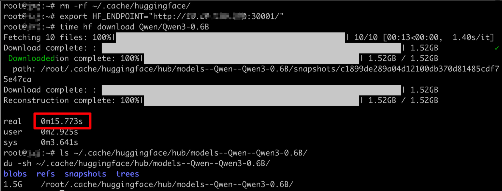

# Cache models through a proxy project

## Goal

This guide introduces on-demand proxy caching. On the first client request, MatrixHub downloads and caches the model from Hugging Face. Later requests load the model directly from the MatrixHub cache.

## Architecture


## Prerequisites

- [MatrixHub is deployed](../installation/index.md). This guide uses `http://192.0.2.10:30001` as the example MatrixHub address.
- Keep the client and MatrixHub on the same internal network when possible.

## Ensure that a target registry and proxy project exist

Open the MatrixHub address in a browser and sign in.

- Username: `admin`
- Password: `changeme`


After signing in, open **Personal Center** and change the password as soon as possible.



### Create a target registry

Select the username in the upper-right corner, then select **Platform Settings**.



Select **Registry Management**, then select **Create Target Registry**.



Select the Hugging Face provider. Enter `hf-mirror` (or `huggingface.co`) as the registry name and `https://hf-mirror.com` (or `https://huggingface.co`) as the target URL. Enable **Verify Remote Certificate**, then select **Test Connection**.



Select **Confirm**. The target registry is created.

### Create a proxy project

Select **Project Management**, then select **Create Project**.



Enter `Qwen` as the project name, select **Public**, enable the proxy, select the `hf-mirror` target registry created earlier, enter `Qwen` as the proxy organization, then select **Confirm**.


Select **Qwen** in the project list to open the project.



The project does not contain a model yet.



## Download a model through MatrixHub on the internal network

### Install the Hugging Face hf CLI

See the [Hugging Face CLI guide](https://huggingface.co/docs/huggingface_hub/guides/cli) for installation information.

```bash
curl -LsSf https://hf.co/cli/install.sh | bash
```

### Point HF_ENDPOINT to MatrixHub

```shell
export HF_ENDPOINT="http://192.0.2.10:30001"
```

### Download Qwen3-0.6B for the first time

```shell
time hf download Qwen/Qwen3-0.6B
```

The first download took a long time because upstream bandwidth was limited: 119 minutes.


View the downloaded model files and their size.

```shell
ls ~/.cache/huggingface/hub/models--Qwen--Qwen3-0.6B/
du -sh ~/.cache/huggingface/hub/models--Qwen--Qwen3-0.6B/
```



The model detail page now shows the model weights and other files.



### Download Qwen3-0.6B again

Delete the locally downloaded model files, then download the model from MatrixHub again.

```shell
rm -rf ~/.cache/huggingface/
export HF_ENDPOINT="http://192.0.2.10:30001"
time hf download Qwen/Qwen3-0.6B
```



The download took approximately 15 seconds, showing that the model was cached in MatrixHub.

## Conclusion

The first on-demand download depends on upstream network speed. Later downloads come directly from the MatrixHub cache and are much faster.
