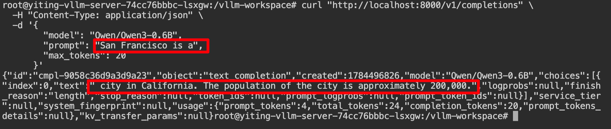

# Load a model into vLLM through MatrixHub

## Goal

Load a model into vLLM through MatrixHub and run a simple inference request.

## Architecture


## Prerequisites

- [MatrixHub is deployed](../installation/index.md) and the model is [cached](./mirror-from-huggingface.md). This guide uses `http://192.0.2.10:30001` as the example MatrixHub address.
- A GPU that meets the model requirements is available.
- The vLLM node and MatrixHub are on the same internal network.

## Deploy vLLM

### Option 1: Deploy vLLM in a container with nerdctl or Docker

- To install the GPU driver, see [Install NVIDIA Container Toolkit for Docker deployment](https://docs.nvidia.com/datacenter/cloud-native/container-toolkit/latest/install-guide.html).
- To deploy vLLM, see [deploy vLLM using Docker](https://docs.vllm.ai/en/latest/deployment/docker/).

The following example deploys vLLM with nerdctl and enters the container.

```shell
nerdctl stop qwen 2>/dev/null || true
nerdctl rm qwen 2>/dev/null || true
nerdctl run -d \
  --gpus device=0 \
  --shm-size 8G \
  --network host \
  --name qwen \
  --entrypoint sleep \
  docker.m.daocloud.io/vllm/vllm-openai:v0.18.0 \
  infinity

nerdctl exec -it qwen -- sh
```

### Option 2: Deploy vLLM on Kubernetes

- To install the GPU driver, see [Install NVIDIA GPU Operator for Kubernetes deployment](https://docs.nvidia.com/datacenter/cloud-native/gpu-operator/latest/getting-started.html).
- To deploy vLLM, see [deploy vLLM using Kubernetes](https://docs.vllm.ai/en/latest/deployment/k8s/).

Example deployment YAML:

```yaml
kubectl apply -f - <<EOF
kind: Deployment
apiVersion: apps/v1
metadata:
  name: vllm-server
  labels:
    app: vllm
spec:
  replicas: 1
  selector:
    matchLabels:
      app: vllm
  template:
    metadata:
      labels:
        app: vllm
    spec:
      volumes:
        - name: shm
          emptyDir:
            medium: Memory
            sizeLimit: 2Gi
      containers:
        - name: vllm
          image: docker.m.daocloud.io/vllm/vllm-openai:v0.18.0
          command:
            - sleep
          args:
            - infinity
          ports:
            - containerPort: 8000
              protocol: TCP
          resources:
            limits:
              memory: 64G
              nvidia.com/gpu: '1'
            requests:
              memory: 6G
              nvidia.com/gpu: '1'
          volumeMounts:
            - name: shm
              mountPath: /dev/shm
EOF
```

Enter the container.

```shell
kubectl exec -it deploy/vllm-server -- sh
```

### Option 3: Deploy vLLM in a Python environment

- To install the GPU driver, see [Install NVIDIA GPU drivers for Python deployment](https://docs.nvidia.com/datacenter/tesla/driver-installation-guide/latest/).
- To deploy vLLM, see [deploy vLLM using Python](https://docs.vllm.ai/en/latest/getting_started/installation/gpu/#set-up-using-python).

## Start vLLM and load the model through MatrixHub

Enter the vLLM runtime, set `HF_ENDPOINT` to the internal MatrixHub address, and start vLLM.

```shell
export HF_ENDPOINT="http://192.0.2.10:30001"
vllm serve Qwen/Qwen3-0.6B --max-model-len 1024
```


The log shows that vLLM downloaded `Qwen/Qwen3-0.6B` through MatrixHub and loaded it successfully. The model weights were approximately 1.5 G. At an internal network speed of 91 M/s, the download took approximately 16 seconds.

## Send a request to the model deployed with vLLM

Open another terminal, enter the vLLM runtime, and call the API.

```shell
curl "http://localhost:8000/v1/completions" \
  -H "Content-Type: application/json" \
  -d '{
        "model": "Qwen/Qwen3-0.6B",
        "prompt": "San Francisco is a",
        "max_tokens": 20
      }'
```

The model returns a response.



## Summary

Set `HF_ENDPOINT` to connect vLLM to MatrixHub and download models over the internal network. Download time depends on the internal network speed.
