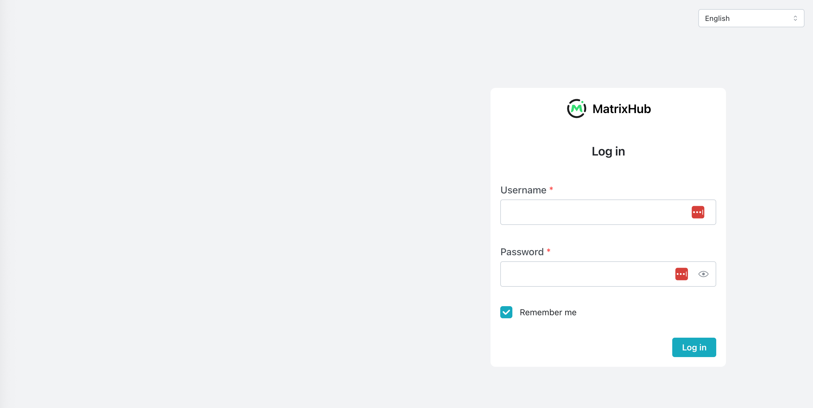

# Log In and Log Out

MatrixHub uses a browser session to keep you authenticated in the web interface. When logging in, you can choose whether the session should remain available after the browser is closed.

## Prerequisites

- Obtain the URL of your MatrixHub instance, for example `http://127.0.0.1:3001`.
- Obtain an active MatrixHub username and password from your platform administrator.

## Log In

1. Open the MatrixHub URL in a browser. If you are not authenticated, MatrixHub redirects you to the login page.
1. Select the interface language in the upper-right corner if needed.
1. Enter your **Username** and **Password**. Use the icon in the password field to show or hide the password.
1. Select or clear **Remember me** according to the session behavior described below.
1. Click **Log in** or press Enter. After successful authentication, MatrixHub opens the home page.

If the username or password is incorrect, MatrixHub remains on the login page. Verify the credentials and try again. Passwords are case-sensitive.

## What Does "Remember Me" Mean?

**Remember me** controls how long the browser session can remain available. It does not save or autofill your username or password.

| Setting | Default Session Behavior |
|---------|--------------------------|
| Selected | The session is stored in a persistent cookie, so you can remain logged in after closing and reopening the browser. The session expires after 7 days without activity and has an absolute maximum lifetime of 30 days. Authenticated activity resets the 7-day idle timer but does not extend the 30-day maximum. |
| Cleared | The session cookie lasts only for the current browser session. Completely closing the browser ends the session. If the browser remains open, the session expires after 8 hours without authenticated activity. |

:::note

- **Remember me** is selected by default on the login page.
- The session durations above are MatrixHub defaults. A platform administrator can change them in the deployment configuration.
- Closing only one tab may not end a non-persistent session if other windows from the same browser remain open.

:::

When a session expires, the next request redirects you to the login page and you must enter your credentials again.

## Log Out

1. Click your username in the upper-right corner to open the account menu.
1. Click **Log Out**. MatrixHub invalidates the current session and returns you to the login page.

Logging out always ends the current browser session, including sessions created with **Remember me** selected.

If you use MatrixHub on multiple browsers or devices, log out from each session separately. Changing your password, or having a platform administrator reset it, invalidates existing sessions and requires you to log in with the new password.

## Troubleshooting

| Problem | Suggested Action |
|---------|------------------|
| The login page reports incorrect credentials | Check the username and password, including letter case. If the password was reset, use the new password. |
| You are redirected to the login page while working | The session may have expired or been invalidated by a password change. Log in again. |
| You remain logged in after reopening the browser | **Remember me** was likely selected. Use **Log Out** when you have finished, especially on a shared device. |
| You cannot access an administration page after login | Your account may not be a platform administrator. Contact a platform administrator if you need additional permissions. |
