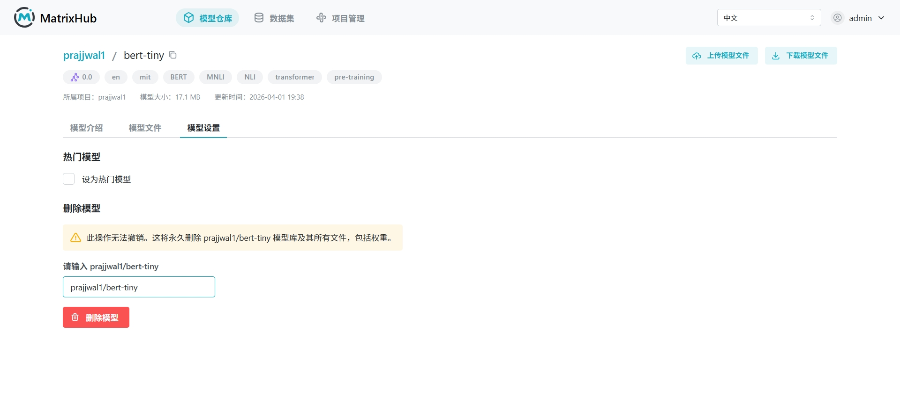

# Model settings

Only members with **admin** or **project admin** permissions can edit the **Model settings** tab.

## Set as featured model

1. Open the target model’s detail page and switch to **Model settings** .

1. Enable **Set as featured model** .

1. After saving, confirm the model appears under **Model repository** -> **Featured models** .

    

:::note

- When featured, platform users can see the model in the featured list.

:::

## Delete model

1. Open the target model’s detail page and switch to **Model settings** .

1. Enter the project name/model name in the field to delete the model.

:::warning

Deleting a model cannot be undone. Back up before proceeding.

:::
