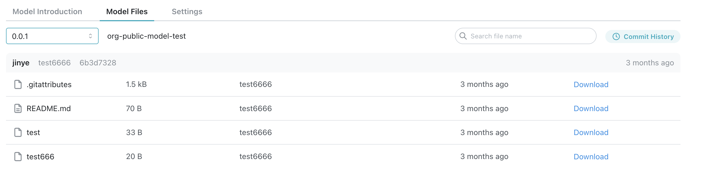

# Command Line Upload and Download

## Prerequisites

- A valid MatrixHub account.
- Joined the target public project. Downloading models requires Project Admin, Editor, or Viewer permissions; uploading models requires Project Admin or Editor permissions.
- To use a proxy project, an available target registry must already exist. To create one, see [Registry Management](../platform-settings/registry-management.md).
- Hugging Face CLI installed locally (`hf` command available).
- Network access to the MatrixHub service endpoint.

## Uploading Models

Uploading models can only be performed by project **Admins** and **Editors**.

1. Log in to the platform, go to **Project Management**, and select the target project.
1. Open the **Model Repository** tab and click **Create Model**.

    

1. Fill in the model name, confirm creation, and enter the model details page.

    

1. Configure the service endpoint in your local terminal.

    ```bash
    export HF_ENDPOINT="https://<your-matrixhub-endpoint>"
    ```

1. Use `hf upload` to upload the local model directory.

    ```bash
    hf upload <project-name>/<model-name> ./<local-model-dir> .
    ```

1. Return to the model details page and refresh to confirm the uploaded files appear in the list.

    

:::note

- If the model name is already taken, please choose a different name and try again.
- Uploading large models for the first time may take a while; please wait for the command to complete.

:::

## Downloading Models

Downloading models can be performed by project **Admins**, **Editors**, and **Viewers**.

1. Enter the target model details page and click **Download Model**.
1. Copy the download command from the popup and execute it in your local terminal.

    ```bash
    export HF_ENDPOINT="https://<your-matrixhub-endpoint>"
    hf download <project-name>/<model-name>
    ```

1. After the command completes, the terminal will output the download directory path.
1. Open the local download directory and verify that the model files are complete and usable.

## Proxy Project Download

1. Create a proxy project first (e.g., `Qwen`).

    

1. Configure the MatrixHub service endpoint. MatrixHub accesses the configured target registry through the proxy project.

    ```bash
    export HF_ENDPOINT="https://<your-matrixhub-endpoint>"
    ```

1. Download a model from the proxy project (example).

    ```bash
    hf download Qwen/Qwen3-0.6B
    ```

:::note

- Once the proxy project is created, you can access models in the target registry through MatrixHub using `hf download`.
- Proxy projects do not support `hf upload`.

:::

## Model Files


### Downloading Single Model Files

1. Enter the model details page and switch to the **Model Files** tab.
1. Click **Download** on the target file's row.
1. After the browser completes the download, open the file to verify the content.

### File Search and Browsing

1. Use the search box in the **Model Files** page to enter keywords (e.g., `.git`, `tokenizer`).
1. Observe the filtered results to ensure the returned files match expectations.
1. If there are many files, click **Load More** to view the full list.

### Branch/Version Switching

1. Enter the **Model Files** page of the model details.
1. Select the target branch in the branch selector (for example, `main`, `0.0.1`, or `0.0.2`).

    

1. Verify that the file list after switching matches the content of that branch.

    
