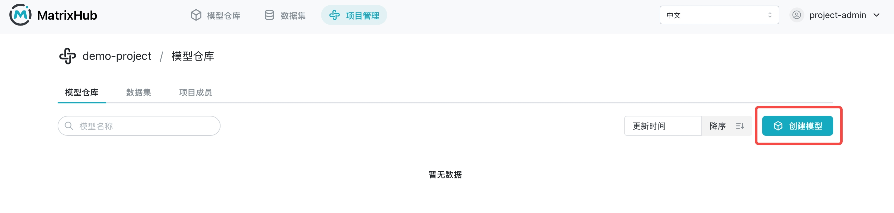

# Operations Overview

Welcome to the MatrixHub operation documentation. This section provides detailed guides on how to manage your projects, assets, and platform settings.

MatrixHub simplifies the transition from public model repositories to production-grade infrastructure:

- **Private Model Hosting**: Securely store fine-tuned model weights with version control.
- **High-speed Cache Distribution**: Accelerate model distribution via P2P technology to reduce bandwidth costs.
- **Project Collaboration**: Manage teams and permissions across different AI initiatives.

