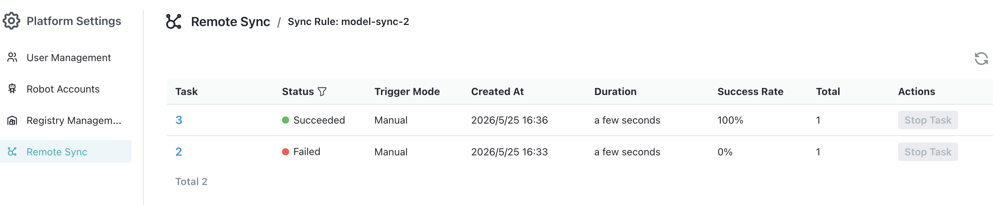

# Remote Synchronization

Remote Synchronization syncs models between the current MatrixHub instance and a remote registry. The remote registry can be an external model source or another accessible MatrixHub instance, depending on the connection configured in **Registry Management**. A sync policy supports two directions:

- **Pull:** Sync resources from a configured remote registry into the current MatrixHub instance.
- **Push:** Sync resources from the current MatrixHub instance to a configured remote registry.

A policy can be triggered manually or scheduled with a cron expression. Each run creates a sync task, and the task is split into sync jobs by matched models.

## Prerequisites

- **Permissions:** Only Platform Admins can create, edit, delete, and run remote sync policies.
- **Registry connection:** Create an available registry connection in [Registry Management](./registry-management.md). Pull requires a source registry, and push requires a target registry.
- **Target project:** Confirm the project name where the sync result will be written.
- **Schedule:** If you select scheduled execution, prepare a five-field cron expression in the format `minute hour day month weekday`.

## Steps

1. Log in to MatrixHub with an admin account, go to **Platform Management** in the navigation (or **Platform Settings** under the **Admin** dropdown), and open the **Remote Synchronization** page.

    

1. Click **Create** and complete the sync policy configuration in the modal.

    - Fill in **Name** and **Description**.
    - Select the **Sync Rule**, then select the corresponding **Source Registry** or **Target Registry**.
    - Configure **Resource Filter**, **Target Project**, **Trigger Mode**, **Bandwidth Limit**, and **Overwrite Existing Resources**.

    

    Use the following examples as a reference. Replace the registry, project, and resource names with values from your own environment.

    | Scenario | Reference Configuration |
    |----------|-------------------------|
    | Pull a single model from a remote registry | Sync Rule: Pull Source Registry: `matrixhub-remote` Resource Name: `Qwen/Qwen3-0.6B` Resource Type: Model Target Project: `demo` Trigger Mode: Manual Bandwidth Limit: `-1` |
    | Pull models from a remote registry in batch | Sync Rule: Pull Source Registry: `matrixhub-remote` Resource Name: `Qwen/**` Resource Type: Model Target Project: `demo` Trigger Mode: Scheduled Cron: `0 0 * * *` Bandwidth Limit: `1024 Kbps` |
    | Push a local model to a remote registry | Sync Rule: Push Target Registry: `matrixhub-remote` Resource Name: `demo/Qwen3-0.6B` Resource Type: Model Target Project: `test-org` Trigger Mode: Manual Bandwidth Limit: `-1` |

1. Click **Confirm** to create the policy. After creation, you can **Sync**, **Edit**, **Enable/Disable**, or **Delete** the policy from the list.

## Tasks and Logs

- Clicking **Sync** creates a sync task immediately. Task statuses include **Pending**, **Running**, **Succeeded**, **Failed**, and **Stopped**.

    

- A sync task contains one or more sync jobs. Pull jobs use the action `clone`; push jobs use the action `push`.
- In the task details, you can view each job's model information, source location, target location, execution status, and logs.

    

- When you stop a running task, MatrixHub cancels in-flight jobs and marks unfinished jobs as stopped.

## Configuration Parameters

| Parameter | Description |
|-----------|-------------|
| Name / Description | Used to identify the sync policy. The name must be at least 2 characters, contain only lowercase letters, numbers, dots, underscores, and hyphens, and start with a lowercase letter or number. Description is optional, up to 50 characters. |
| Sync Rule | Select the direction: **Pull** or **Push**. The direction cannot be changed after creation. |
| Source / Target Registry | Pull uses a source registry. Push uses a target registry. Registry connections are maintained in **Registry Management**. |
| Resource Name | The model path to sync, such as `Qwen/Qwen3-0.6B`. Pull supports `*`, `**`, or `Qwen/**` for batch matching. |
| Resource Type | Currently only **Model** is supported. |
| Target Project | For pull, this is a project in the current MatrixHub instance. For push, this is a project in the remote registry. |
| Trigger Mode / Cron | Run manually or on a five-field cron schedule. Cron is required only for scheduled policies. |
| Bandwidth Limit | `-1` means unlimited. You can also enter a value in `Kbps` or `Mbps` using the page unit. |
| Overwrite Existing Resources | When enabled, models with the same name are overwritten by the sync result. When disabled, existing models are not overwritten. |
| Enabled State | When disabled, scheduled policies will not trigger automatically. |
