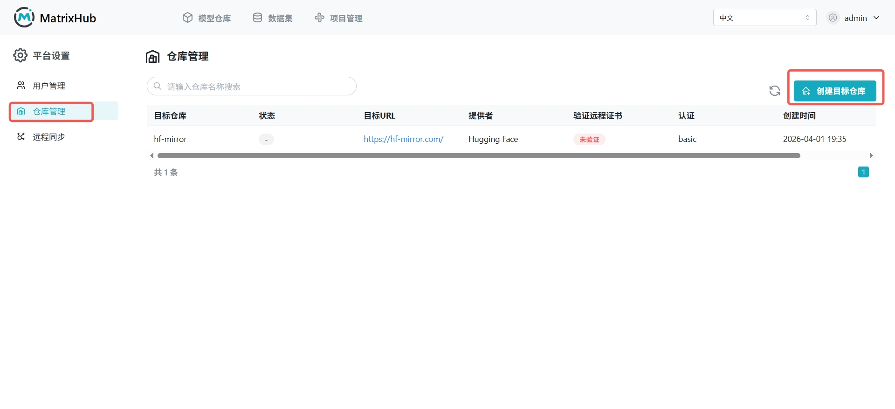
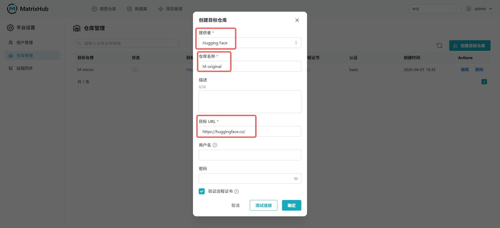

# Repository Management

## Prerequisites

- You must be a **Platform Admin**.

## Steps

1. Navigate to **Platform Settings** -> **Repository Management**.

    

1. Click **Create Repository**, enter the repository name and storage configuration, then click **Confirm**.

    

