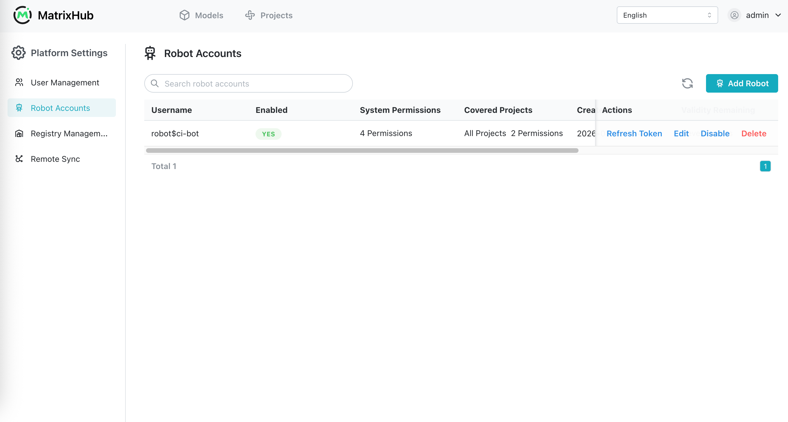
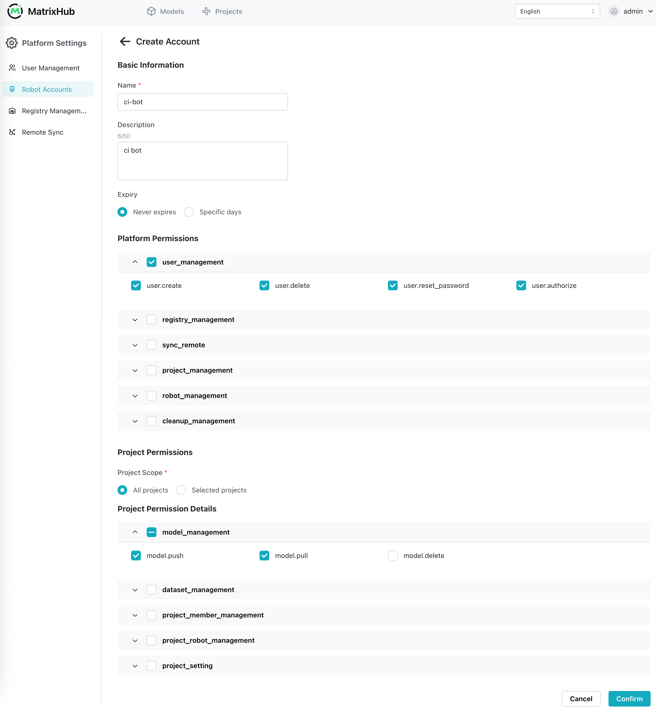
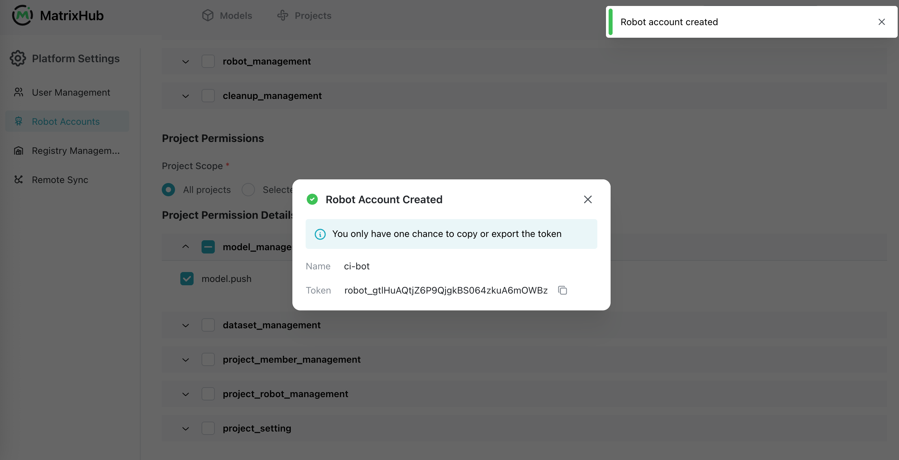
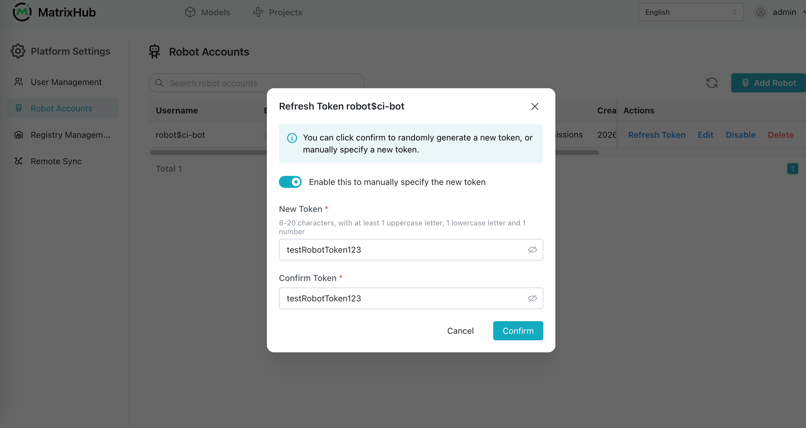

# Robot Accounts

Robot accounts are non-human identities intended for automation, CI/CD jobs, and service-to-service access. Each robot account has its own token, validity period, enabled state, and fine-grained system and project permissions.

## Prerequisites

- Log in to MatrixHub with a platform administrator account.
- Identify the minimum system and project permissions required by the automation.
- If project permissions apply only to selected projects, create those projects before creating the robot account.

## Robot Account List

Go to **Platform Settings** -> **Robot Accounts**. The list displays the following information:

| Parameter | Description |
|-----------|-------------|
| Username | The account identifier. MatrixHub automatically adds the `robot$` prefix to the name entered during creation. |
| Enabled | Whether the account can authenticate and access resources. |
| System Permissions | The number of configured platform-level permissions. |
| Covered Projects | Whether project permissions apply to all projects or selected projects, together with the number of configured project permissions. |
| Created At | The time the robot account was created. |
| Validity Remaining | The remaining validity period, **Never Expires**, or **Expired**. |
| Description | The purpose or usage description of the account. |
| Actions | Supports **Refresh Token**, **Edit**, **Enable/Disable**, and **Delete**. |

Use the search box to filter robot accounts by name.



## Create a Robot Account

1. On the **Robot Accounts** page, click **Add Robot**.
1. Under **Basic Information**, enter a unique name and an optional description.
1. Set **Expiry** to **Never expires** or **Specific days**. When using a specific duration, enter at least `1` day.
1. Under **Platform Permissions**, select only the system operations required by the robot account.
1. Under **Project Permissions**, choose a project scope:

    - **All projects:** The selected project permissions apply to every project.
    - **Selected projects:** Select one or more existing projects. The configured project permissions apply only to those projects.

1. Under **Project Permission Details**, select the required permissions for models, datasets, project members, project robot accounts, and project settings.
1. Click **Confirm**. New robot accounts are enabled immediately.



After the account is created, MatrixHub displays its token once. Copy it immediately and store it in a secret manager or another secure location. The token cannot be viewed again after the dialog is closed.



:::note

The account username is `robot$<name>`. For example, entering `ci-bot` creates the username `robot$ci-bot`.

:::

## Use a Robot Account

Use the robot username and token as HTTP Basic Authentication credentials when calling the MatrixHub API. The following example creates a user and therefore requires the robot account to have the corresponding user-management permission:

```bash
curl --request POST 'http://<matrixhub-endpoint>/api/v1alpha1/users' \
  --header 'Content-Type: application/json' \
  --user 'robot$ci-bot:<robot-token>' \
  --data '{
    "username": "example-user",
    "password": "<initial-password>",
    "is_admin": false
  }'
```

For model operations with the Hugging Face CLI, configure the MatrixHub endpoint, run `hf auth login`, and paste an automatically generated robot token when prompted:

```bash
export HF_ENDPOINT="http://<matrixhub-endpoint>"
hf auth login
hf download <project>/<model>
```

The request succeeds only when the account is enabled, its token has not expired, and its assigned permissions cover the requested operation and project.

## Edit a Robot Account

1. Find the account and click **Edit**.
1. Update its description, expiry, system permissions, project scope, or project permissions. The account name cannot be changed.
1. Click **Confirm**. Permission changes take effect immediately.

Follow the principle of least privilege: grant only the permissions and project scope required by the automation.

## Refresh a Token

1. Find the account and click **Refresh Token**.
1. Choose one of the following methods:

    - Keep manual specification disabled and click **Refresh Token** to let MatrixHub generate a new token.
    - Enable manual specification, then enter and confirm a token containing 8–20 characters, including at least one uppercase letter, one lowercase letter, and one number.

1. Copy the new token from the success dialog and update every client that uses the account.



Refreshing the token invalidates the previous token immediately. Token-only clients such as the Hugging Face CLI require an automatically generated robot token; custom tokens should be used with the robot username through HTTP Basic Authentication.

## Enable, Disable, or Delete an Account

- **Disable:** Click **Disable** and confirm. Authentication with the account stops immediately, while its configuration remains available.
- **Enable:** Click **Enable** and confirm. The account can authenticate again if its token is still valid.
- **Delete:** Click **Delete** and confirm. The account and its credentials are permanently removed.

:::warning

Disabling, deleting, or refreshing a robot account can interrupt automation that uses its token. Update or stop dependent jobs before performing these operations.

:::

## Configuration Parameters

| Parameter | Description |
|-----------|-------------|
| Name | Required and unique. MatrixHub stores and displays it with the `robot$` prefix. It cannot be changed after creation. |
| Description | Optional description of the account's purpose, up to 50 characters. |
| Expiry | **Never expires** or a validity duration of at least 1 day. Expired accounts cannot authenticate. |
| Platform Permissions | Fine-grained permissions for platform-level operations such as user, registry, synchronization, project, robot-account, and cleanup management. |
| Project Scope | Applies the selected project permissions to **All projects** or **Selected projects**. |
| Projects | Existing projects covered when **Selected projects** is used. |
| Project Permissions | Fine-grained permissions for model, dataset, member, project robot-account, and project-setting operations. |
| Token | The secret used to authenticate the robot account. It is displayed in full only after creation or token refresh. |
