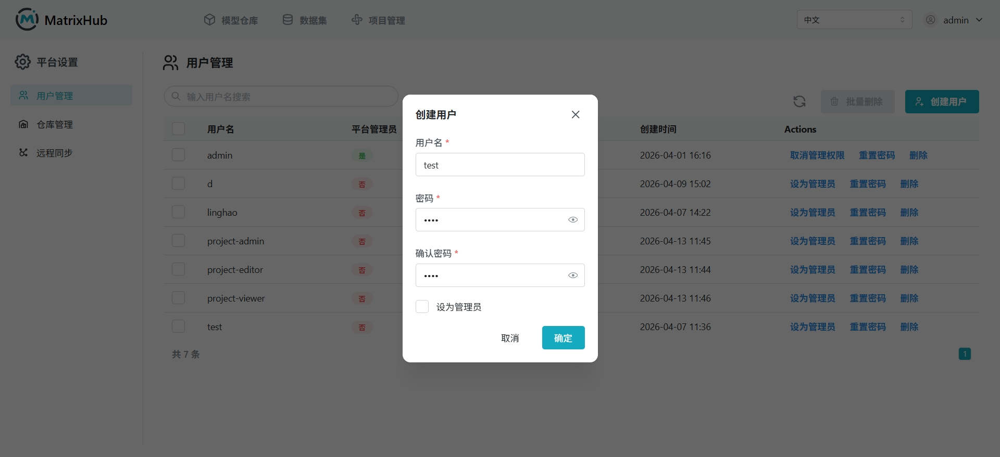

# User Management

## Prerequisites

- You must be an **Organization Admin** or **Platform Admin**.

## Steps

### Create User

1. Log in to MatrixHub and navigate to **Platform Settings** -> **User Management**.

    

1. Click **Create User**, fill in the username, email, and initial password, then click **Confirm**.

    

### Reset Password

1. Find the target user in the list, click **Reset Password**, enter the new password, and confirm.

    

