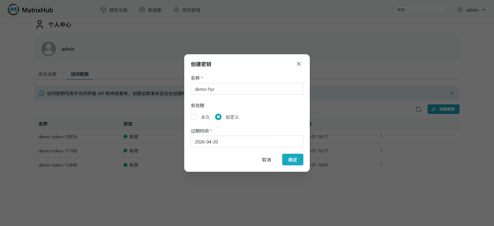
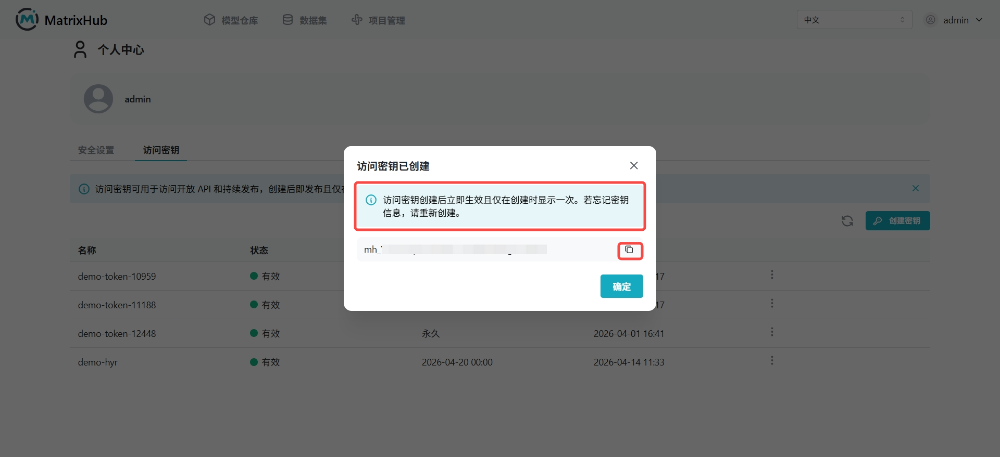

# Access Token

## Prerequisites

- A valid MatrixHub account.
- Hugging Face CLI installed locally (`hf` command available). Login via `hf auth login`.

## Steps

### Create Access Token

1. Log in to the MatrixHub platform. Go to **Personal Center** -> **Access Token** page.

    

1. Click **Create Access Token**, fill in a name (e.g., `demo`), select the expiration time, and click **Confirm**.

    

1. Once created, a window will pop up displaying the Token. **Copy and save it immediately**, as it will not be shown again.

    

### Use Access Token

1. Configure the service endpoint in your local terminal.

    ```bash
    export HF_ENDPOINT="https://<your-matrixhub-endpoint>"
    ```

1. Run the login command.

    ```bash
    hf auth login
    ```

1. Enter your saved Token when prompted.

1. Once logged in, you can access private projects in **MatrixHub** via the CLI.

    ```bash
    hf download <project-name>/<model-name>
    ```

### Revoke Access Token

1. Go to **Personal Center** -> **Access Token** page, find the Token you want to revoke, and click **Delete**.

1. Once revoked, any CLI operations using that Token will fail immediately.

## Parameters

| Parameter | Description |
|-----------|-------------|
| Name | A descriptive name for the Token. |
| Expiration | The duration the Token remains valid. |
| Token Value | The actual secret string used for authentication. |

