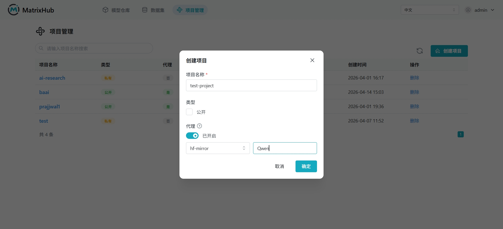

# Create and Delete Projects

## Prerequisites

- Logged into MatrixHub.
- To create a project, you need the **Organization Admin** or **Project Creator** role, or be part of an organization that allows project creation.

## Steps

1. In the navigation bar, click **Project Management**. You will see the project list.

    

1. Click **Create Project**, fill in the project name, select the project type (Regular or Proxy), and click **Confirm**.

    

1. Once created, you will be redirected to the project detail page. You can now start adding members or uploading models/datasets to the **Project Repository**.

1. To delete a project, go to the project detail page, click **Settings**, and select **Delete Project**.

:::warning

Deleting a project is irreversible. It will delete all models, datasets, and member relationships within the project. Please back up important data beforehand.

:::

## Configuration Parameters

| Parameter | Description |
|-----------|-------------|
| Project Name | A unique identifier for the project. Can contain letters, numbers, and hyphens. |
| Project Type | **Regular**: Standard project for hosting local models. **Proxy**: Projects that mirror external repositories like Hugging Face. |
| Organization | The organization or workspace the project belongs to. |

