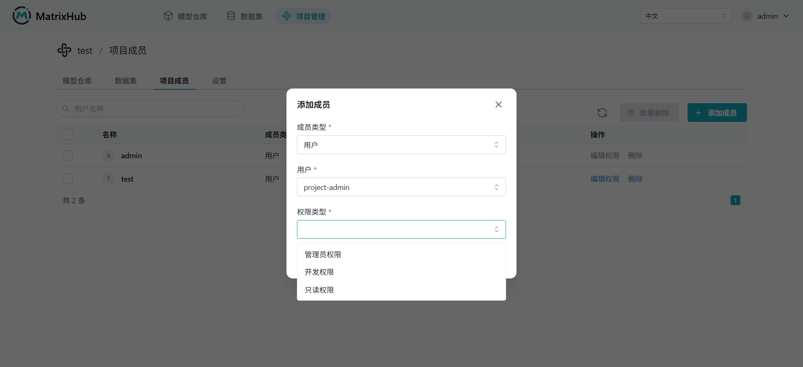
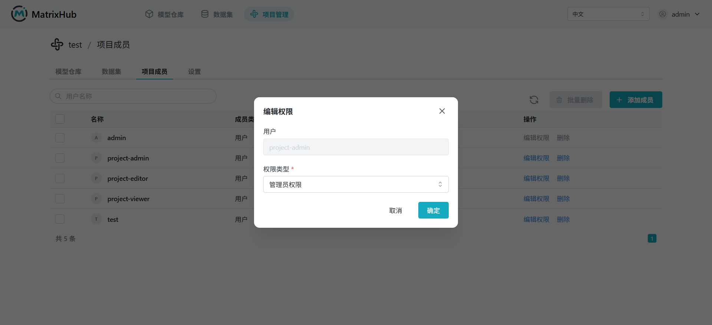

# Project Members

## Prerequisites

- You must be a **Project Admin** or **Organization Admin** to manage project members.

## Steps

1. Log in to MatrixHub, go to **Project Management**, select the target project, and click the **Project Members** tab.

    

1. Click **Add Member**, enter the user's name or email, select the role, and click **Confirm**.

    

1. To change a member's role or remove them, click **Edit** or **Remove** on the member's row.

    

## Role Permissions

| Role | Description |
|------|-------------|
| Project Admin | Full access to the project, including managing members and settings. |
| Developer | Can upload, download, and manage models and datasets. |
| Viewer | Read-only access to models and datasets. |

