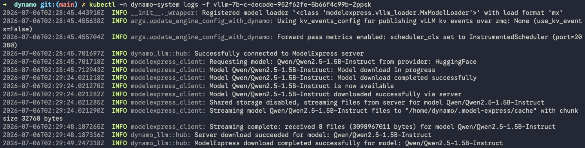
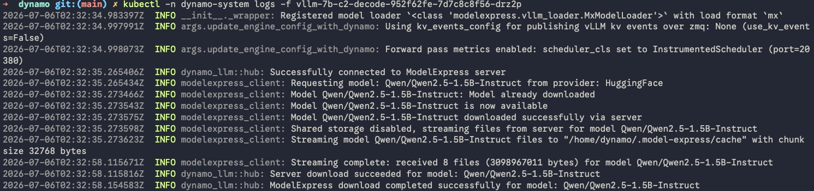

当推理服务扩容到多个 Worker 时，每个新 Worker 都会从模型仓库下载完整模型。对于 3 GB 的模型，每个 Worker 会增加 30–40 秒；对于 70B 模型，每个 Worker 则可能要多等 10 分钟以上。

[ModelExpress](https://docs.nvidia.com/dynamo/kubernetes-deployment/model-loading/model-express) 是 NVIDIA Dynamo 中的模型分发缓存层，位于 Worker 与模型来源（MatrixHub 或 Hugging Face）之间。第一个 Worker 会触发下载并将模型写入 ModelExpress 缓存；之后的 Worker 都从该缓存获取模型，无需再次下载。

本次测试为 `Qwen/Qwen2.5-1.5B-Instruct`（约 3 GB）部署两个 Dynamo vLLM Worker，对比第一个 Worker（缓存未命中）和第二个 Worker（缓存命中）的模型获取耗时。

{/* truncate */}

## 环境

| 组件 | 配置 |
|---|---|
| GPU | HAMi vGPU |
| 模型 | Qwen/Qwen2.5-1.5B-Instruct（约 3 GB） |
| ModelExpress | v0.3.0 |
| MatrixHub | 私有部署、兼容 Hugging Face 的 Endpoint |
| 存储模式 | `NO_SHARED_STORAGE=1`（gRPC 流式传输） |

## 工作原理

```
┌──────────┐     ┌──────────────┐     ┌────────────┐
│ Worker 1 │────▶│ ModelExpress │────▶│ MatrixHub  │
│ Worker 2 │────▶│   （缓存）   │     │  （仓库）   │
│ Worker N │────▶│              │     └────────────┘
└──────────┘     └──────────────┘
```

- **第一次请求：** ModelExpress 从 MatrixHub 下载模型到本地缓存，再通过 gRPC 将文件流式传输给请求该模型的 Worker。
- **后续请求：** ModelExpress 直接从本地缓存流式传输文件，不再从 MatrixHub 下载。

相较于仅使用 MatrixHub 的方案（Blog 1），Decode 组件需要额外配置三个环境变量：

- `VLLM_PLUGINS=modelexpress`：启用 ModelExpress vLLM 插件。
- `MODEL_EXPRESS_NO_SHARED_STORAGE=1`：使用 gRPC 流式传输，而非共享文件系统。
- `MODEL_EXPRESS_URL`：ModelExpress Server 地址。

## 部署文件

### Worker 1：dgd-blog2-c-mx.yaml

```yaml
apiVersion: nvidia.com/v1beta1
kind: DynamoGraphDeployment
metadata:
  name: vllm-7b-c
  namespace: dynamo-system
spec:
  components:
    - name: Frontend
      type: frontend
      replicas: 1
      podTemplate:
        spec:
          containers:
            - name: main
              image: nvcr.io/nvidia/ai-dynamo/vllm-runtime:latest
              workingDir: /workspace
              env:
                - name: HF_ENDPOINT
                  value: "http://<matrixhub-endpoint>"
              command: ["python3", "-m", "dynamo.frontend"]
              args: ["--http-port", "8000"]
              resources:
                requests:
                  cpu: "2"
                  memory: "4Gi"
                limits:
                  cpu: "2"
                  memory: "4Gi"
    - name: decode
      type: decode
      replicas: 1
      podTemplate:
        spec:
          containers:
            - name: main
              image: nvcr.io/nvidia/ai-dynamo/vllm-runtime:latest
              workingDir: /workspace
              env:
                - name: HF_ENDPOINT
                  value: "http://<matrixhub-endpoint>"
                - name: VLLM_PLUGINS
                  value: "modelexpress"
                - name: MODEL_EXPRESS_NO_SHARED_STORAGE
                  value: "1"
                - name: MODEL_EXPRESS_URL
                  value: "http://<modelexpress-service>:8001"
              command: ["python3", "-m", "dynamo.vllm"]
              args:
                - --model
                - Qwen/Qwen2.5-1.5B-Instruct
                - --served-model-name
                - Qwen/Qwen2.5-1.5B-Instruct
                - --tensor-parallel-size
                - "1"
                - --gpu-memory-utilization
                - "0.85"
                - --max-model-len
                - "8192"
                - --no-enable-log-requests
              resources:
                requests:
                  cpu: "4"
                  memory: "16Gi"
                  nvidia.com/vgpu: "1"
                  nvidia.com/gpucores: "30"
                  nvidia.com/gpumem: "10000"
                limits:
                  cpu: "4"
                  memory: "16Gi"
                  nvidia.com/vgpu: "1"
                  nvidia.com/gpucores: "30"
                  nvidia.com/gpumem: "10000"
```

### Worker 2：dgd-blog2-c2-mx.yaml

Worker 2 是一个独立的 DynamoGraphDeployment，配置与 Worker 1 相同，仅名称不同（`vllm-7b-c2`）。完整 YAML 只有 `metadata.name` 不同。

## 清理 ModelExpress 缓存

ModelExpress 将模型文件存放在 PVC（`local-path`）上。仅重启 Pod 不会删除缓存文件。要从干净状态开始测试，执行：

```bash
kubectl exec -n model-express deploy/model-express-modelexpress \
  -- rm -rf /root/models--Qwen--Qwen2.5-1.5B-Instruct /root/blobs

kubectl rollout restart deployment/model-express-modelexpress -n model-express
kubectl rollout status deployment/model-express-modelexpress -n model-express
```

验证缓存已清理：

```bash
kubectl exec -n model-express deploy/model-express-modelexpress \
  -- ls /root/models--Qwen--Qwen2.5-1.5B-Instruct
# 预期：ls: cannot access ... No such file or directory
```

## 部署 Worker 1

```bash
kubectl apply -f dgd-blog2-c-mx.yaml
kubectl get pods -n dynamo-system -o wide -w
```

查看 Decode Pod 日志：

```bash
kubectl logs -n dynamo-system -f <c-decode-pod>
```

```
2026-07-06T02:28:45 INFO dynamo_llm::hub: Successfully connected to ModelExpress server
2026-07-06T02:28:45 INFO modelexpress_client: Requesting model: Qwen/Qwen2.5-1.5B-Instruct from provider: HuggingFace
2026-07-06T02:28:45 INFO modelexpress_client: Model Qwen/Qwen2.5-1.5B-Instruct: Model download in progress
2026-07-06T02:29:24 INFO modelexpress_client: Model Qwen/Qwen2.5-1.5B-Instruct: Model download completed successfully
2026-07-06T02:29:24 INFO modelexpress_client: Shared storage disabled, streaming files from server for model Qwen/Qwen2.5-1.5B-Instruct
2026-07-06T02:29:24 INFO modelexpress_client: Streaming model Qwen/Qwen2.5-1.5B-Instruct files to "/home/dynamo/.model-express/cache" with chunk size 32768 bytes
2026-07-06T02:29:48 INFO modelexpress_client: Streaming complete: received 8 files (3098967011 bytes) for model Qwen/Qwen2.5-1.5B-Instruct
```



Worker 1 等待 ModelExpress 从 MatrixHub 下载模型耗时 38.3 秒，随后经 gRPC 流式接收文件耗时 24.2 秒。

## 部署 Worker 2

Worker 1 就绪后，部署 Worker 2：

```bash
kubectl apply -f dgd-blog2-c2-mx.yaml
kubectl get pods -n dynamo-system -o wide -w
```

查看 Decode Pod 日志：

```bash
kubectl logs -n dynamo-system -f <c2-decode-pod>
```

```
2026-07-06T02:32:35 INFO dynamo_llm::hub: Successfully connected to ModelExpress server
2026-07-06T02:32:35 INFO modelexpress_client: Requesting model: Qwen/Qwen2.5-1.5B-Instruct from provider: HuggingFace
2026-07-06T02:32:35 INFO modelexpress_client: Model Qwen/Qwen2.5-1.5B-Instruct: Model already downloaded
2026-07-06T02:32:35 INFO modelexpress_client: Shared storage disabled, streaming files from server for model Qwen/Qwen2.5-1.5B-Instruct
2026-07-06T02:32:35 INFO modelexpress_client: Streaming model Qwen/Qwen2.5-1.5B-Instruct files to "/home/dynamo/.model-express/cache" with chunk size 32768 bytes
2026-07-06T02:32:58 INFO modelexpress_client: Streaming complete: received 8 files (3098967011 bytes) for model Qwen/Qwen2.5-1.5B-Instruct
```



Worker 2 日志中的 `Model already downloaded` 表明 ModelExpress 完全跳过了下载，直接从本地缓存流式传输，耗时 22.8 秒。

## 验证推理服务

两个 Worker 均就绪后，验证它们能否处理推理请求：

```bash
# Worker 1
kubectl exec -n dynamo-system <c-frontend-pod> -- \
  curl -s http://localhost:8000/v1/chat/completions \
  -H "Content-Type: application/json" \
  -d '{"model":"Qwen/Qwen2.5-1.5B-Instruct","messages":[{"role":"user","content":"hi"}],"max_tokens":20}' \
  | python3 -m json.tool

# Worker 2
kubectl exec -n dynamo-system <c2-frontend-pod> -- \
  curl -s http://localhost:8000/v1/chat/completions \
  -H "Content-Type: application/json" \
  -d '{"model":"Qwen/Qwen2.5-1.5B-Instruct","messages":[{"role":"user","content":"hello"}],"max_tokens":20}' \
  | python3 -m json.tool
```

两个 Worker 都会返回正常响应：

```json
{
    "choices": [
        {
            "message": {
                "content": "Hello! How can I assist you today?",
                "role": "assistant"
            },
            "finish_reason": "stop"
        }
    ],
    "model": "Qwen/Qwen2.5-1.5B-Instruct"
}
```

## 结果

| | ModelExpress → MatrixHub 下载 | gRPC 流式传输 | 模型获取总耗时 |
|---|---:|---:|---:|
| Worker 1（缓存未命中） | 38.3 s | 24.2 s | **62.5 s** |
| Worker 2（缓存命中） | 0 s | 22.8 s | **22.8 s** |

对比未使用 ModelExpress 的场景，请参阅 [Blog 1：Dynamo 与 MatrixHub 集成](https://matrixhub.ai/blog/dynamo-matrixhub-integration)。Blog 1 使用 `Qwen/Qwen3-0.6B`，而本文使用 `Qwen/Qwen2.5-1.5B-Instruct`，因此下表数据仅用于说明背景，不能作为直接的耗时对比。

| 来源 | 模型获取耗时 |
|---|---:|
| 公网 Hugging Face | 约 10 分 32 秒 |
| MatrixHub 直连 | 29 s |

Worker 2 节省了完整的 38.3 秒 MatrixHub 下载时间。Worker 数量越多，收益越明显：N 个 Worker 共享一次下载。

## 说明

**第一个 Worker 的额外开销。** 第一个经过 ModelExpress 的 Worker（62.5 s）比 MatrixHub 直连（29 s）更慢，因为模型多经过了一跳 gRPC 流式传输（约 24 s）。当多个 Worker 需要同一个模型时，ModelExpress 才能发挥价值。

**流式传输吞吐。** gRPC 流式传输阶段在约 23 秒内传输了 3 GB（约 131 MB/s）。当前实现使用 32 KB 分块，共约 94,000 次迭代。使用共享存储（`NO_SHARED_STORAGE=0`）时，Worker 可以直接挂载 ModelExpress 缓存目录，跳过流式传输；对于已缓存模型，模型获取耗时接近零。

**适用场景。**

| 场景 | 建议 |
|---|---|
| 单 Worker | MatrixHub 直连下载（最快） |
| 多 Worker 扩容 | ModelExpress + MatrixHub |
| 可使用共享文件系统（NFS/Lustre） | ModelExpress shared_storage 模式 |
| 没有共享文件系统 | ModelExpress NO_SHARED_STORAGE 流式传输模式 |
