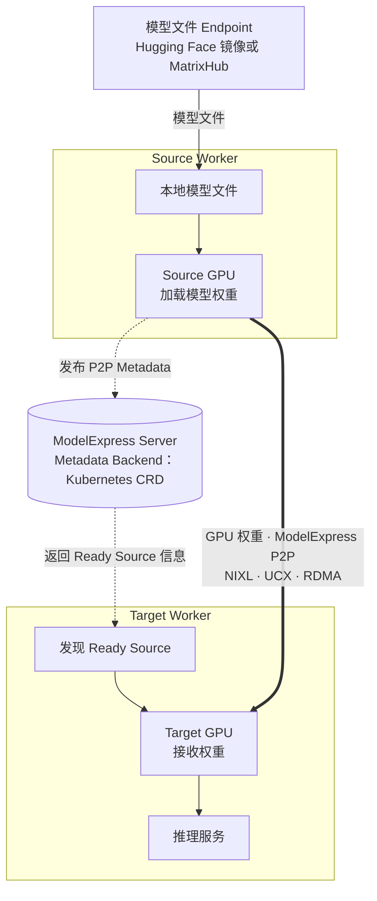
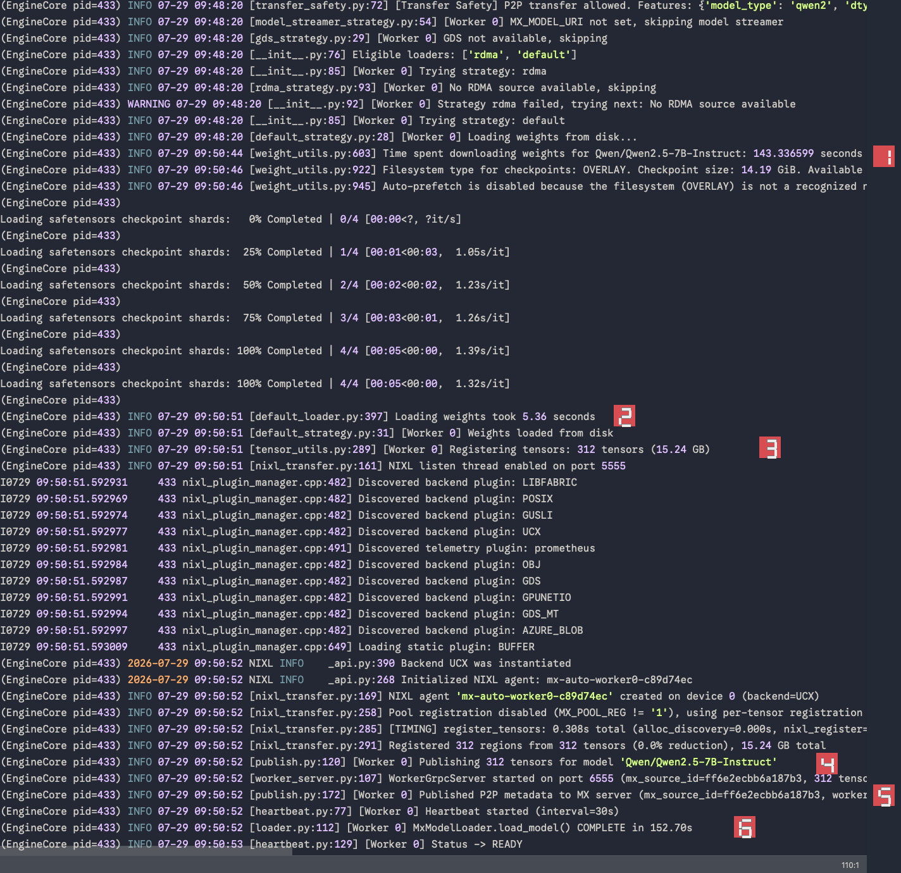

启动一个新的推理 Worker，实际上包含两次不同的数据移动：模型文件先进入 Worker 本地缓存，随后模型权重再进入 GPU 显存。这两个阶段经常被统称为“模型加载”，但它们面对的瓶颈不同，需要的加速机制也不同。

[MatrixHub](https://github.com/matrixhub-ai/matrixhub) 通过靠近集群的私有化、Hugging Face 兼容模型服务加速第一阶段。[ModelExpress](https://docs.nvidia.com/dynamo/kubernetes-deployment/model-loading/model-express) GPU-to-GPU P2P 则面向第二阶段：当一个 Source Worker 已经加载好模型后，Target Worker 可以通过 NIXL、UCX 和 RDMA 直接接收 Source GPU 中的权重，无需再次下载权重文件。

本文记录 Runtime 构建、关键 DGD 配置和跨节点 GPU-to-GPU P2P 验证过程；随后再用 Hugging Face/MatrixHub × 直拉/P2P 四组实验解释每一阶段的实际耗时。



{/* truncate */}

## 实验问题与四组设计

实验需要区分两个问题：

1. 模型文件如何进入 Worker 本地 Cache？
2. 模型权重如何进入目标 GPU？

围绕这两个问题设计了四组场景：

| 编号 | 场景 | 要回答的问题 |
|---|---|---|
| E1 | Hugging Face 直拉 | Worker 能否从指定的 Hugging Face 镜像下载并加载模型？ |
| E2 | MatrixHub 直拉 | Worker 能否从 MatrixHub 下载并加载同一模型？ |
| E3 | Hugging Face + P2P | Source 通过 Hugging Face 准备好后，能否向 Target 发送 GPU 权重？ |
| E4 | MatrixHub + P2P | Source 通过 MatrixHub 准备好后，能否向 Target 发送 GPU 权重？ |

这里的**直拉**是指 Worker 的 Hugging Face Provider 从指定 Endpoint 下载模型文件，并写入本地 Cache；它不代表 ModelExpress Server 向 Worker 流式传输完整模型。

在 P2P 场景中，Source 首先完成模型文件准备、GPU 加载和 P2P Metadata 发布。Target 随后通过 ModelExpress Metadata Backend 发现 Source，建立 NIXL/UCX 通道，经 RDMA 接收张量并启动推理服务。

## 实验环境

验证在同一个 Kubernetes 集群的两个 GPU 节点上完成：

| 项目 | 配置 |
|---|---|
| GPU | 每节点 1 × NVIDIA A800 80GB PCIe |
| 网络 | 两个节点均具备 RDMA 能力 |
| 模型 | `Qwen/Qwen2.5-7B-Instruct` |

Source 和 Target 分别调度到不同节点。具体软件版本和配置在后续复现步骤中说明；内部节点名称、地址和镜像仓库统一使用占位符。

## 关键结果

- 在同一 Source 节点的归档记录中，模型文件准备耗时从 Hugging Face 镜像的 4,382.20 秒降至 MatrixHub 的 144.579 秒。该结果受网络、上游和 Cache 状态影响，不代表通用加速倍数。
- E4 将 312 个 Tensor、共 15.24 GB 权重从 Source GPU 传到 Target GPU：纯 RDMA 传输耗时 1.25 秒，记录速率为 97.5 Gbps；总接收耗时 2.59 秒，`MxModelLoader` 耗时 3.13 秒。
- Target 最终返回 `MH_P2P_OK`，证明收到的权重可以用于初始化模型并提供推理服务。


## 第一步：构建支持 ModelExpress 的 Dynamo Runtime

实验所用的标准 Dynamo Runtime 不保证包含 GPU-to-GPU 加载所需的全部能力，因此先基于固定的 Runtime 1.3.0 Digest 构建新镜像，并安装固定版本的 ModelExpress Python Client。

先获取指定版本源码：

```bash
MX_TAG=v0.4.1
MX_COMMIT=e72b140dfc71ee8769898ba750abd43b3c39e8b8

git clone https://github.com/ai-dynamo/modelexpress.git modelexpress
cd modelexpress
git fetch origin tag "$MX_TAG"
git checkout --detach "$MX_COMMIT"
test "$(git rev-parse HEAD)" = "$MX_COMMIT"
```

在仓库根目录创建以下 `Dockerfile`。公开示例使用 `<dynamo-runtime-image>@sha256:<digest>` 作为占位符；实际构建时应固定到经过验证的 Runtime Digest，避免基础镜像漂移。

```dockerfile
ARG DYNAMO_VLLM_RUNTIME_IMAGE=<dynamo-runtime-image>@sha256:<digest>
FROM ${DYNAMO_VLLM_RUNTIME_IMAGE}

ARG DYNAMO_VLLM_RUNTIME_IMAGE
ARG MODELEXPRESS_TAG=v0.4.1
ARG MODELEXPRESS_COMMIT=e72b140dfc71ee8769898ba750abd43b3c39e8b8

LABEL org.opencontainers.image.title="ModelExpress-enabled Dynamo vLLM runtime" \
      io.daocloud.dynamo.base.image="${DYNAMO_VLLM_RUNTIME_IMAGE}" \
      io.daocloud.modelexpress.python.tag="${MODELEXPRESS_TAG}" \
      io.daocloud.modelexpress.python.commit="${MODELEXPRESS_COMMIT}"

COPY --chown=dynamo:dynamo modelexpress_client/python /opt/modelexpress/client
WORKDIR /opt/modelexpress/client

USER root
RUN uv pip install --system . \
    && python3 -m pip freeze | sort > /opt/modelexpress/python-dependencies.txt
USER dynamo

WORKDIR /workspace
```

构建 `linux/amd64` 镜像：

```bash
MX_BASE_IMAGE=<dynamo-runtime-image>@sha256:<digest>
MX_IMAGE=<registry>/mx-vllm-runtime:1.3.0-mx0.4.1-e72b140

docker build --platform linux/amd64 --progress=plain \
  --build-arg DYNAMO_VLLM_RUNTIME_IMAGE="$MX_BASE_IMAGE" \
  --build-arg MODELEXPRESS_TAG=v0.4.1 \
  --build-arg MODELEXPRESS_COMMIT=e72b140dfc71ee8769898ba750abd43b3c39e8b8 \
  --tag "$MX_IMAGE" \
  --file Dockerfile \
  .
```

构建完成后，不只检查镜像是否存在，还要验证 Client 版本及 Dynamo、ModelExpress、NIXL、vLLM 和 ModelExpress vLLM Engine 的核心 Import：

```bash
docker run --rm --platform linux/amd64 "$MX_IMAGE" \
  python3 -c '
import importlib.metadata
import dynamo, modelexpress, nixl, vllm
import modelexpress.engines.vllm
print("modelexpress=" + importlib.metadata.version("modelexpress"))
print("imports=ok")
'

docker push "$MX_IMAGE"

skopeo inspect --override-os linux --override-arch amd64 \
  --format 'digest={{.Digest}} arch={{.Architecture}} os={{.Os}}' \
  "docker://$MX_IMAGE"
```

最后记录远端 Manifest Digest，并在后续 DGD 中使用 Digest 引用镜像，而不是可变 Tag。

## 第二步：做集群和硬件预检

部署前确认两个节点的 GPU 和 RDMA 资源可用、运行镜像可以正常拉取，并确保 MatrixHub、ModelExpress 及其 Metadata 服务均已就绪，避免基础环境问题干扰后续验证。

## 第三步：准备 Source 和 Target DGD

实验使用两个 `DynamoGraphDeployment`：

| 角色 | DGD | 节点 | 资源 |
|---|---|---|---|
| Source | `mx-mh-p2p-source` | `source-node` | 1 GPU + 1 `spidernet.io/rdmas` |
| Target | `mx-mh-p2p-target` | `target-node` | 1 GPU + 1 `spidernet.io/rdmas` |

两端 Worker 使用相同的模型、Revision、Runtime 和 ModelExpress Service。完整的 Source 与 Target DGD 主要在 `metadata.name` 和 Worker 的 `nodeSelector` 上不同：Source 固定到 `source-node`，Target 固定到 `target-node`；每个 DGD 包含一个 Frontend 和一个 vLLM Decode Worker。完整清单见文末参考配置。

## 第四步：启动 Source 并发布 P2P Metadata

准备好 Source DGD 后提交：

```bash
kubectl apply -f <source-dgd.yaml>
kubectl -n dynamo-system get pods -w
kubectl -n dynamo-system logs -f <source-worker-pod>
```

Source 日志应依次出现以下信号：

1. 完成模型文件准备。
2. 从磁盘加载权重。
3. 开始注册 312 个 GPU Tensor。
4. 开始发布 312 个 Tensor。
5. 输出 `Published P2P metadata`。
6. `MxModelLoader` 完成加载。

本次 E4 记录中，Source 的 `Time spent downloading weights` 为 143.336599 秒，随后从磁盘读取权重耗时 5.36 秒，并注册、发布了 312 个 Tensor，共 15.24 GB。



只有看到 `Published P2P metadata` 后才能启动 Target；否则 Target 没有可发现的 Ready Source。

## 第五步：启动 Target 并验证 RDMA 接收

准备好完整 Target DGD 后提交，并持续查看 Worker 日志：

```bash
kubectl apply -f <target-dgd.yaml>
kubectl -n dynamo-system get pods -w
kubectl -n dynamo-system logs -f <target-worker-pod>
```

Target 日志应依次证明：

1. 发现 Ready Source。
2. 拉取 Tensor Manifest。
3. 开始接收 GPU 权重。
4. 完成 NIXL/UCX RDMA 传输。
5. `MxModelLoader` 完成并进入 Ready。

本次 E4 记录中，Target 从 Source 收到 312 个 Tensor、共 15.24 GB：纯 RDMA 传输耗时 1.25 秒，记录速率为 97.5 Gbps；总接收耗时 2.59 秒；`MxModelLoader` 在 3.13 秒完成并进入 Ready。


这些数字的边界不同：1.25 秒只覆盖纯 RDMA 数据传输，2.59 秒覆盖完整接收过程，3.13 秒覆盖 Target 侧 Loader 阶段。它们都不等于从提交工作负载到返回首个 Token 的端到端耗时。

## 第六步：用固定 Prompt 验证推理

Target Ready 后，将 Frontend 转发到本地：

```bash
kubectl -n dynamo-system port-forward \
  deployment/mx-mh-p2p-target-frontend 8000:8000
```

保持该命令运行，在另一个终端发送固定 Prompt：

```bash
curl -sS http://127.0.0.1:8000/v1/chat/completions \
  -H 'Content-Type: application/json' \
  -d '{
    "model": "Qwen/Qwen2.5-7B-Instruct",
    "messages": [{"role": "user", "content": "Reply exactly: MH_P2P_OK"}],
    "temperature": 0,
    "max_tokens": 16
  }'
```

响应内容为 `MH_P2P_OK`。这一步把验证范围从“RDMA 传输完成”扩展到“Target 能使用收到的权重初始化模型并实际提供推理服务”。


## 四组实验数据对比

完成上述功能链路后，再把直拉与 P2P 场景放在同一张表中。各行对应不同阶段，应逐行理解，不能简单相加成一个端到端时间。

| 指标 | E1：HF 直拉 | E2：MatrixHub 直拉 | E3：HF + P2P | E4：MatrixHub + P2P |
|---|---:|---:|---:|---:|
| Source 模型获取 Endpoint | Hugging Face 镜像 | MatrixHub | Hugging Face 镜像 | MatrixHub |
| Target 权重来源 | Target 本地模型文件 | Target 本地模型文件 | Source GPU | Source GPU |
| Source 模型文件准备 | 4,382.20 s | 144.579 s | 4,161.32 s | 143.34 s |
| Target 模型文件下载 | 4,247.68 s | 150.718 s | 不适用 | 不适用 |
| Source GPU 加载 | 20.88 s | 28.22 s | `MxModelLoader` 159.36 s | `MxModelLoader` 152.70 s |
| Target GPU 加载 | 32.46 s | 69.05 s | `MxModelLoader` 3.41 s | `MxModelLoader` 3.13 s |
| P2P 张量数 / 数据量 | 无 | 无 | 312 / 15.24 GB | 312 / 15.24 GB |
| 纯 RDMA 传输 | 无 | 无 | 1.34 s / 91.0 Gbps | 1.25 s / 97.5 Gbps |
| 推理验证 | 通过 | 通过 | 通过 | 通过 |

这张表表达两项互补的事实。

第一，MatrixHub 在两个节点上都成功完成了模型文件供应。在同一 Source 节点的归档记录中，经 Hugging Face 镜像准备模型文件耗时 4,382.20 秒，经 MatrixHub 则为 144.579 秒。具体倍数取决于实际网络、上游状态和缓存条件，但这组结果体现了将模型分发服务部署在推理集群附近的价值。

第二，P2P 场景不再让 Target 重复下载权重文件，而是从 Ready Source GPU 接收 15.24 GB 权重。在 E4 中，Target 的完整 `MxModelLoader` 阶段为 3.13 秒，随后推理验证通过。

## 结论

MatrixHub 与 ModelExpress P2P 不是竞争关系，而是模型就绪链路中相邻的两个阶段。

| 场景 | 建议路径 |
|---|---|
| 第一个副本，或当前没有 Ready Source | 从集群内 MatrixHub 缓存下载 |
| 已有兼容的 Ready Source，需要继续扩容 | 使用 ModelExpress P2P 从 Source GPU 获取权重 |
| 集群没有可用的 RDMA 通道 | 使用 MatrixHub 直拉 |
| 离线环境或需要受控的模型供应 | 使用 MatrixHub 作为统一模型源 |
| 需要评估启动性能 | 分开测量文件准备、GPU 加载和端到端就绪耗时 |

对于一次冷启动，MatrixHub 缩短模型仓库到第一个 Worker 的路径；当已有 Source 就绪后，ModelExpress P2P 可以避免 Target 重复下载权重文件，直接把权重从已就绪 GPU 送到新 GPU。两者组合后，模型就绪过程形成一条清晰的流水线：先高效准备一个 Source，再以它为起点让更多 Worker 上线。

## 文末参考：Source / Target DGD YAML

以下两份是完整的 `DynamoGraphDeployment` 示例，分别保存为 `source.yaml` 与 `target.yaml` 后即可作为部署起点。请替换尖括号中的 Endpoint、镜像 Digest 和节点名；两端必须使用相同的模型、Revision、Runtime 和 ModelExpress Service。

### Source DGD

```yaml
apiVersion: nvidia.com/v1beta1
kind: DynamoGraphDeployment
metadata:
  name: mx-mh-p2p-source
  namespace: dynamo-system
spec:
  backendFramework: vllm
  components:
    - name: Frontend
      type: frontend
      replicas: 1
      podTemplate:
        spec:
          containers:
            - name: main
              image: <runtime-image>@sha256:<digest>
              imagePullPolicy: IfNotPresent
              workingDir: /workspace
              env:
                - name: HF_ENDPOINT
                  value: http://<matrixhub-endpoint>
              command: ["python3", "-m", "dynamo.frontend"]
              args: ["--http-port", "8000"]
    - name: VllmWorker
      type: decode
      replicas: 1
      sharedMemorySize: 2Gi
      podTemplate:
        spec:
          nodeSelector:
            kubernetes.io/hostname: <source-node>
          containers:
            - name: main
              image: <runtime-image>@sha256:<digest>
              imagePullPolicy: IfNotPresent
              workingDir: /workspace
              securityContext:
                runAsUser: 0
                allowPrivilegeEscalation: true
                capabilities:
                  add: ["IPC_LOCK", "SYS_RESOURCE"]
              env:
                - name: HF_ENDPOINT
                  value: http://<matrixhub-endpoint>
                - name: VLLM_PLUGINS
                  value: modelexpress
                - name: MODEL_EXPRESS_URL
                  value: http://<modelexpress-service>:8001
                - name: MX_SERVER_ADDRESS
                  value: http://<modelexpress-service>:8001
                - name: MODEL_EXPRESS_NO_SHARED_STORAGE
                  value: "1"
                - name: MX_MODEL_REVISION
                  value: a09a35458c702b33eeacc393d103063234e8bc28
                - name: MX_NIXL_BACKEND
                  value: UCX
                - name: MX_P2P_METADATA
                  value: "1"
                - name: MX_METADATA_PORT
                  value: "5555"
                - name: MX_WORKER_GRPC_PORT
                  value: "6555"
                - name: MX_CONTIGUOUS_REG
                  value: "0"
                - name: UCX_RNDV_SCHEME
                  value: get_zcopy
                - name: NIXL_LOG_LEVEL
                  value: INFO
                - name: UCX_LOG_LEVEL
                  value: WARN
              command: ["/bin/sh", "-lc"]
              args:
                - >-
                  ulimit -l unlimited && exec python3 -m dynamo.vllm
                  --model Qwen/Qwen2.5-7B-Instruct
                  --revision a09a35458c702b33eeacc393d103063234e8bc28
                  --served-model-name Qwen/Qwen2.5-7B-Instruct
                  --load-format mx
                  --tensor-parallel-size 1
                  --gpu-memory-utilization 0.90
                  --max-model-len 8192
                  --no-enable-log-requests
              resources:
                requests:
                  cpu: "4"
                  memory: 16Gi
                  nvidia.com/gpu: "1"
                  spidernet.io/rdmas: "1"
                limits:
                  cpu: "4"
                  memory: 16Gi
                  nvidia.com/gpu: "1"
                  spidernet.io/rdmas: "1"
```

### Target DGD

```yaml
apiVersion: nvidia.com/v1beta1
kind: DynamoGraphDeployment
metadata:
  name: mx-mh-p2p-target
  namespace: dynamo-system
spec:
  backendFramework: vllm
  components:
    - name: Frontend
      type: frontend
      replicas: 1
      podTemplate:
        spec:
          containers:
            - name: main
              image: <runtime-image>@sha256:<digest>
              imagePullPolicy: IfNotPresent
              workingDir: /workspace
              env:
                - name: HF_ENDPOINT
                  value: http://<matrixhub-endpoint>
              command: ["python3", "-m", "dynamo.frontend"]
              args: ["--http-port", "8000"]
    - name: VllmWorker
      type: decode
      replicas: 1
      sharedMemorySize: 2Gi
      podTemplate:
        spec:
          nodeSelector:
            kubernetes.io/hostname: <target-node>
          containers:
            - name: main
              image: <runtime-image>@sha256:<digest>
              imagePullPolicy: IfNotPresent
              workingDir: /workspace
              securityContext:
                runAsUser: 0
                allowPrivilegeEscalation: true
                capabilities:
                  add: ["IPC_LOCK", "SYS_RESOURCE"]
              env:
                - name: HF_ENDPOINT
                  value: http://<matrixhub-endpoint>
                - name: VLLM_PLUGINS
                  value: modelexpress
                - name: MODEL_EXPRESS_URL
                  value: http://<modelexpress-service>:8001
                - name: MX_SERVER_ADDRESS
                  value: http://<modelexpress-service>:8001
                - name: MODEL_EXPRESS_NO_SHARED_STORAGE
                  value: "1"
                - name: MX_MODEL_REVISION
                  value: a09a35458c702b33eeacc393d103063234e8bc28
                - name: MX_NIXL_BACKEND
                  value: UCX
                - name: MX_P2P_METADATA
                  value: "1"
                - name: MX_METADATA_PORT
                  value: "5555"
                - name: MX_WORKER_GRPC_PORT
                  value: "6555"
                - name: MX_CONTIGUOUS_REG
                  value: "0"
                - name: UCX_RNDV_SCHEME
                  value: get_zcopy
                - name: NIXL_LOG_LEVEL
                  value: INFO
                - name: UCX_LOG_LEVEL
                  value: WARN
              command: ["/bin/sh", "-lc"]
              args:
                - >-
                  ulimit -l unlimited && exec python3 -m dynamo.vllm
                  --model Qwen/Qwen2.5-7B-Instruct
                  --revision a09a35458c702b33eeacc393d103063234e8bc28
                  --served-model-name Qwen/Qwen2.5-7B-Instruct
                  --load-format mx
                  --tensor-parallel-size 1
                  --gpu-memory-utilization 0.90
                  --max-model-len 8192
                  --no-enable-log-requests
              resources:
                requests:
                  cpu: "4"
                  memory: 16Gi
                  nvidia.com/gpu: "1"
                  spidernet.io/rdmas: "1"
                limits:
                  cpu: "4"
                  memory: 16Gi
                  nvidia.com/gpu: "1"
                  spidernet.io/rdmas: "1"
```

:::caution 安全说明

上述 Root、权限提升和 Capability 来自本次实验配置，不应直接视为生产默认值。生产部署应根据 Runtime、RDMA Device Plugin 和节点策略逐项验证，优先以非 Root 运行，只授予实际需要的 Capability；除非组件确实要求，否则不要启用 `allowPrivilegeEscalation`。

:::
