import Tabs from '@theme/Tabs';
import TabItem from '@theme/TabItem';

大模型在金融、政务、能源等强监管行业落地时，团队通常要面对两个问题：

1. **把模型带进内网**：公网模型库访问不了，上百 G 的权重靠人工拷贝，一次要好几天。
2. **管好模型权限**：模型是核心资产，谁能下载、修改、管理，必须有清晰的边界。

两者缺一不可。一个**部署在内网、兼容 Hugging Face 的私有模型库**可以同时解决：对内统一存放模型、管理权限，对外让研发团队用熟悉的方式访问。

{/* truncate */}

<div className="enterprise-blog">

## 全貌：模型进入内网，统一存放、全员共享

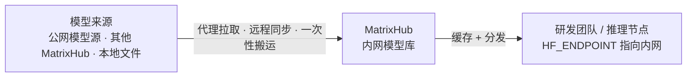

模型统一存放在内网模型库，全员从内网获取、不再依赖公网。研发侧通过把 `HF_ENDPOINT` 指向内网地址即可接入，**代码零改动**。

模型进入内网有三种方式，按网络环境选择：

- **代理拉取**：环境可联网时，首次访问从公网源拉取并缓存，之后全员走内网缓存。
- **远程同步**：与另一环境的 MatrixHub 自动同步，保持模型一致。
- **一次性搬运**：完全断网时，先获取模型文件再整体搬入。

:::tip[延伸阅读]

代理拉取与缓存分发的详细操作步骤，可参考：

- [《DeepSeek v4 分发实践》](./2026-04-27-deepseek-v4-distribution.md)
- [《内网 vLLM 集群分发示例》](./2026-04-27-examples.md)

:::

## 权限隔离：让“谁能碰模型”有边界

模型是核心资产，MatrixHub 通过三层机制设限：

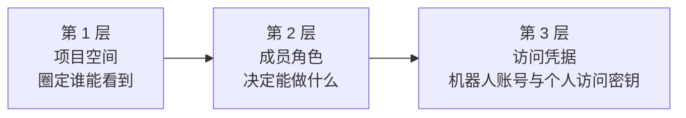

### 第 1 层：项目空间——一个团队一个“独立空间”

每个团队、业务线拥有独立项目，例如研发、测试、生产分别用 `dev`、`stage`、`prod`，项目之间默认不可见、天然隔离。下面用这三个项目演示隔离效果。

#### 1. 管理员视角：项目并存

管理员登录后，可以看到平台上的所有项目：

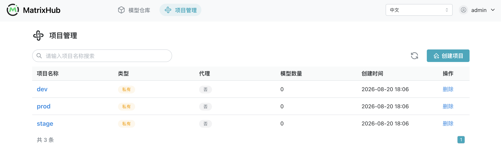

#### 2. 各项目成员互不重叠

每个项目拥有自己的成员，彼此独立：

<Tabs groupId="project-members">
  <TabItem value="dev" label="dev" default>

  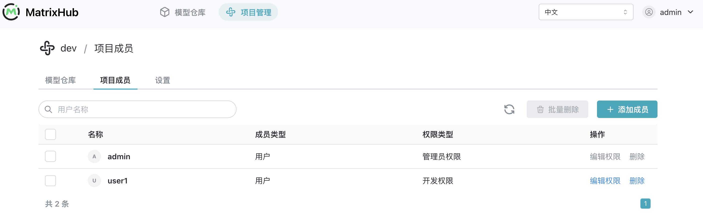

  </TabItem>
  <TabItem value="stage" label="stage">

  

  </TabItem>
  <TabItem value="prod" label="prod">

  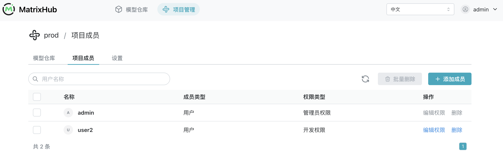

  </TabItem>
</Tabs>

#### 3. 成员登录：只见自己的项目

分别用三个项目的成员账号登录，各自只能看到自己所属的项目：

<Tabs groupId="member-login">
  <TabItem value="dev" label="dev" default>

  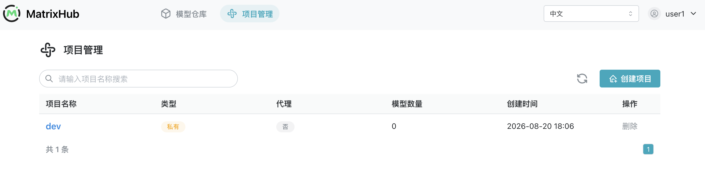

  </TabItem>
  <TabItem value="stage" label="stage">

  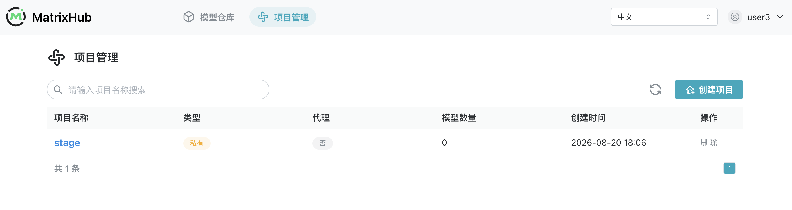

  </TabItem>
  <TabItem value="prod" label="prod">

  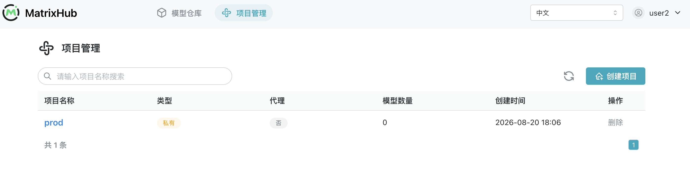

  </TabItem>
</Tabs>

同一个登录入口，不同团队成员看到不同的项目集合——这就是“独立空间”最直观的体现。

### 第 2 层：成员角色——在项目里能做什么

| 角色 | 能做什么 | 典型场景 |
| --- | --- | --- |
| 管理员 | 管理项目的一切（设置、成员） | 平台运维负责人，负责搭建项目、分配成员 |
| 编辑者 | 上传、修改模型 | 训练 / 微调的算法工程师，负责发布模型新版本 |
| 查看者 | 可查看、下载，不能上传或改动 | 需查阅模型的同事；以只读方式拉取模型的流水线 |

想让某个同事只能查看、下载模型而不能上传或改动？授予查看者角色即可。

在项目成员列表中，可以看到每个成员的账号与角色：


权限会真实生效——查看者账号尝试上传模型时，会被直接拒绝：

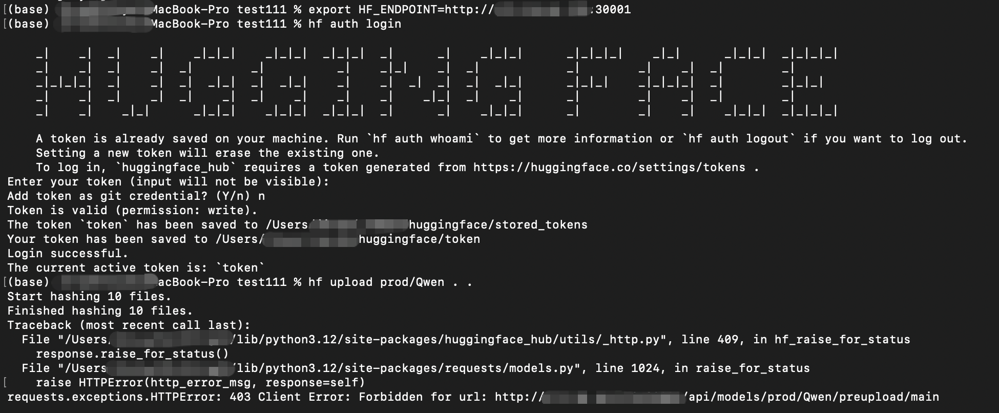

### 第 3 层：访问凭据——机器人账号与个人访问密钥

在浏览器中操作时，用户通过登录账号确认身份；模型下载、上传以及 CI/CD、推理服务等 CLI/API 操作，则需要使用访问凭据。MatrixHub 提供两种方式：

| 方式 | 代表的身份 | 适用场景 | 权限与生命周期 |
| --- | --- | --- | --- |
| 机器人账号 | 独立的程序身份 | CI/CD、推理服务、共享流水线 | 由平台管理员单独设置项目范围、权限和有效期，可独立停用或刷新令牌 |
| 个人访问密钥 | 当前登录用户 | 个人开发、调试以及本地 `hf` 命令 | 继承用户已有的项目角色和权限，可自行创建、设置有效期或删除 |

两种方式在 CLI/API 层面都会使用令牌认证，但令牌所代表的身份不同，因此适合的使用场景也不同。

#### 方式一：机器人账号——为程序创建独立身份

平台管理员可以为 CI/CD、推理服务等程序创建机器人账号，并直接限定它能够访问的项目和具体权限：


创建后，机器人账号可以在平台中统一查看、停用、删除或刷新令牌，生命周期不依赖某个员工的个人账号：

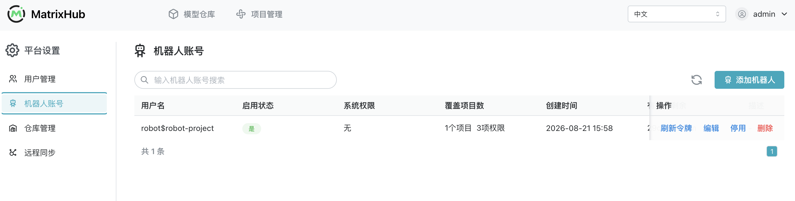

#### 方式二：个人访问密钥——沿用个人账号权限

用户也可以在个人中心创建访问密钥，用于本地 `hf` 命令、个人脚本或调试。访问密钥继承当前账号已有的项目角色和权限，不会获得额外授权；密钥只在创建时完整显示一次，应立即保存并妥善保管：

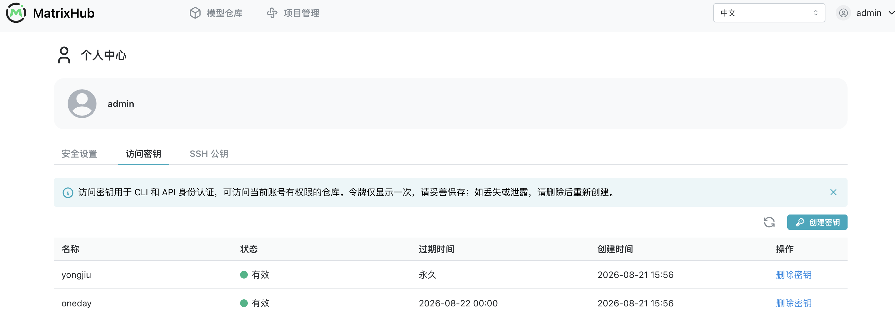

## 模型入库：自研模型统一管理

微调完成后，可以通过以下四步把本地模型纳入 MatrixHub 统一管理。

#### 1. 创建目标模型仓库

登录控制台，在目标项目下创建模型仓库。上传模型的账号需要具备该项目的管理员或编辑者权限。

#### 2. 确认待上传的本地模型文件

上传前检查模型目录，确认权重、配置、Tokenizer 等运行所需文件完整，避免入库后才发现缺少依赖文件：

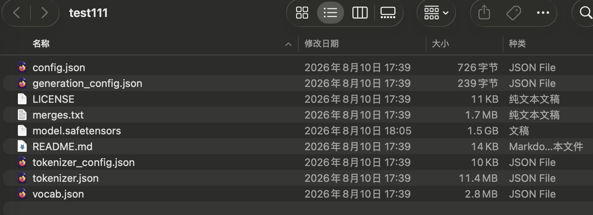

#### 3. 配置 MatrixHub 地址并上传

在本地终端设置 `HF_ENDPOINT` 指向内网 MatrixHub，然后使用 `hf upload` 上传整个模型目录：

```bash
export HF_ENDPOINT=http://<内网MatrixHub地址>
hf upload <项目名>/<模型名> ./<本地模型目录> .
```

终端显示文件哈希计算、LFS 文件传输和上传完成地址，即表示客户端上传流程已结束：

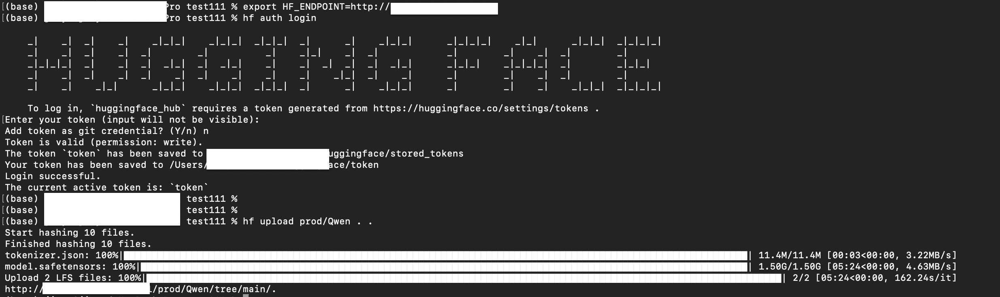

#### 4. 验证模型文件与版本记录

回到控制台刷新模型页面，从“模型详情”和“提交记录”两个视角确认入库结果：

<Tabs groupId="model-verification">
  <TabItem value="files" label="模型详情" default>

  模型详情页用于确认权重、配置等文件已经完整入库。

  

  </TabItem>
  <TabItem value="commits" label="提交记录">

  每次上传或修改都会留下提交记录，方便追踪模型版本和变更历史。

  

  </TabItem>
</Tabs>

入库后，模型不再散落在各台机器上；版本、文件与改动记录统一留痕，团队即可按熟悉的方式取用。

## 隔离、受控环境下的模型分发

按目标环境与模型源之间是否连通，分两种方式：

### 场景一：完全断网的环境——一次性搬运


- **可联网环境**：直接下载模型文件即可；若先用 MatrixHub 缓存再搬运，版本与文件结构会一并带入，省去重新上传。
- **隔离网络**：把模型导入部署好的 MatrixHub，团队即可正常取用。

:::info[操作提示]

下载与导入的具体操作和上文“模型入库”一致：使用 `hf download` 拉取，使用 `hf upload` 导入。

:::

### 场景二：环境之间可联通——远程同步，自动搬运

当过渡环境与内网（或两地数据中心）之间可连通时，可用**远程同步**自动把模型从一处同步到另一处。

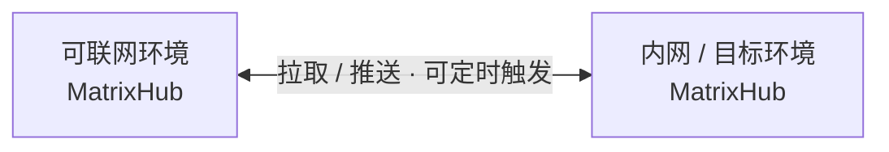

配置步骤：

1. 在控制台创建目标仓库，把可联网环境的 MatrixHub 配置为远端仓库：


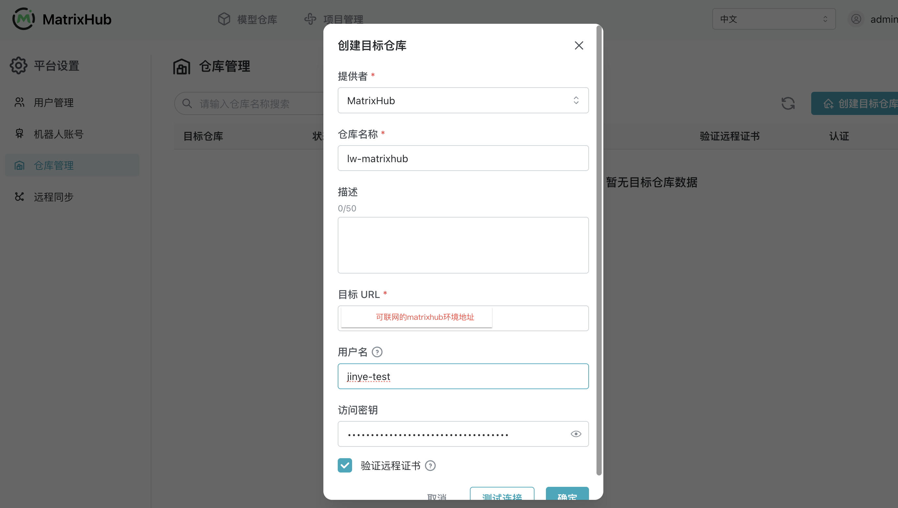

2. 创建同步规则，指定目标仓库、资源与触发方式：


3. 触发同步后，在任务页查看执行进度与日志：


4. 同步完成后，在目标项目中查看同步过来的模型文件信息：


#### 远程同步的核心优势

远程同步的价值不只是完成一次文件复制，而是把跨环境的模型流转变成一套**可重复、可控制、可追踪**的流程。

| 核心能力 | 解决的问题 | 带来的价值 |
| --- | --- | --- |
| 双向流转 | 不同环境可能需要把模型拉进来，也可能需要向外推送 | 一套同步机制同时覆盖模型引入与分发，适配过渡区、内网和多数据中心等不同拓扑 |
| 自动执行 | 人工拷贝需要反复操作，容易遗漏新版本 | 支持定时执行和手动触发，减少重复运维，让目标环境更及时地获得所需版本 |
| 传输可控 | 大模型传输可能占满链路，同名模型也可能被意外覆盖 | 可限制同步带宽并设置覆盖策略，让传输过程更可预测，降低对生产网络和已有资产的影响 |
| 全程可观测 | 手工搬运过程不透明，失败后难以定位具体模型和原因 | 每次同步生成独立任务并按模型拆分执行，进度与日志可查，便于定位问题和复盘结果 |

例如，在可联网的过渡环境缓存好新模型后，可以由 MatrixHub 按计划同步到内网；在多地数据中心场景中，也可以用同一套策略保持所需模型版本一致。平台管理员统一配置策略后，模型流转不再依赖临时脚本和人工值守。

## 总结：把模型带进内网，也把管理能力留在内网

企业需要的“私有版 Hugging Face”，不只是一个存放模型文件的地方，而是一套贯穿**接入、管理和分发**的内部模型基础设施：

- **接入方式不变**：研发团队继续使用熟悉的 Hugging Face 工具，只需把 `HF_ENDPOINT` 指向内网 MatrixHub，无需改造业务代码。
- **模型资产集中管理**：自研模型、外部模型及其版本记录统一留在平台中，不再散落在个人机器和临时存储上。
- **权限边界清晰**：项目空间与成员角色控制“谁能看到、谁能操作”，机器人账号和个人访问密钥分别承载程序身份与个人身份。
- **跨环境流转可控**：代理缓存、一次性搬运和远程同步覆盖联网、隔离及多数据中心场景；带宽策略、任务进度和日志让传输过程可控、可查。

对强监管行业而言，真正重要的并不只是“把模型下载得更快”，而是让模型能够**进得来、管得住、分得动、查得到**。这正是 MatrixHub 在企业内网中承担的角色。

</div>
