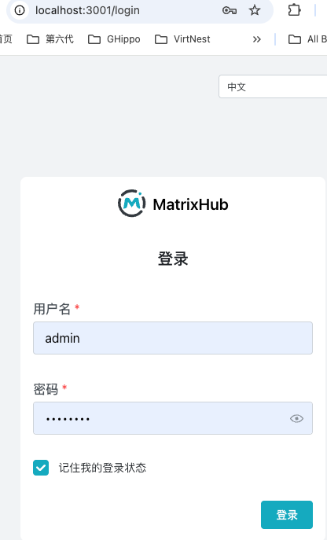

# DeepSeek v4 跑不起来？99% 的人都卡在分发

最近 DeepSeek 发布了 DeepSeek v4，不少团队都在第一时间尝试接入。

但如果你是在企业环境（尤其是内网 / 私有化），很快就会发现一件事：

> 👉 模型不是最大的问题，**分发才是**

我们在内网落地 DeepSeek v4，踩了一堆坑，整理下来，本质其实就三类问题。

## 一、你以为是“下载问题”，其实是架构问题

### ❌ Hugging Face 在企业环境并不好用

- 网络不稳定甚至断网
- 下载慢 / 大文件易中断
- 权限不可控

👉 看起来是“下载慢”，本质是：

> **Hugging Face 不是为企业分发设计的，它的设计目标是“研究协作”，不是“企业分发”**

## 二、你开始自救，但问题更大

### ❌ 常见方案都会踩坑

- 手动拷贝 → 版本混乱、不可审计
- NFS / NAS → IO 打爆、无缓存
- 每台机器拉 → 带宽耗尽、冷启动慢

尤其在 vLLM / SGLang 场景下：

> 👉 **每个节点都在重复下载模型= 带宽 × N 倍放大**
## 三、真正的问题其实只有一个

所有问题，本质可以归结为一句话：

> 👉 **缺一个“模型分发基础设施层”（就像镜像仓库之于容器）”**

就像你不会直接用 Docker Hub，而是会用私有镜像仓库一样。

但在模型领域，这一层长期是缺失的。

## 四、我们的解法

### ✅ 核心思路

```
公网模型源（Hugging Face）
        ↓
模型代理 / 缓存层
        ↓
企业内部统一分发
        ↓
vLLM / 推理服务
```

```
这个架构本质上复用了一个已经被验证过的模式：  
  
- Docker → Docker Hub → Harbor  
- Maven → Central → Nexus  
- PyPI → pip → 私有仓库  
  
👉 **模型分发，本质是同一类问题**
```

### ✅ 关键能力

这个分发层需要：

1. **代理 Hugging Face（不是替代）**
2. **自动缓存模型**
3. **支持断点续传**
4. **支持权限控制**
5. **支持内网分发**
6. **兼容 vLLM / SGLang**
## 五、我们把它做成了一个项目

👉 **[MatrixHub](https://github.com/matrixhub-ai/matrixhub)**

本质上就是：

> 👉 **企业版 Hugging Face + 模型分发加速层**
> 1. Hugging Face 代理（解决公网问题）  
> 2. 模型缓存层（解决重复下载）  
> 3. 企业分发入口（解决权限与统一接入）

你可以把它理解为：

- 模型领域的 “Harbor”
- 或者：**AI 时代的镜像仓库**
## 六、快速上手
## 🧱 Step 1：启动服务

下载 <a href="/deploy/docker/docker-compose.yaml" down load="docker-compose.yaml">docker-compose.yaml</a> 以及 <a href="/deploy/docker/config.yaml" down load="config.yaml">config.yaml</a>， 保证二者在同一目录下

```
docker compose -f docker-compose.yaml up -d
```
默认服务地址：

```
http://127.0.0.1:3001
```

验证：

```
curl http://127.0.0.1:3001
```
## 🔐 Step 2：登录

- 用户名：`admin`
- 密码：`changeme`

👉 **建议立即修改密码**


## 🌐 Step 3：创建远程仓库 Remote（代理 Hugging Face）

关键配置：

```
Remote URL: https://huggingface.co  
Type: HuggingFace
## 建议远程仓库的名称为 huggingface
```
作用：

```
请求 → MatrixHub → Hugging Face → 回源
```


## 📦 Step 4：创建 Proxy 项目

作用：给用户一个统一入口
```
用户 → 代理项目 → 远程仓库（HF） → 缓存
```

创建项目时选择刚才创建的远程仓库 huggingface，并填写代理的模型组织deepseek-ai


## ⚙️ Step 5：客户端接入（关键一步）


```
export  HF_ENDPOINT="http://127.0.0.1:3001"
```


👉 本质是：

> - 劫持客户端请求  
> - 首次回源 Hugging Face  
> - 自动缓存到本地  
> - 后续全部走内网

## ⬇️ Step 6：下载模型（DeepSeek V4）

```
hf download deepseek-ai/DeepSeek-V4-Pro
```

# 🔍 验证“缓存是否生效”

你可以用 curl 看请求行为：

### 第一次请求（回源）


```
curl  -I http://127.0.0.1:3001/deepseek-ai/DeepSeek-V4-Pro/resolve/main/config.json
```

特征：

- 请求时间较长
- 有回源 header（类似 upstream）
### 第二次请求（命中缓存）

```
curl  -I http://127.0.0.1:3001/deepseek-ai/DeepSeek-V4-Pro/resolve/main/config.json
```

特征：

- 响应极快
- 不再访问 Hugging Face

# 写在最后
如果你也在企业内网落地大模型，一定会遇到这类问题：  
  
- 下载慢  
- 带宽炸  
- 节点重复拉  
- 权限不可控  
  
👉 这些都不是“偶发问题”，而是**架构缺失**  
  
MatrixHub 只是把这件事补上了。  
  
如果你正在做类似事情，欢迎交流 👇  
👉 https://github.com/matrixhub-ai/matrixhub

