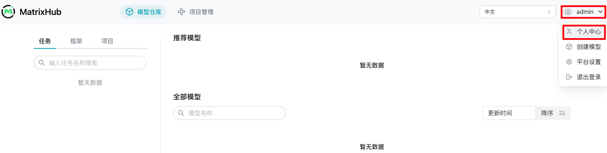
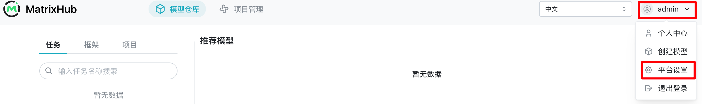
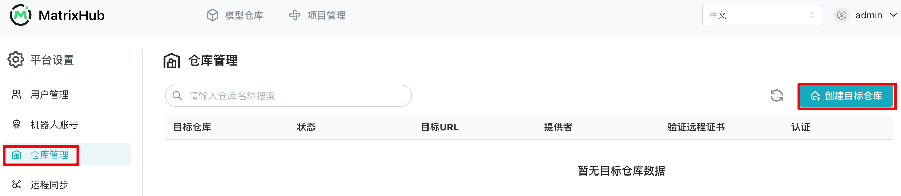
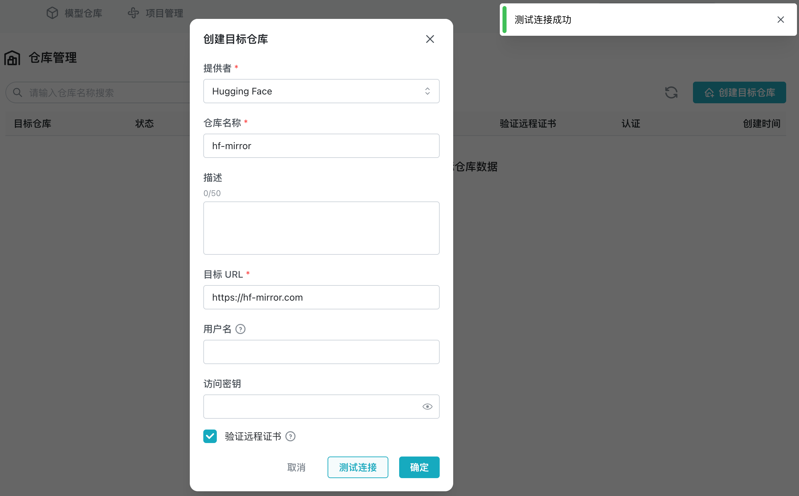
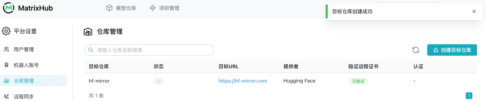
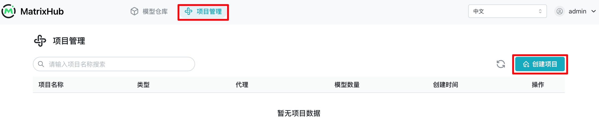
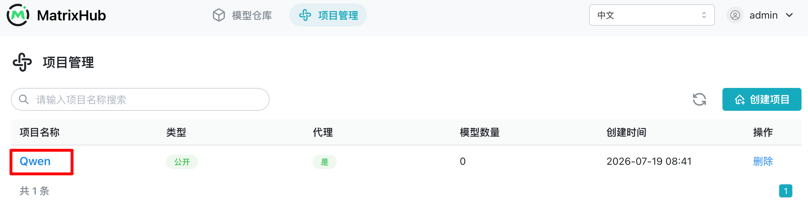
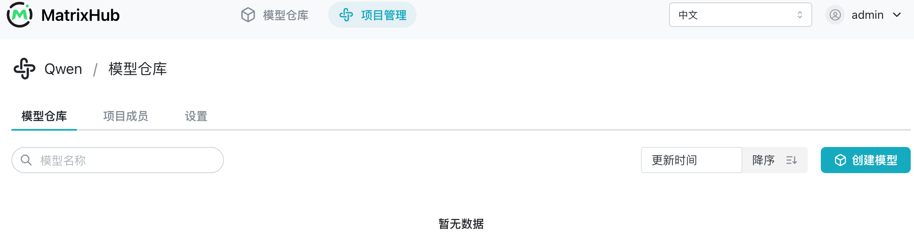
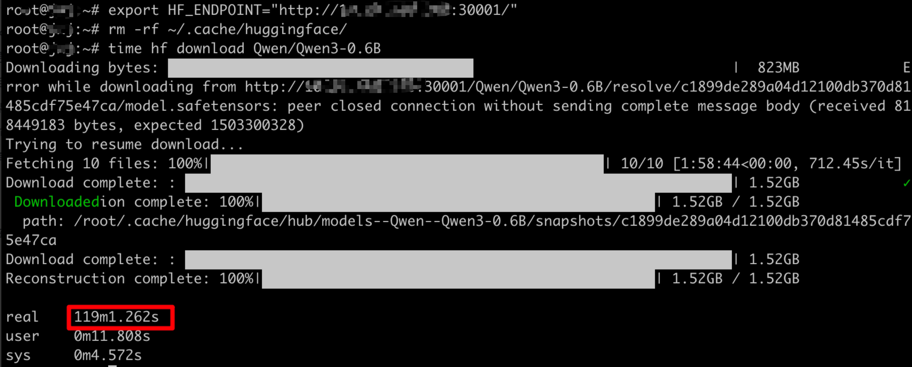
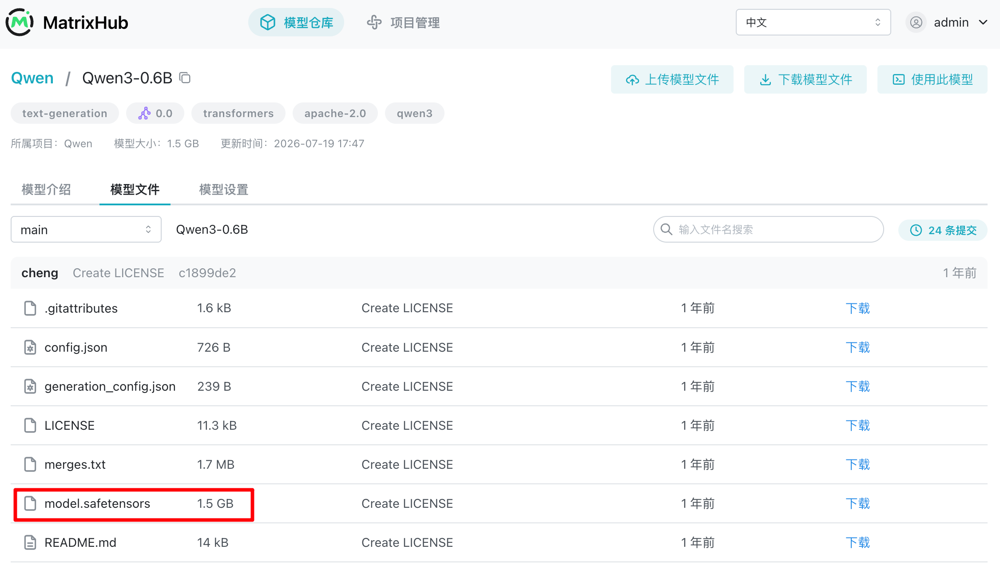

# 通过代理项目缓存模型

## 目标

本篇介绍按需代理缓存功能：客户端第一次请求时 MatrixHub 从 Hugging Face 拉取并缓存模型，后续请求直接从 MatrixHub 缓存加载模型。

## 架构原理


## 前置条件

- [MatrixHub 已经部署](../installation/index.md)，假设 MatrixHub 地址为 `http://192.0.2.10:30001`
- 客户端机器尽量和 MatrixHub 在同一个内网网段

## 确保目标仓库和代理项目存在

用浏览器访问 MatrixHub 地址，进入登录页面进行登录。

- 用户名：`admin`
- 密码：`changeme`


登录平台后建议尽快进入“个人中心”修改密码。



### 创建目标仓库

点击右上角“用户名”，点击“平台设置”。



点击“仓库管理”，点击“创建目标仓库”。



选择提供者 Hugging Face，输入仓库名称 `hf-mirror`（或 `huggingface.co`），输入目标 URL `https://hf-mirror.com`（或 `https://huggingface.co`），勾选“验证远程证书”，点击“测试连接”。



点击“确定”，目标仓库创建成功。



### 创建代理项目

点击“项目管理”，点击“创建项目”。



输入项目名称 `Qwen`，勾选“公开”，开启代理，选择前面创建的目标仓库名称 `hf-mirror`，填写代理组织 `Qwen`，点击“确定”。


在项目列表页面点击“Qwen”进入该项目。



当前项目里没有模型。



## 在客户端机器通过内网 MatrixHub 拉取模型

### 安装 Hugging Face 客户端 CLI 工具 hf

安装命令参考 [Hugging Face CLI 使用指南](https://huggingface.co/docs/huggingface_hub/guides/cli)。

```bash
curl -LsSf https://hf.co/cli/install.sh | bash
```

### 配置环境变量 HF_ENDPOINT 来指向内网 MatrixHub

```shell
export HF_ENDPOINT="http://192.0.2.10:30001"
```

### 首次下载 Qwen3-0.6B 模型

```shell
time hf download Qwen/Qwen3-0.6B
```

由于外网限速，时间比较久：119 分钟。



查看下载到本地的模型文件和大小。

```shell
ls ~/.cache/huggingface/hub/models--Qwen--Qwen3-0.6B/
du -sh ~/.cache/huggingface/hub/models--Qwen--Qwen3-0.6B/
```


在该模型详情页面可以看到模型权重等文件。



### 再次下载 Qwen3-0.6B 模型

在客户端机器上把本地下载的模型权重删掉，重新从 MatrixHub 下载一次。

```shell
rm -rf ~/.cache/huggingface/
export HF_ENDPOINT="http://192.0.2.10:30001"
time hf download Qwen/Qwen3-0.6B
```


下载时间约为 15 秒，说明该模型已经缓存在 MatrixHub 里了。

## 结论

首次按需下载依赖外网网速，再次下载直接从 MatrixHub 缓存下载，速度大幅提升。
