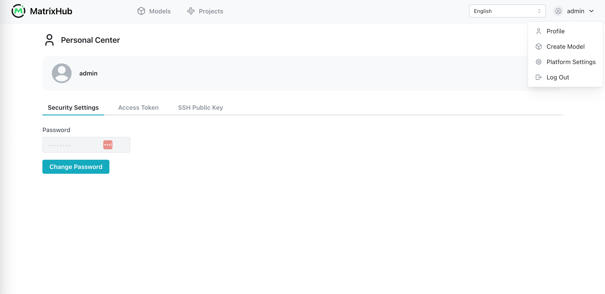

# 登录与退出

MatrixHub 使用浏览器会话维持 Web 界面的登录状态。登录时，可以选择关闭浏览器后是否继续保留该会话。

## 前置条件

- 已获取 MatrixHub 实例的访问地址，例如 `http://127.0.0.1:3001`。
- 已从平台管理员处获取有效的 MatrixHub 用户名和密码。

## 登录

1. 使用浏览器打开 MatrixHub 访问地址。尚未登录时，MatrixHub 会跳转到登录页面。
1. 如有需要，在页面右上角切换界面语言。
1. 输入 **用户名** 和 **密码**。可以使用密码输入框中的图标显示或隐藏密码。
1. 根据下文介绍的会话行为，勾选或取消勾选 **记住我的登录状态**。
1. 点击 **登录** 或按 Enter 键。身份认证成功后，MatrixHub 会进入首页。

如果用户名或密码不正确，MatrixHub 会停留在登录页面。请检查凭据后重试，密码区分大小写。

## “记住我的登录状态”是什么？

**记住我的登录状态** 用于控制浏览器会话可以保留多久，不会保存或自动填写用户名和密码。

| 设置 | 默认会话行为 |
|------|--------------|
| 已勾选 | 会话存储在持久 Cookie 中，关闭并重新打开浏览器后仍可保持登录。连续 7 天没有操作时会话失效，无论期间是否操作，会话最长保留 30 天。有效的身份认证请求会重新计算 7 天空闲时间，但不会延长 30 天的最长时间。 |
| 未勾选 | 会话 Cookie 仅在本次浏览器会话中有效。完全关闭浏览器后，会话随即结束；如果浏览器保持打开，连续 8 小时没有身份认证活动时会话失效。 |

:::note

- 登录页面默认勾选 **记住我的登录状态**。
- 上述会话时长是 MatrixHub 的默认配置，平台管理员可以在部署配置中修改。
- 如果同一浏览器仍有其他窗口处于打开状态，仅关闭当前标签页可能不会结束非持久会话。

:::

会话失效后，下一次请求会跳转到登录页面，需要重新输入凭据。

## 退出登录

1. 点击页面右上角的用户名，打开账号菜单。
1. 点击 **退出登录**。MatrixHub 会使当前会话失效并返回登录页面。

无论登录时是否勾选 **记住我的登录状态**，退出登录都会结束当前浏览器中的会话。

如果在多个浏览器或设备上使用 MatrixHub，需要分别退出各个会话。修改密码或由平台管理员重置密码后，已有会话都会失效，必须使用新密码重新登录。

## 故障排查

| 问题 | 建议操作 |
|------|----------|
| 登录页面提示凭据不正确 | 检查用户名、密码和字母大小写。如果密码已被重置，请使用新密码。 |
| 使用过程中跳转到登录页面 | 会话可能已经过期，或因密码变更而失效。请重新登录。 |
| 重新打开浏览器后仍保持登录 | 登录时可能勾选了 **记住我的登录状态**。使用完毕后请主动 **退出登录**，尤其是在共享设备上。 |
| 登录后无法访问平台设置页面 | 当前账号可能不是平台管理员。如需额外权限，请联系平台管理员。 |
