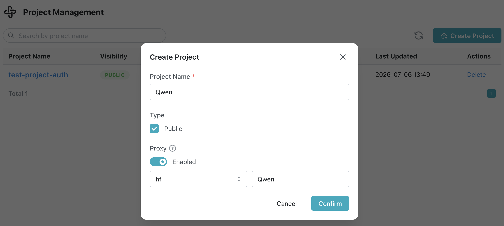
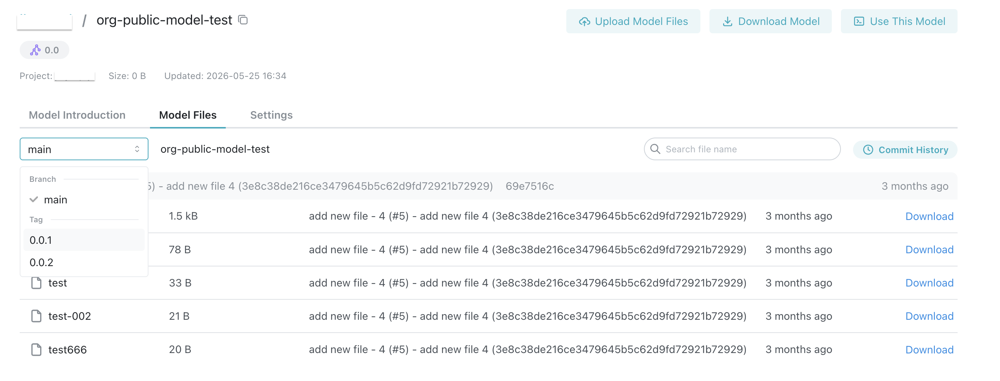

# 命令行上传与下载

## 前置条件

- 拥有有效的 MatrixHub 账号。
- 已加入目标公开项目。下载模型需要项目管理员、开发者或只读权限；上传模型需要项目管理员或开发者权限。
- 如需使用代理项目，需已存在一个可使用的目标仓库；如需创建目标仓库，请参考[仓库管理](../platform-settings/registry-management.md)。
- 本地已安装 Hugging Face CLI（`hf` 命令可用）。
- 网络可以访问 MatrixHub 服务端点。

## 上传模型

上传模型仅支持项目**管理员**和**开发者**执行。

1. 登录平台，进入 **项目管理**，选择目标项目。
1. 打开 **模型仓库** 选项卡，点击 **创建模型**。

    

1. 填写模型名称，确认创建，进入模型详情页。

    

1. 在本地终端中配置服务端点。

    ```bash
    export HF_ENDPOINT="https://<your-matrixhub-endpoint>"
    ```

1. 使用 `hf upload` 上传本地模型目录。

    ```bash
    hf upload <project-name>/<model-name> ./<local-model-dir> .
    ```

1. 返回模型详情页并刷新，确认上传的文件出现在列表中。

    

:::note

- 如果模型名称已被占用，请选择不同的名称重试。
- 首次上传大模型可能需要一些时间；请耐心等待命令完成。

:::

## 下载模型

下载模型支持项目**管理员**、**开发者**和**只读**权限执行。

1. 进入目标模型详情页，点击 **下载模型**。
1. 从弹窗中复制下载命令，并在本地终端中执行。

    ```bash
    export HF_ENDPOINT="https://<your-matrixhub-endpoint>"
    hf download <project-name>/<model-name>
    ```

1. 命令完成后，终端将输出下载目录路径。
1. 打开本地下载目录，验证模型文件是否完整且可用。

## 代理项目下载

1. 首先创建一个代理项目（例如：`Qwen`）。

    

1. 配置 MatrixHub 服务端点。MatrixHub 会通过代理项目访问已配置的目标仓库。

    ```bash
    export HF_ENDPOINT="https://<your-matrixhub-endpoint>"
    ```

1. 从代理项目下载模型（示例）。

    ```bash
    hf download Qwen/Qwen3-0.6B
    ```

:::note

- 创建代理项目后，您可以使用 `hf download` 通过 MatrixHub 访问目标仓库中的模型。
- 代理项目不支持执行 `hf upload` 操作。

:::

## 模型文件


### 下载单个模型文件

1. 进入模型详情页，切换到 **模型文件** 选项卡。
1. 在目标文件所在的行点击 **下载**。
1. 浏览器完成下载后，打开文件以验证内容。

### 文件搜索与浏览

1. 使用 **模型文件** 页面中的搜索框输入关键字（例如：`.git`，`tokenizer`）。
1. 观察过滤结果，确保返回的文件符合预期。
1. 如果文件很多，点击 **加载更多** 查看完整列表。

### 分支/版本切换

1. 进入模型详情的 **模型文件** 页面。
1. 在分支选择器中选择目标分支（例如：`main`，`0.0.1`，`0.0.2`等）。

    

1. 验证切换后的文件列表是否与该分支的内容一致。

    
