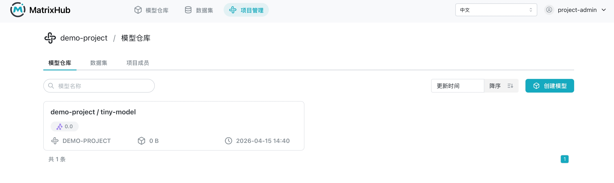

# 命令行上传和下载

## 前提条件

- 已有可登录 MatrixHub 的账号
- 已加入目标项目并具备模型仓库读写权限（管理员权限，开发权限）
- 本地已安装 Hugging Face CLI（`hf` 命令可用）
- 网络可访问 MatrixHub 服务地址

## 上传模型

1. 登录平台后，进入 **项目管理** ，选择目标项目。
1. 打开 **模型仓库** 标签页，点击 **创建模型** 。

    

1. 填写模型名称并确认创建，进入模型详情页。

    

1. 在本地终端配置服务地址。

    ```bash
    export HF_ENDPOINT="https://<your-matrixhub-endpoint>"
    ```

1. 使用 `hf upload` 上传本地模型目录。

    ```bash
    hf upload <project-name>/<model-name> ./<local-model-dir>
    ```

1. 返回模型详情页刷新，确认文件列表已出现上传文件。

    


:::note

- 若提示模型名重复，请更换模型名称后重新创建。
- 首次上传大模型可能耗时较长，请等待命令执行完成。

:::

## 下载模型

1. 进入目标模型详情页，点击 **下载模型** 。
1. 在弹窗中复制下载命令，在本地终端执行。

    ```bash
    export HF_ENDPOINT="https://<your-matrixhub-endpoint>"
    hf download <project-name>/<model-name>
    ```

1. 命令执行完成后，终端会输出下载目录路径。
1. 打开本地下载目录，确认模型文件完整可用。

## 代理项目（Proxy）上传和下载

1. 在平台先创建一个代理项目（例如 `proxy-demo` ）。

1. 在代理项目中创建模型后，即可通过命令行对代理站点执行上传和下载。


    ```bash
    export HF_ENDPOINT="https://<your-matrixhub-endpoint>"
    ```

1. 下载代理项目中的模型（示例）。

    ```bash
    hf download proxy-project/Qwen3-ASR-0.6B
    ```

1. 从映射到 Hugging Face 组织（如 `prajjwal1` ）的代理项目下载模型（示例）。

    ```bash
    hf download prajjwal1/bert-tiny
    ```

1. 上传本地模型到代理项目（示例）。

    ```bash
    hf upload proxy-project/tiny-model ./<local-model-dir>
    ```

:::note

- 代理项目创建完成后，可使用 `hf download` 和 `hf upload` 访问代理站点模型仓库。
- `hf upload` 需要同时提供远端仓库和本地路径：`hf upload <project>/<model> <local_path>` 。

:::

##模型文件
    
### 下载单个模型文件

1. 进入模型详情页，切换到 **模型文件** 。
1. 在目标文件所在行点击 **下载** 。
1. 浏览器完成下载后，打开文件核对内容。

### 文件检索与浏览

1. 在 **模型文件** 页使用搜索框输入文件名关键字（如 `.git`、`tokenizer`）。
1. 观察列表过滤结果，确认返回文件符合预期。
1. 如文件较多，点击 **加载更多** 查看完整列表。

### 版本分支切换

1. 进入模型详情页的 **模型文件** 页面。
1. 在分支选择器中选择目标分支（如 `main`、`test`）。
1. 核对分支切换后的文件列表是否与该分支内容一致。
