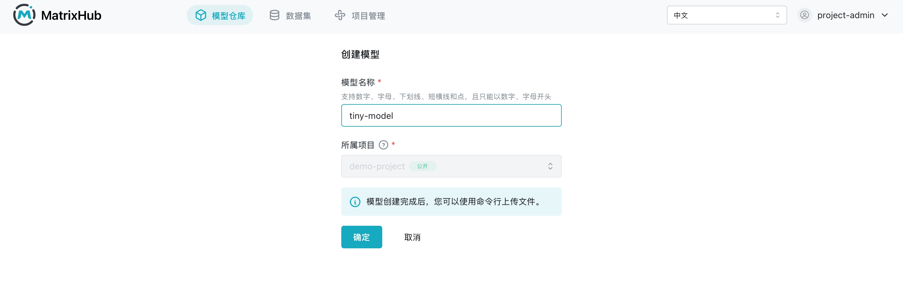
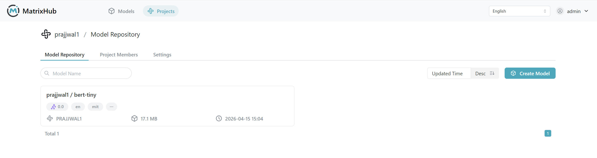
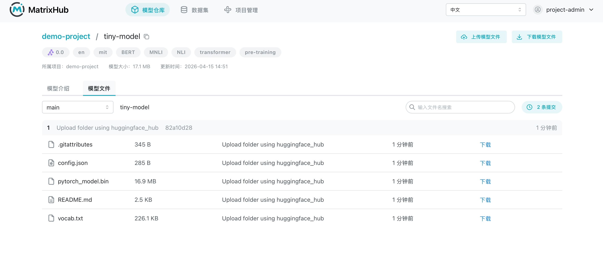
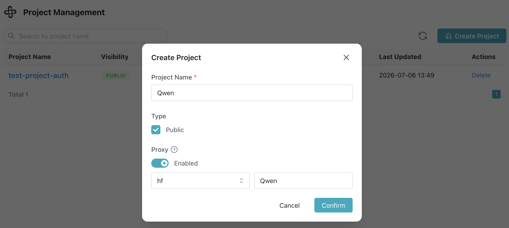
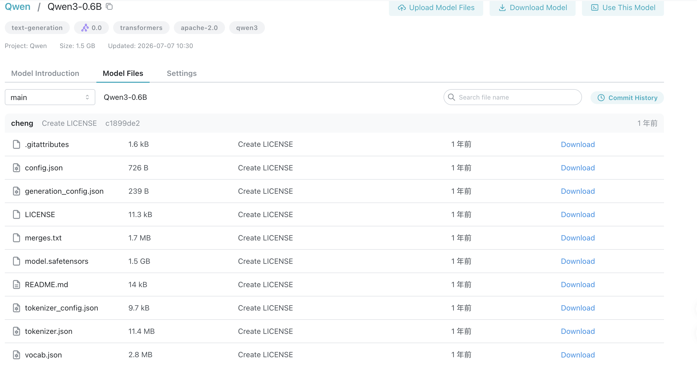
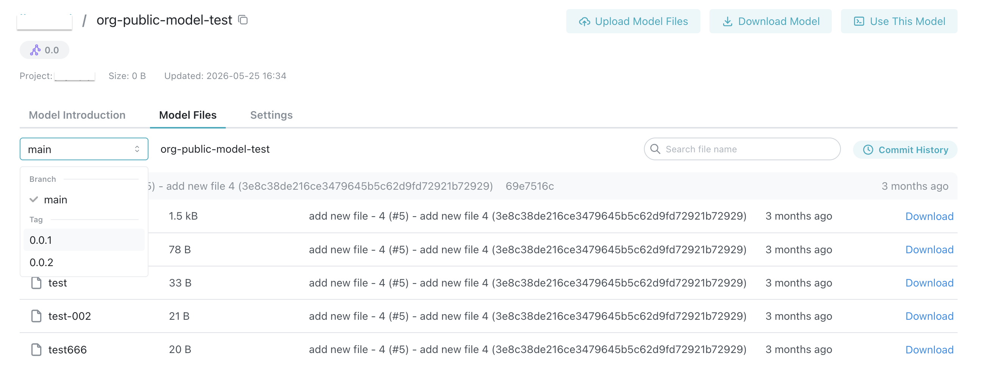
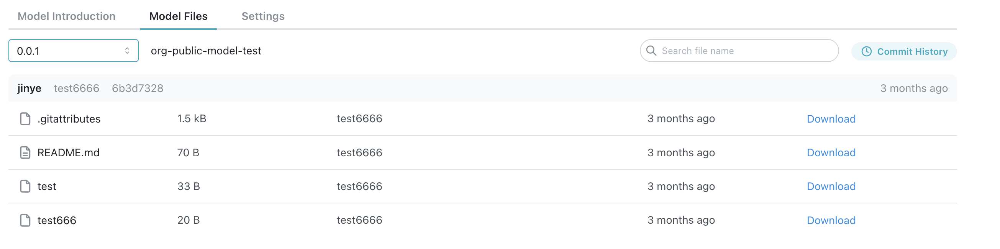

# 命令行上传与下载

## 前置条件

- 拥有有效的 MatrixHub 账号。
- 已加入目标公开项目。下载模型需要项目管理员、开发者或只读权限；上传模型需要项目管理员或开发者权限。
- 如需使用代理项目，需已存在一个可使用的目标仓库；如需创建目标仓库，请参考[仓库管理](../platform-settings/registry-management.md)。
- 本地已安装 Python，并准备安装 Hugging Face 命令行工具。
- 网络可以访问 MatrixHub 服务端点。

## 上传模型

上传模型仅支持项目**管理员**和**开发者**执行。

1. 登录平台，点击右上角头像打开下拉菜单，选择 **创建模型**。

    

1. 填写模型名称及其他信息，确认创建。创建完成后点击模型卡片进入模型详情页。

    
1. 在模型详情页点击右上角 **上传模型文件**，打开上传文件步骤。


    在本地终端安装 Hugging Face 命令行工具。

    ```bash
    python -m pip install -U huggingface_hub
    ```

1. 配置 MatrixHub 服务端点和访问 Token。

    ```bash
    export HF_ENDPOINT="https://<your-matrixhub-endpoint>"
    export HF_TOKEN="<your-matrixhub-token>"
    ```

    私有项目或启用鉴权的 MatrixHub 实例需要配置 `HF_TOKEN`。请将示例中的服务端点和 Token 替换为实际值。

1. 使用 `hf upload` 上传本地模型目录。将本地路径替换为模型文件所在的实际路径。

    ```bash
    hf upload <project-name>/<model-name> /path/to/<local-model-dir> .
    ```

1. 返回模型详情页并刷新，确认上传的文件出现在列表中。

    

:::note

- 如果模型名称已被占用，请选择不同的名称重试。
- 首次上传大模型可能需要一些时间；请耐心等待命令完成。

:::

## 下载模型

下载模型支持项目**管理员**、**开发者**和**只读**权限执行。

1. 在本地终端安装 Hugging Face 命令行工具。

    ```bash
    python -m pip install -U huggingface_hub
    ```

1. 进入目标模型详情页，点击 **下载模型**。
1. 在弹窗中配置 MatrixHub 服务端点，并复制下载命令到本地终端执行。

    ```bash
    export HF_ENDPOINT="https://<your-matrixhub-endpoint>"
    hf download <project-name>/<model-name>
    ```

    私有项目或启用鉴权的 MatrixHub 实例还需要配置访问 Token：

    ```bash
    export HF_TOKEN="<your-matrixhub-token>"
    ```

1. 命令完成后，模型默认保存到 Hugging Face 缓存目录（通常为 `~/.cache/huggingface/hub`）。如需指定本地目录，可使用 `--local-dir` 参数。
1. 打开本地下载目录，验证模型文件是否完整且可用。

## 代理项目下载模型

使用代理项目下载模型前，请先在 **仓库管理** 中创建代理仓库地址。具体操作请参考[仓库管理](../platform-settings/registry-management.md)。

代理仓库支持按以下维度配置代理范围：

- **组织**：代理指定组织下的模型仓库。
- **个人账号**：代理指定个人账号下的模型仓库。

完成代理仓库配置后：

1. 创建一个代理项目（例如：`Qwen`）。

    

1. 进入代理项目详情页，打开 **模型仓库** 选项卡。

    代理项目无需手动创建模型。下载模型后刷新模型仓库页面，系统会根据已配置的代理仓库自动生成对应的模型卡片。

1. 在 **模型仓库** 页面选择下载方式：

   - **快速下载**：输入目标仓库中的完整模型名称，例如 `Qwen/Qwen3-0.6B`，生成下载命令。
   - **下载模型**：点击右上角 **下载模型**，在弹窗中输入目标仓库中的完整模型名称，生成下载命令。

1. 在本地终端安装 Hugging Face 命令行工具，并配置 MatrixHub 服务端点。

    ```bash
    python -m pip install -U huggingface_hub
    export HF_ENDPOINT="https://<your-matrixhub-endpoint>"
    ```

1. 复制页面生成的下载命令并执行。以下为示例：

    ```bash
    hf download Qwen/Qwen3-0.6B
    ```

1. 等待下载命令执行完成，返回代理项目的 **模型仓库** 页面并刷新列表，确认系统已自动生成模型卡片。

:::note

- 代理仓库地址和代理范围需要提前配置完成，否则代理项目无法访问对应模型。
- 代理项目不需要手动创建模型；模型卡片会在模型下载完成并刷新模型仓库页面后自动生成。
- 代理项目不支持执行 `hf upload` 操作。

:::

## 模型文件



### 下载单个模型文件

1. 进入模型详情页，切换到 **模型文件** 选项卡。
1. 在目标文件所在的行点击 **下载**。
1. 浏览器完成下载后，打开文件以验证内容。

### 文件搜索与浏览

1. 使用 **模型文件** 页面中的搜索框输入关键字（例如：`.git`，`tokenizer`）。
1. 观察过滤结果，确保返回的文件符合预期。
1. 如果文件很多，点击 **加载更多** 查看完整列表。

### 分支/版本切换

1. 进入模型详情的 **模型文件** 页面。
1. 在分支选择器中选择目标分支（例如：`main`，`0.0.1`，`0.0.2`等）。

    

1. 验证切换后的文件列表是否与该分支的内容一致。

    
