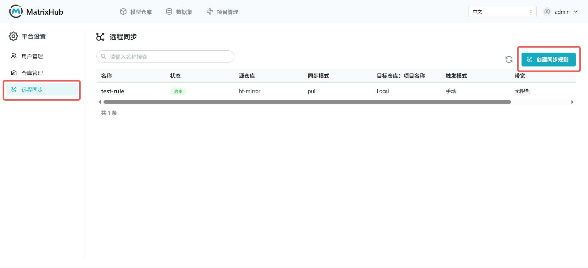
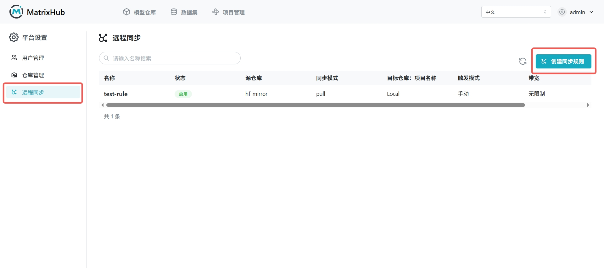

# 远程同步

远程同步用于将远程模型仓库（例如 Hugging Face 等已配置的源）中的 **模型** 或 **数据集** 按规则拉取到当前 MatrixHub 部署中，适合私有化场景下由平台统一拉取与更新资源。

## 前提条件

- **权限:** 仅 **平台管理员** 可创建与管理远程同步规则。
- **源仓库:** 已在 **仓库管理** 中配置可用的远程源；未配置源仓库时无法指定拉取来源。
- **项目与仓库:** **目标项目** 为可选项；不填写时，资源由平台按默认规则存放。**项目** 与 **仓库** 为不同概念，请按实际界面区分。

## 操作步骤

1. 使用管理员账号登录 MatrixHub ，在导航中进入 **平台管理**（或 **Admin** 下拉中的 **平台设置**），打开 **远程同步** 页面。

    

1. 点击 **创建** ，在弹窗中填写规则并保存。

    - **名称:** 建议使用便于识别的标识（如英文或规范命名）。
    - **描述:** 可选，长度上限以界面为准（常见为 50 字以内）。

    
1. 配置 **同步方向** 与 **源仓库** 、 **资源过滤器** 、 **目标项目** 、 **触发模式** 、 **带宽限制** 等项（详见下文 **配置参数说明**）。

1. 点击 **确定** 完成创建。创建后可在列表中对规则进行 **编辑** 、 **删除** ，或通过 **立即同步** 等操作触发拉取（具体按钮名称以界面为准）。

:::note

- 当前产品以从远程 **拉取（Pull）** 为主；是否支持 **推送（Push）** 及 **触发模式** 的全部选项以实际版本为准。
- 若界面仅提供 **自动** 或 **手动** 之一，请按当前可用选项操作。

:::

## 配置参数说明

| 名称 | 说明 |
|-----|------|
| 名称 | 同步规则的显示名称，最长 64 个字符，只能包含小写字母、数字、分隔符("-")及点("." )，且必须以小写字母或数字开头。 |
| 描述 | 对规则用途的补充说明，长度 50 字以内）。 |
| 同步规则 | 选择同步方向，当前通常以 **Pull** 为主；是否支持 **Push** 以版本能力为准。 |
| 源仓库 | 选择已在 **仓库管理** 中配置的远程源（如官方站、镜像站或企业自定义源）。 |
| 资源名称 | 按名称匹配待同步资源，例如 `llama-3` 或 `*` 表示全部。 |
| 资源类型 | 指定同步对象类型，常见为 **模型** 、 **数据集** 或两者同时选择。 |
| 目标项目 | 同步后的资源归属项目或工作空间，**非必填**；不填时按平台默认规则存放。 |
| 触发模式 | **手动**：仅在点击同步时执行；**自动**：按周期策略自动检查并拉取更新。 |
| 带宽限制 | 控制同步下载带宽。填 `-1` 表示不限制；正数按界面单位限制峰值速率。 |
| 覆盖已有资源 | 勾选后同名资源按远程版本覆盖本地；不勾选时本地已存在则跳过。 |
