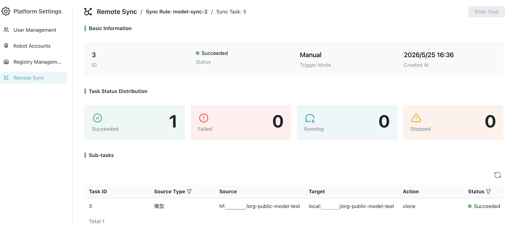

# 远程同步

远程同步用于在当前 MatrixHub 与远端仓库之间同步模型。远端仓库可以是外部模型源，也可以是另一个可访问的 MatrixHub 实例，具体以**仓库管理**中的连接配置为准。同步规则支持两种方向：

- **拉取（Pull）：** 从已配置的远端仓库同步资源到当前 MatrixHub。
- **推送（Push）：** 从当前 MatrixHub 同步资源到已配置的远端仓库。

每条规则可以手动执行，也可以配置定时任务自动执行。每次执行都会生成一条同步任务，并按匹配到的模型拆分为具体的同步作业。

## 前置条件

- **权限：** 只有平台管理员可以创建、编辑、删除和执行远程同步规则。
- **仓库连接：** 已在[仓库管理](./registry-management.md)中创建可用的仓库连接。拉取需要源仓库，推送需要目标仓库。
- **目标项目：** 已确认同步结果要写入的项目名称。
- **定时规则：** 如果选择定时执行，需要准备五段式 cron 表达式，格式为 `分钟 小时 日期 月份 星期`。

## 操作步骤

1. 使用管理员账号登录 MatrixHub，进入导航栏的 **平台管理**（或 **管理员** 下拉菜单中的 **平台设置**），然后打开 **远程同步** 页面。

    

1. 点击 **创建**，在弹窗中完成同步规则配置。

    - 填写 **名称** 和 **描述**。
    - 选择 **同步规则**，并选择对应的 **源仓库** 或 **目标仓库**。
    - 配置 **资源过滤**、**目标项目**、**触发模式**、**带宽限制** 和 **覆盖已有资源**。

    

    可参考以下示例填写，示例中的仓库、项目和资源名称请替换为实际环境中的值。

    | 场景 | 参考配置 |
    |------|----------|
    | 从远端仓库拉取单个模型 | 同步规则：拉取 源仓库：`matrixhub-remote` 资源名称：`Qwen/Qwen3-0.6B` 资源类型：模型 目标项目：`demo` 触发模式：手动 带宽限制：`-1` |
    | 从远端仓库批量拉取模型 | 同步规则：拉取 源仓库：`matrixhub-remote` 资源名称：`Qwen/**` 资源类型：模型 目标项目：`demo` 触发模式：定时 Cron：`0 0 * * *` 带宽限制：`1024 Kbps` |
    | 推送本地模型到远端仓库 | 同步规则：推送 目标仓库：`matrixhub-remote` 资源名称：`demo/Qwen3-0.6B` 资源类型：模型 目标项目：`test-org` 触发模式：手动 带宽限制：`-1` |

1. 点击 **确认** 完成创建。创建后，可以在列表中执行 **同步**、**编辑**、**启用/禁用** 或 **删除** 等操作。

## 任务和日志

- 点击 **同步** 会立即创建一条同步任务，任务状态包括 **等待中**、**运行中**、**成功**、**失败** 和 **已停止**。

    

- 一条同步任务下会包含一个或多个同步作业。拉取作业的动作显示为 `clone`，推送作业的动作显示为 `push`。
- 在任务详情中可以查看每个作业的模型信息、源位置、目标位置、执行状态和日志。

    

- 对运行中的任务执行 **停止** 后，系统会取消正在执行的作业，并将未完成的作业标记为已停止。

## 配置参数

| 参数 | 描述 |
|------|------|
| 名称 / 描述 | 用于识别同步规则。名称至少 2 个字符，只能包含小写字母、数字、点、下划线和连字符，且必须以小写字母或数字开头；描述可选，最多 50 个字符。 |
| 同步规则 | 选择同步方向：**拉取** 或 **推送**。规则创建后不能切换方向。 |
| 源仓库 / 目标仓库 | 拉取时选择源仓库；推送时选择目标仓库。仓库连接在 **仓库管理** 中维护。 |
| 资源名称 | 要同步的模型路径，如 `Qwen/Qwen3-0.6B`；拉取时可用 `*`、`**` 或 `Qwen/**` 批量匹配。 |
| 资源类型 | 当前仅支持 **模型**。 |
| 目标项目 | 拉取时为当前 MatrixHub 项目；推送时为远端仓库中的项目。 |
| 触发模式 / Cron | 手动执行或按五段式 cron 定时执行。仅选择定时时需要填写 cron。 |
| 带宽限制 | `-1` 表示不限制；也可按页面单位填写 `Kbps` 或 `Mbps`。 |
| 覆盖已有资源 | 开启后，同名模型会被同步结果覆盖；关闭后不会覆盖已有模型。 |
| 启用状态 | 禁用后，定时规则不会自动触发。 |
