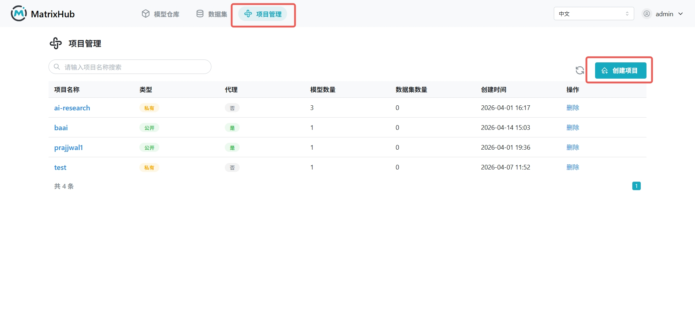

# 创建和删除项目

## 前提条件

- 已登录 MatrixHub
- 创建代理项目时，需先在 **仓库管理** 中配置目标仓库（如 Hugging Face）

## 操作步骤

1. 登录平台后进入 **项目管理** 页面，查看项目总览。

    

1. 点击 **创建项目** ，填写项目名称，选择项目可见性（公开/私有），按需勾选 **代理项目** 后点击 **确定** 。

    

1. 创建完成后，新项目会出现在项目列表中，且创建者自动拥有该项目 **管理员权限** 。

1. 删除项目时，在项目列表中找到目标项目并执行删除操作。

:::warning

删除项目不可恢复，请在删除前确认项目内模型和数据已完成备份。

:::

## 配置参数说明

| 参数 | 说明 |
|------|------|
| 项目名称 | 仅支持小写字母、数字、连字符（`-`）；且必须以字母或数字开头和结尾 |
| 可见性 | **公开** ：其他用户可在项目管理中看到该项目； **私有** ：仅项目成员可见 |
| 代理项目 | 勾选后可通过目标仓库进行代理访问 |
| 目标仓库 | 代理项目必填，如 Hugging Face |
| Organization/用户名 | 当模型路径为 `组织名/模型名`（如 `Qwen/Qwen3.5-35B-A3B`）时填写 Organization；个人账号模型填写用户名 |

## 项目规则说明

- **谁能创建项目：** 具备项目创建权限的用户可创建项目
- **创建后角色：** 创建者自动成为该项目 **管理员**
- **公开项目可见性：** 非成员用户可在项目列表看到公开项目
- **私有项目可见性：** 非成员用户默认不可见
- **代理项目访问：** 可下载公开模型；私有模型仍受目标仓库权限控制

## 命名规则示例

| 类型 | 示例 |
|------|------|
| 合法名称 | `test-project1`、`t1`、`1test2`、`test-project`、`test`、`12` |
| 非法名称 | `t`、`-test`、`test 01`、`test%123`、`test*123`、`test~01`、`test@#$^&*()+=01`、`1test-`、`Test` |
