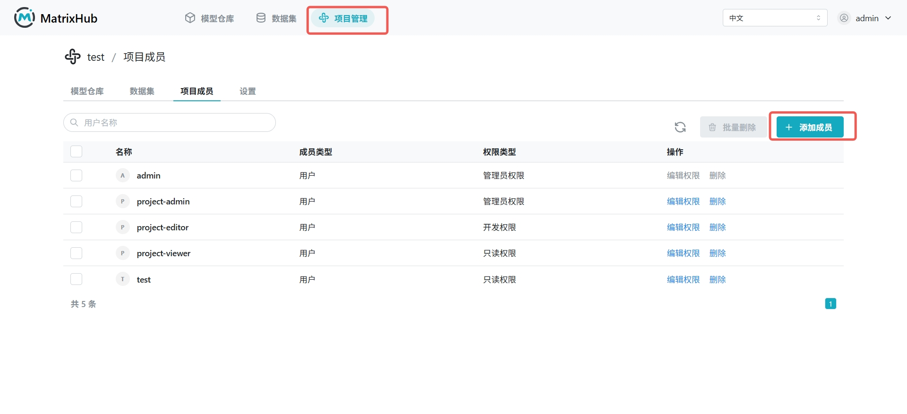

# 项目成员

## 前提条件

- 当前账号为项目 **管理员** 或平台 **管理员**
- 目标用户已在平台内创建账号

## 操作步骤

1. 登录 MatrixHub，进入 **项目管理** ，选择目标项目后点击 **项目成员** 页签。

    

1. 点击 **添加成员** ，在弹窗中选择成员类型、用户和权限类型后点击 **确定** 。

    

1. 在成员列表中找到目标用户，点击 **编辑权限** ，选择新的权限类型并确认。

    

## 配置参数说明

| 参数 | 说明 |
|------|------|
| 成员类型 | 当前支持选择 **用户** |
| 用户 | 需要加入项目的账号 |
| 权限类型 | **管理员** ：可管理成员并维护项目资源； **开发者** ：可上传、下载、删除模型和数据集； **只读** ：仅可查看并下载模型和数据集 |

## 角色权限说明

| 角色 | 菜单权限 | 核心功能权限 | 特殊说明 |
|------|------|------|------|
| 平台管理员 | 可查看所有菜单 | 可使用平台全部功能 | 平台最高权限 |
| 项目管理员 | 无平台设置菜单 | 添加/编辑/移除成员，上传/下载/删除模型和数据集，删除项目 | 不能将自己从当前项目移除 |
| 项目开发者 | 无平台设置菜单 | 查看成员，上传/下载/删除模型和数据集 | 无成员管理和项目删除权限 |
| 项目只读 | 无平台设置菜单 | 查看成员，下载模型和数据集 | 无上传、删除和成员管理权限 |
| 普通用户（非项目成员） | 无平台设置菜单 | 可查看公开项目的模型/数据集并下载 | 私有项目默认不可见 |

## 可见性补充

- 只有项目 **管理员** 和平台 **管理员** 可以修改项目设置
- 项目 **开发者** 和 **只读** 角色可查看设置项但不能修改
- 非项目成员默认不能看到该项目内容（公开资源除外）