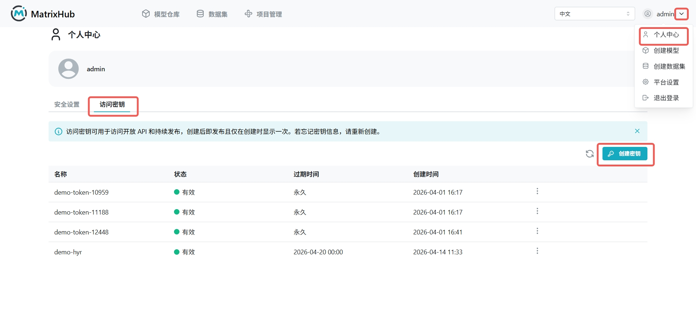
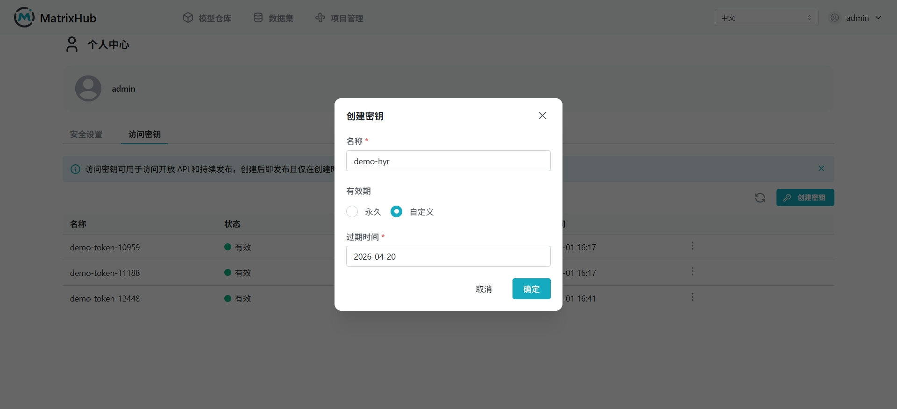

# Access Token

## 前提条件

- 已有可登录 MatrixHub 的账号
- 已有至少一个可访问的私有仓库 或 公开访问的仓库（示例：`my-matrixhub-project/test-mn`）
- 本地已安装 Hugging Face CLI，并可在终端执行 `hf auth login`

## 操作步骤

### 创建 Access Token

1. 登录 MatrixHub，进入 **个人中心** -> **访问密钥** 页面。

    

1. 点击 **创建密钥** ，填写名称（示例：`demo`），选择有效期（如 **永久** 或指定时长），点击 **确定** 。

    

1. 在创建成功弹窗中复制生成的 Token，并妥善保存。

    
### 使用 Access Token

1. 使用 MatrixHub 地址，配置访问端点：

    ```bash
    export HF_ENDPOINT="matrixhub.url" # example：http://127.0.0.1:xxx
    ```

1. 在终端执行登录命令：

    ```bash
    hf auth login
    ```

1. 按提示粘贴 Token，完成认证。


1. 执行下载命令验证matrixhub仓库访问权限：

    ```bash
    hf download my-matrixhub-project/test-mn
    ```

### 撤销 Access Token

1. 返回 **个人中心** -> **访问密钥** 页面，在目标 Token 右侧执行删除操作。

1. 撤销后再次执行需要认证的命令，会提示未登录或认证失效。

## 配置参数说明

| 参数 | 说明 |
|------|------|
| 名称 | Token 的标识名称，便于区分不同用途 |
| 有效期 | 可选 **永久** 或自定义日期，过期后自动失效 |
| Token 值 | 仅在创建时完整展示一次，需立即复制保存 |
